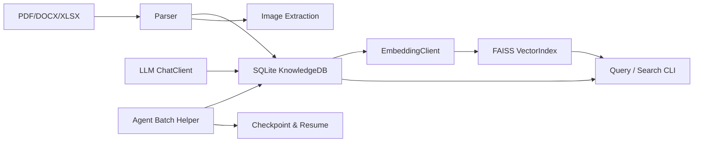

# work-docs-library

通用化技术文档知识库管理工具。

本项目是一个面向技术文档（PDF、Word、Excel）的自动化知识提取与检索 pipeline。它支持：

- **多格式文档解析**：PDF（含图片/矢量图区域提取）、DOCX、XLSX
- **结构化存储**：SQLite 存储文档元数据、章节、文本块（chunk）
- **向量索引**：基于 FAISS 的语义向量索引，支持相似度搜索
- **LLM 摘要与关键词**：利用大模型自动生成 chunk 级摘要和关键词
- **Agent 批量协作工作流**：通过 `agent_batch_helper.py` 实现 checkpoint/resume 的长文档摘要流水线

---

## 目录

1. [架构概览](#架构概览)
2. [目录结构](#目录结构)
3. [安装](#安装)
4. [快速开始](#快速开始)
5. [CLI 参考](#cli-参考)
   - [doc_extractor.py](#docextractorpy)
   - [agent_batch_helper.py](#agentbatchhelperpy)
6. [配置说明](#配置说明)
7. [核心模块说明](#核心模块说明)
8. [开发与测试](#开发与测试)
9. [功能稳定性 / 安全性 / 代码风格分析](#功能稳定性--安全性--代码风格分析)
10. [已知限制与注意事项](#已知限制与注意事项)

---

## 架构概览



**数据流说明：**

1. `IngestionPipeline` 扫描输入路径，调用对应 `Parser` 提取文本、表格、图片。
2. 解析结果以 `Document` / `Chunk` 模型写入 `SQLite`。
3. `EmbeddingClient` 调用 LLM 嵌入接口，将向量写入 `FAISS` 索引，并将 embedding 存入 chunk 的 metadata。
4. `agent_batch_helper.py` 将 embedded 但未 summarized 的 chunk 分批导出，供 Agent 阅读并写回摘要/关键词。
5. 用户通过 `doc_extractor.py` 进行关键词查询、章节查询、页码查询或语义向量搜索。

---

## 目录结构

```
work-docs-library/
├── scripts/
│   ├── doc_extractor.py          # 主 CLI
│   ├── agent_batch_helper.py     # Agent 批量协作 CLI
│   ├── requirements.txt
│   ├── .env.example              # 环境变量模板
│   ├── prompts/
│   │   ├── summarize.txt         # LLM 摘要提示词
│   │   └── filter_config.json    # 低价值内容过滤规则
│   ├── core/
│   │   ├── config.py             # 配置中心
│   │   ├── models.py             # 数据模型 (Document/Chunk/Chapter)
│   │   ├── db.py                 # SQLite 数据库操作
│   │   ├── llm_client.py         # LLM API 客户端
│   │   ├── vector_index.py       # FAISS 向量索引管理
│   │   ├── pipeline.py           # 文档摄入流水线
│   │   └── chapter_editor.py     # 交互式章节编辑器
│   ├── parsers/
│   │   ├── pdf_parser.py         # PDF 解析器（pymupdf）
│   │   ├── office_parser.py      # DOCX / XLSX 解析器
│   │   └── image_utils.py        # 图片压缩工具
│   └── tests/                    # pytest 测试集
├── knowledge_base/               # 运行时自动生成：数据库、FAISS 索引、图片
└── README.md
```

---

## 安装

### 环境要求

- Python >= 3.11
- 支持 Linux/macOS/Windows（主要测试于 Linux）

### 安装步骤

```bash
cd ~/.kimi/plugins/work-docs-library
python3 -m venv venv
source venv/bin/activate
pip install -r scripts/requirements.txt
```

### 配置环境变量

复制模板并编辑：

```bash
cp scripts/.env.example scripts/.env
# 编辑 scripts/.env，填入你的 API Key
```

---

## 快速开始

### 1. 导入文档

```bash
python scripts/doc_extractor.py ingest --path ./docs
```

使用 `--dry-run` 预览，不实际调用 API：

```bash
python scripts/doc_extractor.py ingest --path ./docs --dry-run
```

### 2. 查看已导入文档

```bash
python scripts/doc_extractor.py status
```

### 3. Agent 批量摘要（推荐工作流）

```bash
# 自动过滤低价值页（目录、版权声明、封装尺寸等），分批导出，支持断点续传
python scripts/agent_batch_helper.py auto --doc-id <DOC_HASH> --output-dir ./auto_batches --filter
```

执行后会生成 `batch_001.txt`，由 Agent 阅读并输出 `batch_001.json`，再次运行同一命令即可自动应用并进入下一批。

### 4. 语义搜索

```bash
python scripts/doc_extractor.py search --text "AHB bus arbitration mechanism" --top-k 5
```

### 5. 按章节查询

```bash
python scripts/doc_extractor.py query --doc-id <DOC_HASH> --chapter "System Architecture"
```

---

## CLI 参考

### `doc_extractor.py`

| 子命令 | 作用 | 关键参数 |
|--------|------|----------|
| `ingest` | 提取并存储文档 | `--path`（必填）, `--dry-run`, `--auto-chapter` |
| `status` | 列出所有已导入文档 | 无 |
| `chapter-edit` | 交互式编辑/覆盖文档的章节信息 | `--doc-id`（必填） |
| `query` | 按页码、章节、关键词查询 chunk | `--doc-id`, `--page`, `--chapter`, `--chapter-regex`, `--keyword`, `--top-k` |
| `search` | 基于 FAISS 的语义向量搜索 | `--text`（必填）, `--top-k` |
| `toc` | 显示文档目录，或按标题模糊搜索文档 | `--doc-id` 或 `--match` |
| `list-pending` | 列出已嵌入但未摘要的 chunk | `--doc-id`, `--top-k` |
| `write-summary` | 手动为某个 chunk 写入摘要 | `--chunk-db-id`, `--summary` |
| `write-keywords` | 手动为某个 chunk 写入关键词 | `--chunk-db-id`, `--keywords` |
| `write-embedding` | 手动为某个 chunk 写入向量（JSON 文件） | `--chunk-db-id`, `--embedding-file` |
| `reprocess` | 强制重新处理文档（忽略缓存） | `--doc-id` |

### `agent_batch_helper.py`

| 子命令 | 作用 | 关键参数 |
|--------|------|----------|
| `list` | 列出指定文档的 pending chunks | `--doc-id` |
| `dump` | 将一批 pending chunks 导出为 `.txt` | `--doc-id`, `--batch-size`, `--offset`, `--output` |
| `apply` | 从 JSON 文件批量回写摘要/关键词 | `--input` |
| `filter` | 根据 `filter_config.json` 自动过滤低价值 chunk | `--doc-id` |
| `progress` | 显示文档摘要进度（含进度条） | `--doc-id` |
| `auto` | 自动流水线：filter → smart-batch → dump → checkpoint/resume | `--doc-id`, `--output-dir`, `--batch-size`, `--target-chars`, `--filter` |

**`apply` 的 JSON 格式示例：**

```json
[
  {"chunk_db_id": 391, "summary": "该章节描述了 DMA 控制器的工作流程...", "keywords": "DMA, controller, burst, arbitration"},
  {"chunk_db_id": 392, "summary": "...", "keywords": "..."}
]
```

---

## 配置说明

### 环境变量（`.env`）

| 变量名 | 默认值 | 说明 |
|--------|--------|------|
| `WORKDOCS_LLM_PROVIDER` | `openai` | LLM 提供商。支持 `openai`、`kimi` 或自定义（需提供 `BASE_URL`） |
| `WORKDOCS_LLM_API_KEY` | 空 | API 密钥（必填） |
| `WORKDOCS_LLM_BASE_URL` | `https://api.openai.com/v1` | API Base URL |
| `WORKDOCS_LLM_MODEL` | `gpt-4o-mini` | 对话模型名称 |
| `WORKDOCS_EMBEDDING_MODEL` | `text-embedding-3-small` | 嵌入模型名称 |
| `WORKDOCS_EMBEDDING_DIM` | `1536` | 嵌入向量维度 |
| `WORKDOCS_IMAGE_MAX_EDGE` | `1024` | 图片压缩后的最大边长（px） |
| `WORKDOCS_IMAGE_QUALITY` | `85` | JPEG 压缩质量 |
| `WORKDOCS_BATCH_SIZE` | `4` | 调用嵌入 API 时的批处理大小 |
| `WORKDOCS_AUTO_VISION` | `0` | 是否开启自动 Vision API 描述图片（`1` 开启） |

**加载顺序：**

1. `~/.kimi/plugins/work-docs-library/.env`（先加载，可被覆盖）
2. `~/.kimi/plugins/work-docs-library/scripts/.env`（后加载，优先级更高）

### 过滤规则 (`scripts/prompts/filter_config.json`)

该文件控制 `agent_batch_helper.py filter/auto` 中哪些 chunk 会被自动标记为 `skipped`。

- **`always_skip`**：绝对跳过规则
  - `chapter_keywords`：章节标题包含这些词时跳过（如 "Table of Contents", "Disclaimer"）
  - `content_keywords`：内容前缀中包含这些词时跳过（如 "All rights reserved"）
  - `chunk_types`：指定 chunk 类型黑名单（如 `image_desc`）
- **`heuristic_skip`**：启发式规则
  - `min_content_length`：内容长度低于阈值跳过
  - `ascii_art_ratio`：纯 ASCII 艺术图比例阈值
  - `dimension_page`：针对封装尺寸/机械数据页的特殊规则

---

## 核心模块说明

| 模块 | 职责 |
|------|------|
| `core/config.py` | 统一读取 `.env` 与固定路径配置 |
| `core/models.py` | 定义 `Chapter`、`Chunk`、`Document` 三个核心 dataclass |
| `core/db.py` | `KnowledgeDB`：SQLite 的增删改查、事务管理 |
| `core/llm_client.py` | `_BaseClient` / `ChatClient` / `EmbeddingClient`：封装 LLM HTTP 请求 |
| `core/vector_index.py` | `VectorIndex`：FAISS 索引的加载、添加、删除、搜索、持久化 |
| `core/pipeline.py` | `IngestionPipeline`：扫描 → 解析 → chunk → 嵌入 → 入库 的完整流程 |
| `core/chapter_editor.py` | `ChapterEditor`：基于 `input()` 的交互式章节增删改 |
| `parsers/pdf_parser.py` | `PDFParser`：基于 `pymupdf` 的文本/图片/矢量图提取，含大量 heuristic |
| `parsers/office_parser.py` | `OfficeParser`：基于 `python-docx` / `openpyxl` 的文档解析 |
| `parsers/image_utils.py` | `compress_image()`：Pillow 图片压缩工具 |

---

## 开发与测试

运行全部测试：

```bash
cd ~/.kimi/plugins/work-docs-library
source venv/bin/activate
pytest scripts/tests/ -v
```

当前测试覆盖：数据库操作、向量索引、pipeline 流程、Agent batch helper、章节编辑器、LLM 客户端（mock）、PDF/Office 解析器、图片工具等。

---

## 功能稳定性 / 安全性 / 代码风格分析

### 稳定性分析

**优势：**
- pytest 覆盖核心模块，共 91 个测试用例。
- `IngestionPipeline` 有基于 `file_hash` 的去重机制，避免重复处理未变更文档。
- `VectorIndex` 支持维度不匹配时自动重建索引，兼容旧版 dict 格式的 `id_map`。
- `agent_batch_helper.py` 的 `auto` 命令具备 checkpoint/resume 能力，适合处理长文档。

**已修复问题（本次分析中实施）：**
1. **`test_llm_client.py` 测试失效**：`mock_env` fixture 原使用 `monkeypatch.setenv`，但 `Config` 在模块导入时即读取环境变量，导致 mock 不生效。已改为直接 `monkeypatch.setattr(Config, ...)`。
2. **VisionClient 资源泄漏**：`pipeline.py` 中原 `vision_client.close()` 位于 `try` 块末尾，若中间步骤异常则无法关闭。已改为 `try/finally` 确保关闭。
3. **LLM 客户端无重试机制**：`llm_client.py` 的 `_post` 已增加 3 次指数退避重试（退避间隔 1s / 2s / 4s）。
4. **Pillow DeprecationWarning**：`pdf_parser.py` 中的 `rgb.getdata()` 已替换为 `rgb.get_flattened_data()`。
5. **路径安全检查增强**：`doc_extractor.py` 和 `agent_batch_helper.py` 中的 `skill_root` 已增加 `.resolve()`，避免符号链接绕过。

**仍存在的潜在问题：**
- `office_parser.py` 的 `.docx` 解析将所有内容合并为单个 `Chunk`，超大文档可能超出 embedding 模型的 token 限制。
- `query_by_page` 使用区间覆盖逻辑，查询大段页码范围时可能返回较多结果。
- FAISS 索引写入与 SQLite 更新非原子操作，若进程在两者之间崩溃，可能出现向量与元数据不一致。
- `ChapterEditor` 使用原始 `input()`，无撤销机制，误操作可能直接覆盖章节数据。

### 安全性分析

| 风险 | 等级 | 说明 |
|------|------|------|
| SQL 注入 | **低** | 所有 SQL 使用参数化查询（`?` 占位符），无字符串拼接。 |
| 路径遍历 | **中→低** | `ingest --path` 本身未限制路径（属于功能需求）。`write-embedding` 与 `agent_batch_helper apply --input` 已增加 `resolve()` + `relative_to(skill_root)` 校验，可防止读取 skill 目录外的文件。 |
| API Key 泄漏 | **低** | Key 存储于 `.env`，未硬编码到代码中。 |
| JSON 反序列化 | **低** | 所有 JSON 使用标准库 `json.load()`，无自定义反序列化风险。 |
| 资源耗尽 | **中** | 大 PDF 的 diagram 渲染、大 DOCX 的单 chunk 合并都可能消耗较多内存/磁盘。 |

### 代码风格分析

**优点：**
- 分层清晰：`core/`（业务）、`parsers/`（IO）、`tests/`（测试）。
- 使用 dataclass 定义领域模型，类型注解覆盖较全。
- `KnowledgeDB._connect()` 使用上下文管理器管理连接生命周期。

**待改进：**
- `pdf_parser.py` 中存在大量 magic numbers（已提取为常量但缺少文档注释说明来源）。
- `doc_extractor.py` 与 `agent_batch_helper.py` 存在重复的路径校验逻辑，可进一步抽象到 `core/utils.py`。
- `IngestionPipeline._process_one` 职责过重，建议拆分为 `_extract_chunks`、`_auto_vision`、`_generate_embeddings` 等私有方法。
- ~~项目中 `print()` 与 `logging` 混用，建议未来统一为结构化日志。~~ **已修复**：诊断/进度/错误信息已统一使用 `logging`（Agent 友好的结构化格式：`%(asctime)s | %(levelname)-8s | %(name)s | %(message)s`），CLI 格式化结果展示与交互式 TUI 保留 `print()`。

---

## 已知限制与注意事项

1. **DOCX 单 chunk 限制**：目前 `.docx` 文件被解析为单个 `Chunk`，超大文档可能导致嵌入/token 超限。
2. **矢量图提取**：PDF 中的矢量图不会通过 `page.get_images()` 直接提取。项目通过识别 `Figure X-X.` 标题来渲染周围区域作为补偿，若文档无 Figure Caption 可能遗漏。
3. **FAISS 与 SQLite 非原子**：在极端情况下（进程崩溃、磁盘满），可能出现 FAISS 索引与 SQLite 元数据不一致。可通过 `reprocess` 命令重建文档来解决。
4. **Vision API 开销**：开启 `WORKDOCS_AUTO_VISION=1` 后，每个包含图片的页面都会调用一次 Vision API，可能产生较高费用。
5. **LLM 客户端 timeout**：当前默认 HTTP timeout 为 120 秒，虽然已增加 3 次重试，但极大文档或极慢网络仍可能超时。

---

## License

本项目为内部工具 SKILL，仅供相关 Agent / 工作流调用使用。
