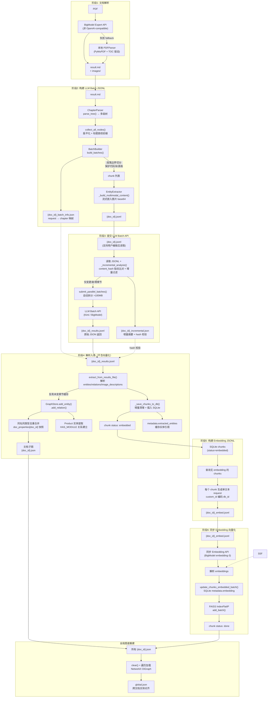

# work-docs-library

通用化技术文档知识库管理工具。

本项目是一个面向技术文档（**当前仅支持 PDF**）的自动化知识提取 pipeline，以 **Kimi Code CLI Plugin** 形式运行。它支持：

- **智能文档解析**：PDF 通过 BigModel Expert API 解析为 Markdown 文本 + 图片，保留完整格式；失败时自动 fallback 到本地 PDFParser
- **知识图谱构建**：自动提取实体（Feature、Module、Register、Signal、Instruction、Interrupt、PipelineStage、Peripheral 等）和关系（IMPLEMENTS、CONTAINS、HAS_REGISTER、INSTRUCTION_READS_REGISTER、MODULE_IMPLEMENTS_INSTRUCTION、INTERRUPT_TRIGGERS 等），构建可查询的跨层级知识图谱（RTL ↔ ISA）
- **向量语义检索**：基于 FAISS 的语义向量索引，支持相似度搜索
- **Batch API 架构**：所有 LLM 调用通过 Batch API 提交，成本为同步 API 的 50%，支持超大 JSONL 自动拆分并行处理
- **章节级增量更新**：文档修订后，按章节 `content_hash` 指纹比较，未变章节复用实体缓存与 embedding，仅对变更/新增章节进行 LLM 提取，万页级文档变更一页时成本降低 99%+
- **Multimodal 图片理解**：LLM 直接分析文档中的图片（时序图、架构框图、寄存器表等），生成文字描述用于向量化

---

> ⚠️ **前置要求**：本项目依赖 Python 虚拟环境。首次安装后，请务必执行 [安装步骤](#安装) 创建 `venv` 并安装依赖，否则 Kimi CLI 调用插件工具时会因缺少依赖而失败。

---

## 目录

1. [架构概览](#架构概览)
2. [目录结构](#目录结构)
3. [安装](#安装)
4. [快速开始](#快速开始)
5. [Plugin 工具说明](#plugin-工具说明)
6. [配置说明](#配置说明)
7. [核心模块说明](#核心模块说明)
8. [开发与测试](#开发与测试)
9. [已知限制与注意事项](#已知限制与注意事项)

---

## 架构概览

### DocGraphPipeline 六阶段架构



**数据流说明：**

1. **阶段1（解析）**：`BigModelParserClient` 调用 **BigModel 专用** Expert API 解析 PDF，输出 Markdown 文本（含 `` 图片引用）+ `images/` 目录（⚠️ 该 API 非 OpenAI-compatible，仅支持 BigModel 厂商；失败时自动 fallback 到本地 `PDFParser`，输出格式完全一致）
2. **阶段2（构建 LLM Batch）**：`ChapterParser.parse_tree()` 将 Markdown 解析为树形章节结构（`#` 文档标题，`##` 章节，`###+` 子章节），`collect_all_nodes()` 递归收集所有有 content 的节点并附加完整标题路径前缀。`BatchBuilder.build_batches()` 按 `max_chars` 切分，超长内容按段落边界（`\n\n+`）切分为 sub-batch，同时保护代码块/表格不被截断。`EntityExtractor` 流式解析图片引用，按原文顺序构建 multimodal content（文本 → `[image_id: alt]` → base64 图片），生成 `{doc_id}.jsonl` + `{doc_id}_batch_info.json`
3. **阶段3（提交 LLM Batch）**：**优先读取** `batch/{doc_id}.jsonl`（支持用户编辑后重新提交），结合 `batch/{doc_id}_batch_info.json` 做增量过滤，仅对变更/新增章节的 requests 提交 Batch API。超大 JSONL 自动按 100MB 拆分并行提交。结果保存为 `{doc_id}_results.jsonl`，增量摘要保存为 `{doc_id}_incremental.json` 供阶段4校验一致性
4. **阶段4（解析入库，不含向量化）**：从 `results.jsonl` 解析 `entities`/`relationships`/`image_descriptions`，复用未变章节的缓存实体/关系。`GraphStore`（NetworkX）构建图谱，**同名同类型实体自动去重合并**，每个文档保存独立子图 `graphs/{doc_id}.json`。同时保存每个文档的原始属性快照到 `doc_properties[doc_id]`，支持按文档精确查询。提取产品型号建立 `Product --[HAS_MODULE]--> Module` 关系。chunks 写入 SQLite，状态设为 `embedded`；每个 chunk 的 `metadata.extracted_entities` 缓存该 chunk 中提及的实体引用，作为后续跨粒度桥接索引的唯一数据源
5. **阶段5（构建 Embedding JSONL）**：从 SQLite 查询状态为 `embedded` 且暂无 `metadata.embedding` 的 chunks，每个 chunk 生成一个单文本 request（`custom_id` 直接编码 `db_id`），生成 `{doc_id}_embed.jsonl`
6. **阶段6（同步 Embedding 向量化）**：读取 `{doc_id}_embed.jsonl`，逐条调用同步 Embedding API（默认 BigModel `embedding-3`），结果直接写入 SQLite `metadata.embedding` + FAISS `IndexFlatIP`，chunk 状态更新为 `done`
7. **跨粒度桥接索引**：`KnowledgeBaseService` 内部维护 `_EntityChunkBridge`，在 `__init__` 时从所有 chunks 的 `metadata.extracted_entities` 全量构建 `chunk_db_id ↔ (entity_type, entity_name)` 双向映射。`ingest_document` / `reprocess_document` 完成后自动同步。提供 O(1) 的正向查询（chunk→entities）和反向查询（entity→chunks），打通向量空间与图谱空间
8. **全局图谱重建**：`KnowledgeBaseService.ingest_document()` 完成后**全量重建**全局图 `graphs/global.json`（`clear()` + 遍历所有子图重新加载），确保无幽灵残留，实现**跨文档知识互通**

### 输入文档约束

本工具对被处理的 Markdown 文档（由 BigModel Expert 解析生成）有以下约束：

1. **图片引用格式**：必须使用标准 Markdown 格式 ``，其中 `image_name` 将作为全局唯一的 `image_id` 使用
2. **image_name 要求**：`[]` 中的名称应有意义且唯一（如 `"Figure 1: Timing Diagram"`），不建议留空。若留空，程序将退化为内部编号
3. **图片路径**：`()` 中的路径应为相对于解析输出目录的相对路径，且该路径下必须存在对应的实际图片文件

---

## 目录结构

```
work-docs-library/
├── plugin.json                   # Kimi Code CLI Plugin 配置
├── AGENTS.md                     # Agent 开发指南（架构、策略、代码规范）
├── README.md                     # 本文件
├── config.json                   # 用户持久化配置（API 参数、模型选择等）
├── scripts/
│   ├── plugin_router.py          # Plugin 统一路由（stdin/stdout JSON）
│   ├── requirements.txt
│   ├── .env.example              # 环境变量模板
│   ├── .env                      # 实际环境变量（gitignored）
│   ├── prompts/                  # LLM 提示词文件（运行时读取，无需重启）
│   │   ├── entity_extraction_system.txt   # 实体提取 system 提示词
│   │   └── entity_extraction_user.txt     # 实体提取 user 模板
│   ├── core/                     # 业务逻辑层
│   │   ├── config.py             # 配置中心
│   │   ├── doc_graph_pipeline.py # ⭐ DocGraphPipeline 主管道
│   │   ├── batch_clients.py      # BaseBatchClient + BatchClient（通用，服务商无感）
│   │   ├── llm_chat_client.py    # LLM 对话客户端（辅助用途）
│   │   ├── embedding_client.py   # Embedding 客户端（辅助用途）
│   │   ├── bigmodel_parser_client.py  # BigModel Expert 文件解析
│   │   ├── graph_store.py        # 图谱存储（NetworkX）
│   │   ├── db.py                 # SQLite 数据库操作
│   │   ├── vector_index.py       # FAISS 向量索引管理
│   │   ├── models.py             # 数据模型 (Document/Chunk)
│   │   ├── enums.py              # StrEnum 定义 (ChunkStatus/DocumentStatus/ChunkType)
│   │   └── knowledge_base_service.py  # 统一服务层封装
│   ├── parsers/                  # IO / 解析层
│   │   ├── pdf_parser.py         # PDF 本地解析器（fallback，输出与 BigModel 一致）
│   │   ├── office_parser.py      # DOCX / XLSX 解析器（代码存在，尚未接入 pipeline）
│   │   └── image_utils.py        # 图片压缩工具
│   └── tests/                    # pytest 测试集（289 个用例）
├── knowledge_base/               # 运行时自动生成
│   ├── workdocs.db               # SQLite 元数据
│   ├── faiss.index               # FAISS 向量索引
│   ├── id_map.json               # FAISS ID 映射
│   ├── parsed/<doc_id>/          # Stage1 解析输出（result.md + images/）
│   ├── batch/                    # Stage2/3/5/6 中间产物（*.jsonl, *_info.json）
│   └── graphs/                   # Stage4 子图快照（{doc_id}.json, global.json）
├── venv/                         # Python 虚拟环境
└── .gitignore
```

---

## 安装

### 环境要求

- Python >= 3.11
- 支持 Linux/macOS/Windows（主要测试于 Linux）

### 安装步骤

```bash
cd ~/.kimi/plugins/work-docs-library
python3 -m venv venv
source venv/bin/activate
pip install -r scripts/requirements.txt
```

### 配置

复制环境变量模板并编辑：

```bash
cp scripts/.env.example scripts/.env
# 编辑 scripts/.env，填入你的 API Key
```

用户持久化配置也可写入 `config.json`（项目根目录），详见 [配置说明](#配置说明)。

---

## 快速开始

本项目以 **Kimi Code CLI Plugin** 形式运行，通过 Kimi CLI 的命令行界面调用工具。

### 1. 导入文档（完整流程）

```bash
# 在 Kimi CLI 中执行
/ingest path/to/document.pdf
```

处理流程：
1. BigModel Expert 解析 PDF → Markdown + 图片
2. 构建树形章节结构
3. 按 batch 提交到 Kimi Batch API 进行实体提取
4. 构建知识图谱并持久化
5. 向量化后写入 SQLite + FAISS

### 2. 分阶段导入（支持人工干预）

当需要审查或修正中间产物时，可使用六阶段流程。每个阶段的产物均持久化到磁盘，支持人工编辑后重新触发下游阶段。

#### 阶段1: 解析（PDF → Markdown）

```bash
/doc_parse path/to/document.pdf
```

- **输入**: PDF 文件
- **输出**: `knowledge_base/parsed/{doc_id}/result.md` + `images/`
- **干预**: 直接编辑 `result.md`（修正文本、调整标题层级、补充内容）
- **触发下一阶段**: `/doc_build_batches {doc_id}`
- **注意**: 编辑后 content_hash 会变化，阶段3 的增量分析将识别为全部变更

#### 阶段2: 构建 Batch JSONL

```bash
/doc_build_batches {doc_id}
# 可选参数: --max-chars 10000（每个 batch 最大字符数）
```

- **输入**: `parsed/{doc_id}/result.md`
- **输出**: `batch/{doc_id}.jsonl` + `batch/{doc_id}_batch_info.json`
- **产物格式**: `jsonl` 每行是一个 JSON request，body 包含 `model`/`messages`/`response_format`/`extra_body`（含 thinking 参数）
- **干预**: 编辑 `jsonl`（修改 prompt、删除不想提交的 request、调整 messages）
- **⚠️ 关键限制**:
  - 删除 requests：无需同步修改 `batch_info.json`（代码会安全忽略多余的映射条目）
  - 修改 `custom_id`：无需同步修改 `batch_info.json`（不会报错，但该 request 在增量过滤时可能不会被选中）
  - **新增 requests：必须在 `batch_info.json` 中同步添加对应的 `custom_id` → `chapter_titles` 映射**，否则 stage4 的 `chapter_map` 无法回填，导致新增实体的 `source_chapter` 为空
  - `extra_body.thinking` 会被 stage3 自动补充（无需手动添加）
- **触发下一阶段**: `/doc_submit_batches {doc_id}`

#### 阶段3: 提交 LLM Batch API

```bash
/doc_submit_batches {doc_id}
# 可选参数: --file-path PATH（原始 PDF 路径，数据库无记录时必填）
#            --jsonl-path PATH（自定义 JSONL 路径）
#            --force（强制重新处理，忽略缓存）
```

- **输入**: 优先读取 `batch/{doc_id}.jsonl`（支持用户编辑后重新提交），结合 `batch_info.json` 做增量过滤
- **输出**: `batch/{doc_id}_results.jsonl` + `batch/{doc_id}_incremental.json`
- **产物格式**: `results.jsonl` 每行是一个 JSON response，`response.body.choices[0].message.content` 是 LLM 提取的 entities/relations/image_descriptions
- **干预**: 编辑 `results.jsonl`（修正 LLM 提取错误：修改 entity 名称、添加遗漏的关系、修正图片描述）
- **注意**: `incremental.json` 是机器生成的 hash 校验文件，**不要手动编辑**
- **触发下一阶段**: `/doc_ingest_results {doc_id}`

#### 阶段4: 解析入库（不含向量化）

```bash
/doc_ingest_results {doc_id}
# 可选参数: --file-path PATH（原始 PDF 路径）
#            --results-path PATH（自定义 results.jsonl 路径）
#            --force（强制重新处理）
```

- **输入**: `batch/{doc_id}_results.jsonl` + `batch/{doc_id}_batch_info.json` + `batch/{doc_id}_incremental.json`
- **输出**: SQLite chunks（状态 `embedded`）+ `graphs/{doc_id}.json`
- **干预**: 直接编辑 `graphs/{doc_id}.json`（但推荐通过 `graph_upsert_entity`/`graph_upsert_relation` 等 Plugin 工具修改，自动维护索引一致性）
- **注意**: 直接编辑子图后，必须调用 `/rebuild_global_graph` 才能同步全局图 `global.json`
- **触发下一阶段**: `/doc_build_embed_jsonl {doc_id}`

#### 阶段5: 构建 Embedding Batch JSONL

```bash
/doc_build_embed_jsonl {doc_id}
```

- **输入**: SQLite chunks（状态 `embedded` 且暂无 `metadata.embedding`）
- **输出**: `batch/{doc_id}_embed.jsonl`
- **分组逻辑**: 每个需要向量化的 chunk 生成一个独立 request，`custom_id` 直接编码 `db_id`（格式 `embed_dbid_{db_id}`），`body.input` 为单字符串。不再使用 token 估算或数组分组
- **产物格式**: `embed.jsonl` 每行 body.input 是单个字符串（chunk content）
- **干预**: 编辑 `embed.jsonl`（删除不想向量化的 chunks）
- **⚠️ 关键限制**:
  - 删除行：可直接删除，不影响其他行（每个 request 独立）
  - 新增行：不建议新增（新 chunk 需先有 db_id）
- **触发下一阶段**: `/doc_submit_embed_batches {doc_id}`

#### 阶段6: 同步 Embedding 向量化

```bash
/doc_submit_embed_batches {doc_id}
# 可选参数: --embed-jsonl-path PATH（自定义 Embedding JSONL 路径）
```

- **输入**: `batch/{doc_id}_embed.jsonl`
- **输出**: SQLite `metadata.embedding` + FAISS 向量索引
- **处理逻辑**: 读取 JSONL 逐条调用同步 Embedding API（`EmbeddingClient.embed_single()`），从 `custom_id` 解析 `db_id`，结果直接入库
- **干预**: 无（此阶段纯 API 调用与结果入库）
- **chunk 状态**: `embedded` → `done`

### 3. 语义搜索

```bash
/search AH bus arbitration
```

### 4. 按章节查询

```bash
/query --doc-id <DOC_HASH> --chapter "System Architecture"
```

### 5. 查看已导入文档

```bash
/status
```

### 6. 图谱查询

图谱数据以 JSON 格式持久化，可直接读取：

```bash
# 查看生成的图谱文件
ls knowledge_base/graphs/

# 查看图谱统计
python -c "
import json, sys
with open('knowledge_base/graphs/<doc_id>.json') as f:
    g = json.load(f)
print(f'entities={len(g.get(\"nodes\", []))}, relations={len(g.get(\"edges\", []))}')
"
```

---

## Plugin 工具说明

Kimi CLI 通过 `plugin.json` 注册以下工具：

| 工具名 | 作用 |
|--------|------|
| `ingest` | 提取并存储文档（PDF），完整流程一次性执行 |
| `doc_parse` | 阶段1：PDF → Markdown + 图片（可手动调整） |
| `doc_build_batches` | 阶段2：Markdown → Batch JSONL（本地生成，不调用 API） |
| `doc_submit_batches` | 阶段3：读取 `batch/{doc_id}.jsonl`（支持用户编辑后重新提交），提交 Batch API 并保存原始结果文件 |
| `doc_build_embed_jsonl` | 阶段5：从已入库 chunks 构建 Embedding Batch JSONL（本地，可审查） |
| `doc_submit_embed_batches` | 阶段6：提交 Embedding Batch API 并解析结果入库（完成向量化） |
| `doc_ingest_results` | 阶段4：从结果文件解析实体、构建图谱、保存 chunks（不含向量化） |
| `semantic_search` | 语义向量搜索（`graph_depth=0`）+ 可选关联图谱扩展（`graph_depth>0`） |
| `query` | 按章节、关键词、概念查询 chunk |
| `status` | 列出所有已导入文档，或查看指定文档的详细状态与进度 |
| `toc` | 查看文档目录 |
| `reprocess` | 强制重新处理文档 |
| `get_content` | 获取完整未截断内容，可选同时返回关联图谱实体/关系 |
| `graph_query` | 查询知识图谱实体（`depth=0`），支持扩展邻居（`depth=1`）和子图（`depth>1`） |
| `graph_path` | 查找两实体间的路径（支持关系过滤） |
| `graph_upsert_entity` | 添加/更新图谱实体（已存在则更新，不存在则创建） |
| `graph_delete_entity` | 删除实体（级联删边） |
| `graph_upsert_relation` | 添加/更新图谱关系 |
| `graph_delete_relation` | 删除关系 |
| `graph_feedback` | 提交（`action=submit`）或查询（`action=query`）对实体/关系的反馈 |
| `graph_conflicts` | 查询冲突日志 |
| `graph_provenance` | 实体来源溯源：从图谱实体通过桥接索引 O(1) 反向查找原始文档 chunk（调试与验证） |
| `rebuild_global_graph` | 全量重建全局图谱（修复不一致） |
| `config` | 打印当前生效配置（支持脱敏） |

---

## 配置说明

### 配置优先级架构

```
1. 环境变量（Kimi CLI 运行时注入，如 llm.api_key）
   ↓
2. config.json（用户持久化配置，项目根目录）
   ↓
3. 环境变量（.env 文件，如 WORKDOCS_LLM_API_KEY）
   ↓
4. 代码硬编码默认值
```

`config.json` 与 `.env` 为双轨配置系统：
- **`config.json`**：用户持久化配置，适合存放模型选择、端点地址、维度等不敏感的参数。由 `plugin.json` 的 `config_file` 指定路径
- **`.env`**：适合存放 API Key 等凭证，gitignored，不进入版本控制
- **环境变量**：Kimi CLI 运行时注入，优先级最高

### 完整配置参考

| 环境变量 | config.json 路径 | 默认值 | 说明 |
|---------|-----------------|--------|------|
| **LLM 配置** | | | |
| `WORKDOCS_LLM_API_KEY` | `llm.api_key` | 空 | Kimi API Key（Batch API 实体提取用） |
| `WORKDOCS_LLM_BASE_URL` | `llm.endpoint` | `https://api.moonshot.cn/v1` | Kimi Base URL |
| `WORKDOCS_LLM_MODEL` | `llm.model` | `kimi-k2.5` | 对话模型 |
| `WORKDOCS_LLM_THINKING_ENABLED` | `llm.thinking_enabled` | `0` | 是否启用 thinking 模式（`1`=`enabled`，`0`=`disabled`）。Kimi K2.6 等模型 thinking 默认开启，**必须显式传递**才能可靠关闭 |
| `WORKDOCS_LLM_BATCH_ENDPOINT` | `llm.batch_endpoint` | `/v1/chat/completions` | LLM Batch API endpoint |
| `WORKDOCS_LLM_BATCH_COMPLETION_WINDOW` | `llm.completion_window` | `24h` | Batch 完成窗口（如 `24h`） |
| `WORKDOCS_LLM_BATCH_MAX_CHARS` | `llm.batch_max_chars` | `10000` | 每个 LLM batch 最大文本字符数 |
| `WORKDOCS_LLM_BATCH_TIMEOUT` | `llm.batch_timeout` | `3600` | LLM Batch API 轮询超时（秒） |
| `WORKDOCS_LLM_MAX_RETRIES` | `llm.max_retries` | `3` | LLM 同步请求最大重试次数 |
| `WORKDOCS_LLM_RETRY_BACKOFF` | `llm.retry_backoff` | `2` | LLM 重试退避系数（秒） |
| `WORKDOCS_LLM_TIMEOUT` | `llm.timeout` | `120` | LLM 同步请求超时（秒） |
| `WORKDOCS_LLM_VISION_MAX_EDGE` | `llm.vision_max_edge` | `1024` | 图片压缩最长边（px） |
| `WORKDOCS_LLM_VISION_QUALITY` | `llm.vision_quality` | `85` | JPEG 压缩质量 1-100 |
| **Embedding 配置** | | | |
| `WORKDOCS_EMBEDDING_API_KEY` | `embedding.api_key` | 空 | BigModel API Key（向量化用） |
| `WORKDOCS_EMBEDDING_BASE_URL` | `embedding.endpoint` | `https://open.bigmodel.cn/api/paas/v4` | BigModel Base URL |
| `WORKDOCS_EMBEDDING_MODEL` | `embedding.model` | `embedding-3` | 向量化模型 |
| `WORKDOCS_EMBEDDING_DIMENSION` | `embedding.dimension` | `1024` | 向量维度 |
| `WORKDOCS_EMBEDDING_BATCH_ENDPOINT` | `embedding.batch_endpoint` | `/v4/embeddings` | Embedding API endpoint（同步调用） |
| `WORKDOCS_EMBED_BATCH_TIMEOUT` | `embedding.batch_timeout` | `3600` | Embedding API 超时（秒） |
| `WORKDOCS_CHUNK_MAX_CHARS` | `chunk.max_chars` | `6000` | **单个 chunk 的最大字符数上限**。在 stage4 入库时，若 chapter content 超过此值，`_maybe_split_chapter` 会将其拆分为多个 sub-chunks |
| `WORKDOCS_EMBED_MAX_RETRIES` | `embedding.max_retries` | `3` | Embedding 同步请求最大重试次数 |
| `WORKDOCS_EMBED_RETRY_BACKOFF` | `embedding.retry_backoff` | `2` | Embedding 重试退避系数（秒） |
| `WORKDOCS_EMBED_TIMEOUT` | `embedding.timeout` | `120` | Embedding 同步请求超时（秒） |
| **Parser 配置** | | | |
| `WORKDOCS_PARSER_API_KEY` | `parser.api_key` | 空 | BigModel Expert 解析 API Key（⚠️ 仅用于 PDF 解析，为 BigModel 专有接口） |
| `WORKDOCS_PARSER_TIMEOUT` | `parser.timeout` | `60` | 解析请求超时（秒） |
| `WORKDOCS_PARSER_MAX_RETRIES` | `parser.max_retries` | `60` | 解析轮询最大重试次数 |
| `WORKDOCS_PARSER_POLL_INTERVAL` | `parser.poll_interval` | `3` | 解析轮询间隔（秒） |
| **Batch 通用配置** | | | |
| `WORKDOCS_BATCH_POLL_INTERVAL` | `batch.poll_interval` | `10` | Batch 状态轮询间隔（秒） |
| `WORKDOCS_BATCH_MAX_POLL_RETRIES` | `batch.max_poll_retries` | `360` | Batch 状态轮询最大次数 |
| `WORKDOCS_BATCH_MAX_FILE_SIZE_MB` | `batch.max_file_size_mb` | `100` | 单个 JSONL 文件大小上限（MB） |
| `WORKDOCS_BATCH_PARALLEL_WORKERS` | `batch.parallel_workers` | `4` | 并行 batch 提交线程数 |
| `WORKDOCS_BATCH_TEMP_DIR` | `batch.temp_dir` | `batch_temp` | Batch 临时文件目录 |
| `WORKDOCS_BATCH_FILE_DOWNLOAD_TEMPLATE` | `batch.download_template` | `{base_url}/files/{file_id}/content` | Batch 结果下载 URL 模板 |
| **Plugin 默认值** | | | |
| `WORKDOCS_PLUGIN_SEARCH_TOP_K` | `plugin.search_top_k` | `5` | 语义搜索默认返回条数 |
| `WORKDOCS_PLUGIN_QUERY_TOP_K` | `plugin.query_top_k` | `10` | 查询默认返回条数 |
| `WORKDOCS_PLUGIN_GRAPH_MAX_DEPTH` | `plugin.graph_max_depth` | `3` | 图谱查询默认最大深度 |
| `WORKDOCS_PLUGIN_SUBGRAPH_DEPTH` | `plugin.subgraph_depth` | `1` | 子图扩展默认深度 |
| `WORKDOCS_PLUGIN_DEFAULT_LIMIT` | `plugin.default_limit` | `100` | 默认分页限制 |
| **Pipeline / Graph** | | | |
| `WORKDOCS_DEFAULT_SUMMARY_LENGTH` | `pipeline.summary_length` | `200` | 默认摘要长度（字符） |
| `WORKDOCS_GRAPH_MAX_PATH_DEPTH` | `graph.max_path_depth` | `6` | 图谱路径搜索最大深度 |
| `WORKDOCS_GRAPH_OUTPUT_DIR` | `graph.output_dir` | `graphs` | 图谱 JSON 输出目录 |

---

## 核心模块说明

### 文档处理管道
| 模块 | 职责 |
|------|------|
| `core/doc_graph_pipeline.py` | ⭐ **DocGraphPipeline**：主管道，涵盖解析 → 章节树 → batch 构建 → multimodal 实体提取 → 结果保存 → 解析入库 → 图谱 → 向量化 |
| `core/bigmodel_parser_client.py` | BigModel Expert 文件解析客户端（⚠️ BigModel 专用 API） |
| `core/batch_clients.py` | BaseBatchClient + BatchClient（通用 OpenAI-compatible Batch API，含并行批处理与结果保存） |
| `core/llm_chat_client.py` | LLM 对话客户端（辅助用途） |
| `core/knowledge_base_service.py` | 统一服务层封装（DB + VectorIndex + GraphStore + Pipeline + `_EntityChunkBridge` 跨粒度桥接索引） |

### 数据模型与存储
| 模块 | 职责 |
|------|------|
| `core/graph_store.py` | GraphEntity / GraphRelation / NetworkXGraphStore：实体关系图谱 |
| `core/db.py` | KnowledgeDB：SQLite 增删改查 |
| `core/vector_index.py` | VectorIndex：FAISS 向量索引管理 |
| `core/models.py` | Chunk、Document 数据模型 |

### 配置
| 模块 | 职责 |
|------|------|
| `core/config.py` | 统一配置中心，环境变量 / `config.json` / `.env` 三层优先级 |

---

## 数据库与存储架构

### Schema

数据库位于 `knowledge_base/workdocs.db`。

#### `documents` — 文档元数据
| 字段 | 说明 |
|------|------|
| `doc_id` (PK) | 文件内容 MD5 哈希 |
| `title` | 文档标题 |
| `source_path` (UNIQUE) | 原始文件路径 |
| `file_type` | `.pdf` |
| `total_pages` | PDF 物理页数 |
| `chapters` | JSON 序列化的章节列表 |
| `extracted_at` | 处理时间戳（ISO 格式） |
| `file_hash` | 内容哈希 |
| `status` | `pending` → `done` / `failed` |

#### `chunks` — 内容块
| 字段 | 说明 |
|------|------|
| `id` (PK, AUTOINCREMENT) | SQLite 自增 ID，FAISS 索引用它 |
| `doc_id` (FK) | 所属文档 |
| `chunk_id` | 逻辑 ID（如 `ch_0`） |
| `content` | 原始提取内容（含合并后的图片描述） |
| `chunk_type` | `text` / `table` / `image_desc` / `summary` |
| `chapter_title` | 所属章节 |
| `keywords` | JSON 列表：提取的关键词 |
| `summary` | 章节摘要 |
| `metadata` | JSON：嵌入向量、图片信息、content_hash、**`extracted_entities`**（chunk→实体映射，桥接索引唯一数据源）、缓存的关系等 |
| `created_at` | 创建时间戳 |
| `status` | `pending` → `embedded` → `done`（`ChunkStatus` StrEnum） |

### 四存储系统架构

本项目使用四个独立的存储系统，各司其职：

| 存储 | 职责 | 持久化 | 原子性 |
|------|------|--------|--------|
| **SQLite** | 文档元数据、chunks 内容、状态、缓存 | `workdocs.db` | 单连接事务（自动 commit） |
| **FAISS** | 向量索引（语义搜索） | `faiss.index` + `id_map.json` | 文件级原子写入（临时文件 + rename）+ `fcntl` 进程锁 |
| **NetworkX** | 全局知识图谱（实体+关系） | `{doc_id}.json`（子图）+ `global.json`（全局图） | 内存操作 + 文件原子写入 |
| **Bridge** | chunk ↔ 实体 双向索引 | 纯内存（重启从 SQLite 重建） | 内存级 |

#### `chunks.metadata` JSON 结构

```json
{
  "content_hash": "md5前16位",
  "extracted_entities": [{"entity_type": "Module", "name": "DMA_Controller", "properties": {}}],
  "extracted_relations": [{"rel_type": "HAS_REGISTER", "from_name": "DMA_Controller", "to_name": "DMA_CTRL"}],
  "image_descriptions": [{"image_id": "img_001", "description": "...", "chapter_title": "..."}],
  "embedding": [0.1, 0.2, ...]
}
```

### Chunk 生命周期状态图

```
                     _save_chunks_to_db
       (insert_chunk + update_chunk_status = embedded)
  ┌─────────────────────────────────────────────────────────┐
  │                                                         ↓
pending ───────────────────────────────────────────────→ embedded
                                                               │
                                stage5: 构建 embed.jsonl       │
                                stage6: 同步 Embedding API     │
                                                               │
                    update_chunks_embedded_batch()             │
                    vec.add_batch()                            │
                                                               ↓
                                                            done
```

注意：`pending` 状态在实际流程中几乎不可见——`_save_chunks_to_db` 直接插入 chunks 并设为 `embedded`。`skipped` 和 `failed` 状态当前未使用。

### 跨存储关联矩阵

| 方向 | 关联机制 | 一致性保证 |
|------|---------|-----------|
| SQLite chunk → FAISS | `chunk.id`（db_id）→ `_id_map[faiss_id]` | FAISS 已加 `fcntl` 进程锁，修改前 `_reload()` 磁盘最新状态；SQLite + FAISS 仍非分布式事务，但单进程内已防并发覆盖 |
| FAISS → SQLite | `_id_map[faiss_id]` → `db.get_chunk_by_db_id(db_id)` | 搜索时回查 SQLite 获取最新内容 |
| SQLite chunk → Graph | `chunk.metadata["extracted_entities"]` | 实体提取时写入 chunk metadata，作为 Bridge 索引的唯一数据源 |
| Graph → SQLite chunk | `_EntityChunkBridge._reverse[EntityRef]` | ingest/reprocess 完成后 `_sync_bridge_for_doc()` 增量同步 |
| Graph 子图 → 全局图 | `ingest_document()` 增量合并；`reprocess_document()` 先移除旧贡献再合并 | `_save_global_graph()` 原子持久化到 `global.json`。崩溃后可从子图 `rebuild_global_graph()` 重建。 |

### 状态转移安全性审计

#### SQLite ↔ FAISS 一致性（stage6）

`stage6_submit_embed_batches` 中执行两步操作：

1. `self.db.update_chunks_embedded_batch(all_items)` — 将 embedding 写入 SQLite `metadata`
2. `self.vec.add_batch(all_items)` — 将向量写入 FAISS 索引

**已修复**：第二步被包裹在 `try/except` 中。若 FAISS 写入失败（如磁盘满），自动回滚第一步——清除 SQLite 中这些 chunks 的 `metadata.embedding`，恢复 `status` 为 `embedded`。下次 stage6 会重新向量化这些 chunks。

此外，FAISS `add_batch()` / `remove_doc()` 均通过 `fcntl.flock` 加进程级排他锁，修改前调用 `_reload()` 加载磁盘最新状态，防止多进程并发覆盖。

#### 极端场景处理

| 场景 | 行为 | 恢复方法 |
|------|------|----------|
| 进程崩溃在 stage4 与 stage6 之间 | chunks 状态为 `embedded`，FAISS 中无对应向量 | 重新调用 `/doc_submit_embed_batches {doc_id}` |
| FAISS 索引文件损坏 | 加载时抛出 `RuntimeError` | 删除 `faiss.index` + `id_map.json`，重新处理所有文档 |
| 全局图异常（节点<10 但文档>0） | 启动时检测到全局图不完整 | 自动触发 `rebuild_global_graph()` 重建；手动调用 `/rebuild_global_graph` 亦可 |
| 子图 `{doc_id}.json` 缺失但 SQLite 存在 | 全局图缺少该文档实体 | 调用 `/doc_reprocess {doc_id}` 重新提取 |

---

## 开发与测试

### 运行测试

```bash
cd /path/to/work-docs-library
PYTHONPATH=scripts ./venv/bin/python -m pytest scripts/tests/ -v
```

**当前状态：296 个测试全部通过。**

### 常用测试文档

- `spru924f.pdf` — TI C2000 HRPWM Reference Guide（~80页，架构框图、时序图、寄存器表）
- `DVI0045.pdf` — ARM Multi-layer AHB Technical Overview（~8页，系统框图）

### BigModel Expert 文件解析配置

项目使用 **BigModel Expert** 作为文档解析主路径：

```bash
# .env 中配置
WORKDOCS_PARSER_API_KEY=your-api-key
```

**API 说明**：
- 服务类型：`expert`（PDF 专用，保留图片，0.012元/页）
- 输出格式：ZIP（`result.md` + `images/*.jpg`）
- 图片命名：`images/{uuid}_{page}_{x}_{y}_{w}_{h}_{index}.jpg`
- 若 BigModel 失败，自动 fallback 到本地 `PDFParser`，输出格式与 BigModel 完全一致（Markdown + images/）

---

## Prompts 提示词文件

`scripts/prompts/` 目录下的文本文件被代码**运行时读取**，无需重启即可生效。

### `entity_extraction_system.txt` — 实体提取 system 提示词

**被谁读取**：`EntityExtractor._load_prompt("entity_extraction_system")`

**作用**：定义 LLM 的身份、实体/关系类型、输出格式。

**格式规范**：
- 纯文本，无占位符
- 明确指定 `entities`、`relationships`、`image_descriptions` 的 JSON 输出格式

### `entity_extraction_user.txt` — 实体提取 user 模板

**被谁读取**：`EntityExtractor._load_prompt("entity_extraction_user")`

**作用**：提供具体任务指令和占位符。

**格式规范**：
- 必须包含 `{{chapters}}` 占位符，运行时被替换为章节文本
- 必须包含 `{{images}}` 占位符（当前替换为空字符串，图片通过 multimodal content 直接传入）

---

## 已知限制与注意事项

1. **仅支持 PDF**：DOCX/XLSX 解析器代码已存在，但尚未接入 `DocGraphPipeline`
2. **Batch API 延迟**：Batch API 成本为同步 API 的 50%，但存在分钟级排队延迟
3. **JSONL 大小限制**：单个 JSONL 文件不能超过 100MB，超大文档会自动拆分为多个并行 batch
4. **Embedding 维度不可变**：FAISS 索引创建后维度固定。更换模型导致维度变化时，必须删除旧索引并重新处理
5. **FAISS 与 SQLite 非原子**：已缓解——FAISS 操作加 `fcntl` 进程锁，修改前 `_reload()` 磁盘最新状态。极端情况仍可通过 `reprocess` 重建
6. **图片压缩**：`LLM_VISION_MAX_EDGE`（默认 1024）和 `LLM_VISION_QUALITY`（默认 85）控制 base64 图片大小
7. **NetworkX 内存上限**：全局图为内存存储，数百个文档 × 万页级时可能达到 GB 级。当前单机目标规模可接受，预留 Neo4j 迁移接口
8. **输入文档约束**：Markdown 图片引用 `` 中的 `name` 将作为 `image_id`，建议填写有意义的名称
9. **PDF 解析依赖 BigModel 专用 API**：文档提取主路径使用 BigModel 专有 Expert API（`/files/parser/create`），非 OpenAI-compatible，无法直接切换至其他厂商。若 BigModel 不可用，可依赖本地 `PDFParser`（PyMuPDF）作为 fallback，输出格式与 BigModel 完全一致，但解析质量可能略有差异
10. **跨产品外设变体**：同一个外设/寄存器出现在多个产品手册中时，`doc_properties` 保存每个文档的原始属性快照，全局图的 `properties` 仍为合并后值。查询时通过 `doc_id` 参数获取指定产品的精确属性。产品型号通过启发式正则从文档标题/文件名自动提取

---

## 许可证

MIT
