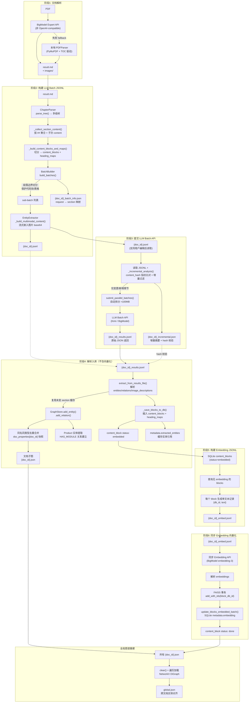
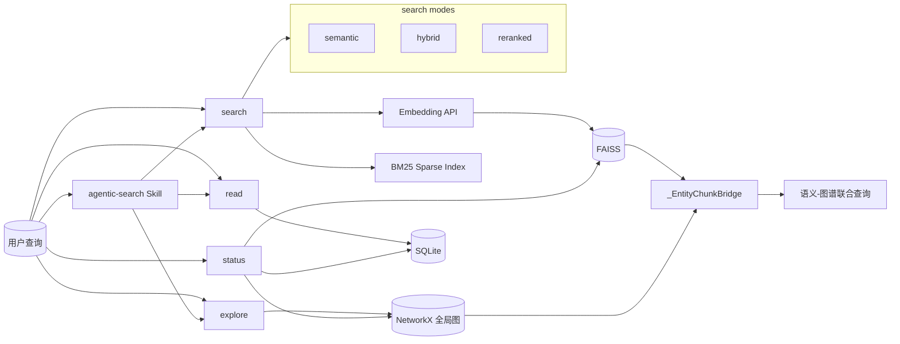

# work-docs-library

通用化技术文档知识库管理工具。

本项目是一个面向技术文档（**当前仅支持 PDF**）的自动化知识提取 pipeline，以 **Kimi Code CLI Plugin** 形式运行。它支持：

- **智能文档解析**：PDF 通过 BigModel Expert API 解析为 Markdown 文本 + 图片，保留完整格式；失败时自动 fallback 到本地 PDFParser
- **知识图谱构建**：自动提取实体（Feature、Module、Register、Signal、Instruction、Interrupt、PipelineStage、Peripheral 等）和关系（IMPLEMENTS、CONTAINS、HAS_REGISTER、INSTRUCTION_READS_REGISTER、MODULE_IMPLEMENTS_INSTRUCTION、INTERRUPT_TRIGGERS 等），构建可查询的跨层级知识图谱（RTL ↔ ISA）
- **向量语义检索**：基于 FAISS 的语义向量索引，支持相似度搜索
- **混合检索与重排序**：BM25 稀疏索引（支持 CJK 2-gram）与 FAISS 稠密检索通过 RRF 融合；LLM cross-encoder 对候选结果重排序，提升复杂查询精度
- **Agentic 搜索**：`AgenticSearchPlanner` 将复杂问题分解为 `SearchStep` 列表，支持多跳检索策略；Agent 通过 `skills/agentic-search/SKILL.md` 编排执行
- **Batch API 架构**：Batch API 优先：提取类 LLM 调用通过 Batch API 提交以降低成本；辅助 LLM 调用（重排序、Agentic 规划、评估 judge）使用同步 API。支持超大 JSONL 自动拆分并行处理
- **章节级增量更新**：文档修订后，按章节 `content_hash` 指纹比较，未变章节复用实体缓存与 embedding，仅对变更/新增章节进行 LLM 提取，万页级文档变更一页时成本降低 99%+
- **Multimodal 图片理解**：LLM 直接分析文档中的图片（时序图、架构框图、寄存器表等），生成文字描述用于向量化
- **评估框架**：`EvalQuestion`/`EvalDataset` 数据模型 + SQLite 持久化；支持 hit rate、MRR、NDCG 等检索指标，以及 Faithfulness、Context Precision、Context Recall 等 LLM-as-judge 指标

---

> ⚠️ **前置要求**：本项目依赖 Python 虚拟环境。首次安装后，请务必执行 [安装步骤](#安装) 创建 `.venv` 并安装依赖，否则 Kimi CLI 调用插件工具时会因缺少依赖而失败。

---

## 目录

1. [架构概览](#架构概览)
2. [目录结构](#目录结构)
3. [安装](#安装)
4. [快速开始](#快速开始)
5. [Plugin 工具说明](#plugin-工具说明)
6. [配置说明](#配置说明)
7. [核心模块说明](#核心模块说明)
8. [开发与测试](#开发与测试)
9. [已知限制与注意事项](#已知限制与注意事项)

---

## 架构概览

### DocGraphPipeline 六阶段架构



**数据流说明：**

1. **阶段1（解析）**：`BigModelParserClient` 调用 **BigModel 专用** Expert API 解析 PDF，输出 Markdown 文本（含 `` 图片引用）+ `images/` 目录（⚠️ 该 API 非 OpenAI-compatible，仅支持 BigModel 厂商；失败时自动 fallback 到本地 `PDFParser`，输出格式完全一致）
2. **阶段2（构建 LLM Batch）**：`ChapterParser.parse_tree()` 将 Markdown 解析为树形章节结构（`#` 文档标题，`##` 章节，`###+` 子章节）。`_collect_section_content()` 按 `##` section 递归聚合自身 content + 所有子孙 content（保留 Markdown 层级）。`_build_content_blocks_and_maps()` 使用 `_split_for_embedding()` 按 `BLOCK_MAX_CHARS`（默认 6000）将聚合内容切分为**向量化粒度**的 content_blocks（段落→句子→字符硬切分兜底，保护代码块/表格）。同时构建 `heading_maps`（`##`/`###`/`####` 都映射到同一 section 的 block 集合）。`BatchBuilder.build_batches()` **按 `section_title` 聚合**多个 content_blocks 为 LLM batch request，保持 LLM 大粒度提取；聚合后若超过 `LLM_BATCH_MAX_CHARS` 再按段落边界切分。`EntityExtractor` 流式解析图片引用，按原文顺序构建 multimodal content，生成 `{doc_id}.jsonl` + `{doc_id}_batch_info.json`
3. **阶段3（提交 LLM Batch）**：**优先读取** `batch/{doc_id}.jsonl`（支持用户编辑后重新提交），结合 `batch/{doc_id}_batch_info.json` 做增量过滤，仅对变更/新增章节的 requests 提交 Batch API。超大 JSONL 自动按 100MB 拆分并行提交。结果保存为 `{doc_id}_results.jsonl`，增量摘要保存为 `{doc_id}_incremental.json` 供阶段4校验一致性
4. **阶段4（解析入库，不含向量化）**：从 `results.jsonl` 解析 `entities`/`relationships`/`image_descriptions`，复用未变 section 的缓存实体/关系。`GraphStore`（NetworkX）构建图谱，**同名同类型实体自动去重合并**，每个文档保存独立子图 `graphs/{doc_id}.json`。同时保存每个文档的原始属性快照到 `doc_properties[doc_id]`，支持按文档精确查询。提取产品型号建立 `Product --[HAS_MODULE]--> Module` 关系。content_blocks 和 heading_maps 写入 SQLite，content_block 状态设为 `embedded`；每个 block 的 `metadata.extracted_entities` 缓存该 block 中提及的实体引用，作为后续跨粒度桥接索引的唯一数据源
5. **阶段5（构建 Embedding JSONL）**：从 SQLite 查询状态为 `embedded` 且暂无 `metadata.embedding` 的 content_blocks，每个 block 生成一条 `{db_id, text}` 记录，生成 `{doc_id}_embed.jsonl`
6. **阶段6（同步 Embedding 向量化）**：读取 `{doc_id}_embed.jsonl`，逐条调用同步 Embedding API（默认 BigModel `embedding-3`），在 FAISS 事务内用 `block_db_id` 作为存储 ID 写入 `IndexIDMap2`，事务提交后再写入 SQLite `metadata.embedding`，content_block 状态更新为 `done`。FAISS 与 SQLite 通过事务保证双写一致性
7. **跨粒度桥接索引**：`KnowledgeBaseService` 内部维护 `_EntityChunkBridge`，在 `__init__` 时从所有 content_blocks 的 `metadata.extracted_entities` 全量构建 `block_db_id ↔ (entity_type, entity_name)` 双向映射。`ingest_document` / `reprocess_document` 完成后自动同步。提供 O(1) 的正向查询（block→entities）和反向查询（entity→blocks），打通向量空间与图谱空间
8. **全局图谱重建**：`KnowledgeBaseService.ingest_document()` 完成后**全量重建**全局图 `graphs/global.json`（`clear()` + 遍历所有子图重新加载），确保无幽灵残留，实现**跨文档知识互通**

### 查询数据流



**查询流程说明：**

1. **`search` — 统一检索入口**
   - `mode=semantic`：通过 `EmbeddingClient` 对 query 编码，`VectorIndex.search` 在 FAISS 中检索最近邻，返回 `block_db_id` 与 dense score。
   - `mode=hybrid`：同时触发稠密检索（FAISS，top 50）与 BM25 稀疏检索（`BM25SparseIndex`，CJK 2-gram + 英文标识符分词，top 50）。`RRFFusionRetriever` 使用 RRF 公式 `score = Σ 1/(k+rank)`（默认 `k=60`）融合两份结果，按 fused score 返回 top_k blocks。
   - `mode=reranked`：先执行 hybrid 检索获取候选 passage 集合（`candidate_k` 默认 `top_k*4`），再通过 `LLMReranker` 或本地 `CrossEncoderReranker` 对 `(query, passage)` 打分，按 relevance score 降序返回 top_k；LLM/CrossEncoder 失败时回退到 hybrid 结果。
   - 三种模式均可通过 `graph_depth>0` 经 `_EntityChunkBridge` 扩展相关实体与子图。

2. **`explore` — 统一图谱入口**
   - `mode=entity`：按 `entity_type`/`name`/`name_pattern` 定位实体。
   - `mode=neighbors`：返回实体的邻居关系。
   - `mode=subgraph`：返回以实体为中心的子图。
   - `mode=path`：在 `NetworkX` 全局图中搜索两实体间的有向路径（默认 `max_depth=3`，兼容 `depth` 别名）。
   - `mode=provenance`：追溯实体到源 doc/chunk。
   - `mode=conflicts`：查看同名实体属性冲突日志。

3. **`read` — 内容读取**
   - 通过 `heading_maps` 索引按 `doc_id`/`chapter`/`chapter_regex`/`concept` 快速定位 blocks，或按 `chunk_db_id` 读取单个 block。
   - 返回完整未截断内容；设置 `with_entities=True` 时通过桥接索引返回关联实体/关系。

4. **`status` — 状态与元数据**
   - 查询文档状态、配置、目录、向量/图谱统计、冲突日志等。
   - `scope=toc` 查看文档目录；`scope=config` 查看脱敏配置。

5. **Agentic 搜索规划**
   - 复杂多跳问题通过外部 `agentic-search` Skill 编排：由 LLM 将问题分解为 `SearchStep` 列表（`semantic`/`hybrid`/`reranked`/`graph`/`chapter`/`metadata`/`synthesize`）。
   - 外部 Agent / Skill 按步骤调用 `search` / `explore` / `read` 等原子 MCP 工具，逐步收集证据并综合回答。

6. **语义-图谱联合查询**
   - `search` 命中 blocks 后，通过 `_EntityChunkBridge` 获取 block 提及的实体。
   - 对每个相关实体调用 `GraphStore.get_subgraph()`，返回 `{chunks, related_entities, subgraphs}`，实现向量空间与图谱空间的互通。

### 输入文档约束

本工具对被处理的 Markdown 文档（由 BigModel Expert 解析生成）有以下约束：

1. **图片引用格式**：必须使用标准 Markdown 格式 ``，其中 `image_name` 将作为全局唯一的 `image_id` 使用
2. **image_name 要求**：`[]` 中的名称应有意义且唯一（如 `"Figure 1: Timing Diagram"`），不建议留空。若留空，程序将退化为内部编号
3. **图片路径**：`()` 中的路径应为相对于解析输出目录的相对路径，且该路径下必须存在对应的实际图片文件
4. **章节层级**：使用 `#` 表示文档标题，`##` 表示章节，`###+` 表示子章节；`##` 是向量化切分与 batch 聚合的主要边界
5. **保留原始内容**：除按标题层级拆分与按 `BLOCK_MAX_CHARS` 切分外，不删除、不截断源文本；代码块与表格在切分时受到保护
6. **多文档一致性**：相同 `entity_type` + `name` 的实体在全局图中自动合并，属性冲突时保留完整性评分更高的版本

## 设计原则与 Agent 使用最佳实践

> 本插件是 AI Agent（Kimi Code 等）的 **MCP 扩展**，不是独立 SaaS。外部 Agent 通过组合原子 MCP 工具完成复杂任务，插件内部不启动完整 Agent 运行时。

### 核心设计原则

1. **复杂策略进 Skill，通用机制进代码**
   - Python 层只提供机制：PDF 解析、chunk 切分、向量检索、图谱 CRUD、单步搜索、评估指标。
   - Skill 层编排策略：导入 workflow、ReAct/Self-Ask 多跳检索、查询分解、结果批判。
   - 示例：`AgenticSearchPlanner` 只把问题分解为 `SearchStep` 列表，具体执行由 `agentic-search` Skill 编排。

2. **状态安全优先于智能**
   - 数据改写类操作（图谱 CRUD、全局图重建、强制重处理、反馈）保留在 `scripts/admin_tools.py`。
   - MCP 表面仅暴露一个写工具 `ingest`；其余均为只读查询工具。
   - Agent 不应尝试调用 `graph_upsert_entity`、`reprocess`、`rebuild_global_graph` 等未暴露工具。

3. **零数据丢失**
   - 源 Markdown 文本不会被过滤或截断。
   - 拆分只发生在标题边界与 `BLOCK_MAX_CHARS` 硬切分兜底，代码块与表格边界受到保护。

4. **来源可溯源**
   - 每个 entity/relation 都记录 `source_doc_ids` 与 `source_chapter`。
   - 回答用户时应优先调用 `explore` `mode=provenance` 或 `read` 确认来源，避免仅依赖图谱关系。

### Agent 使用建议

| 场景 | 推荐工具/Skill | 注意事项 |
|------|---------------|---------|
| 一次性事实查询 | `search` | 关键词明确用 `mode=hybrid`；概念/语义模糊用 `mode=semantic` |
| 需要高精度排序 | `search` `mode=reranked` | 成本更高，仅在对 recall/precision 敏感时使用 |
| 跨文档、多跳、关系问题 | `agentic-search` Skill | 由外部 Skill 编排 `search` / `explore` / `read` 多步执行 |
| 实体/关系/路径/来源/冲突 | `explore` | `mode=entity`/`neighbors`/`subgraph`/`path`/`provenance`/`conflicts` |
| 导入/更新文档 | `ingesting-workdocs` Skill | `ingest` 是长流程，必须用 background task + 轮询 `status` |
| 读取原始证据 | `read` | 按 doc/chapter 或 `chunk_db_id` 读取完整内容 |
| 查看配置/目录/状态 | `status` | `scope=config`/`toc`/`documents`/`quality` 等 |

## Skill 层级与调用路径

插件提供项目级 Skill 与用户级 Skill，Agent 应根据问题类型加载对应子 Skill：

| Skill | 路径 | 作用 | 典型场景 |
|-------|------|------|---------|
| `using-workdocs` | `skills/using-workdocs/SKILL.md` | 入口 Skill，负责派发至子 Skill | 用户首次提问，不确定 workflow |
| `ingesting-workdocs` | `skills/ingesting-workdocs/SKILL.md` | 导入/更新 PDF | 用户提供 PDF 或目录 |
| `exploring-workdocs` | `skills/exploring-workdocs/SKILL.md` | 查询、溯源、图谱探索 | 技术问答、关系查询 |
| `agentic-search` | `skills/agentic-search/SKILL.md` | 多跳 planned retrieval | 问题跨越多个文档，需要结构化检索计划 |
| `synthesizing-workdocs` | `skills/synthesizing-workdocs/SKILL.md` | 把检索结果综合为带引用报告 | 已拿到 search/explore/read 结果，需要生成答案 |
| `fixing-workdocs` | `skills/fixing-workdocs/SKILL.md` | 错误定位与图谱修正 | 用户指出实体/关系/答案错误 |

**推荐调用路径：**

```
using-workdocs（判断意图）
  ├── 导入/更新 → ingesting-workdocs → mcp__workdocs__ingest + status 轮询
  ├── 技术问答 → exploring-workdocs → search / explore / read → synthesizing-workdocs
  ├── 复杂多跳 → agentic-search → 分解 SearchStep → 逐步执行 search / explore / read → synthesizing-workdocs
  └── 用户纠错 → fixing-workdocs → status scope=trace → explore provenance → admin_tools 修正
```

---

## 目录结构

```
work-docs-library/
├── kimi.plugin.json              # Kimi Code 新规范插件 Manifest（MCP server + Skill）
├── skills/
│   ├── using-workdocs/
│   │   └── SKILL.md              # 入口：总览、规则、何时调用子 skill
│   ├── ingesting-workdocs/
│   │   └── SKILL.md              # 文档入库/更新/重试工作流
│   ├── exploring-workdocs/
│   │   └── SKILL.md              # 语义搜索 + 图谱联合查询工作流
│   ├── synthesizing-workdocs/
│   │   └── SKILL.md              # 把检索结果综合为带引用报告
│   └── fixing-workdocs/
│       └── SKILL.md              # 错误定位与图谱修正工作流
├── AGENTS.md                     # Agent 开发指南（架构、策略、代码规范）
├── README.md                     # 本文件
├── scripts/
│   ├── mcp_server.py             # MCP stdio server（JSON-RPC，stdout 隔离）
│   ├── plugin_router.py          # Plugin 工具函数库（被 mcp_server / admin_tools 复用）
│   ├── .env.example              # 环境变量模板
│   ├── .env                      # 实际环境变量（gitignored）
│   ├── prompts/                  # LLM 提示词文件（运行时读取，无需重启）
│   │   ├── entity_extraction_system.txt   # 实体提取 system 提示词
│   │   └── entity_extraction_user.txt     # 实体提取 user 模板
│   ├── core/                     # 业务逻辑层
│   │   ├── config.py             # 配置中心
│   │   ├── doc_graph_pipeline.py # ⭐ DocGraphPipeline 主管道
│   │   ├── batch_clients.py      # BaseBatchClient + BatchClient（通用，服务商无感）
│   │   ├── llm_chat_client.py    # LLM 对话客户端（辅助用途）
│   │   ├── embedding_client.py   # Embedding 客户端（辅助用途）
│   │   ├── bigmodel_parser_client.py  # BigModel Expert 文件解析
│   │   ├── graph_store.py        # 图谱存储（NetworkX）
│   │   ├── db.py                 # SQLite 数据库操作
│   │   ├── vector_index.py       # FAISS 向量索引管理
│   │   ├── sparse_index.py       # BM25 稀疏索引（CJK 2-gram 分词）
│   │   ├── hybrid_retriever.py   # RRF 融合稠密 + 稀疏检索
│   │   ├── reranker.py           # LLM cross-encoder 重排序
│   │   ├── agentic_search.py     # Agentic 搜索规划器（SearchStep 分解）
│   │   ├── evaluation.py         # 评估框架（检索指标 + LLM-as-judge）
│   │   ├── models.py             # 数据模型 (Document/Chunk/EvalQuestion/EvalDataset)
│   │   ├── enums.py              # StrEnum 定义 (ChunkStatus/DocumentStatus/ChunkType)
│   │   ├── knowledge_base_service.py  # 统一服务层封装
│   │   └── status_collector.py   # 结构化状态收集与仪表盘数据聚合
│   ├── parsers/                  # IO / 解析层
│   │   ├── pdf_parser.py         # PDF 本地解析器（fallback，输出与 BigModel 一致）
│   │   ├── office_parser.py      # DOCX / XLSX 解析器（代码存在，尚未接入 pipeline）
│   │   └── image_utils.py        # 图片压缩工具
│   └── tests/                    # pytest 测试集（506 个用例）
├── knowledge_base/               # 运行时自动生成
│   ├── workdocs.db               # SQLite 元数据
│   ├── faiss.index               # FAISS 向量索引（IndexIDMap2，直接存储 block_db_id）
│   ├── parsed/<doc_id>/          # Stage1 解析输出（result.md + images/）
│   ├── batch/                    # Stage2/3/5/6 中间产物（*.jsonl, *_info.json）
│   └── graphs/                   # Stage4 子图快照（{doc_id}.json, global.json）
├── .venv/                        # Python 虚拟环境
└── .gitignore
```

> 项目级 Skill：`skills/agentic-search/SKILL.md` 提供多跳 Agentic 搜索工作流，由外部 Agent 编排调用。

---

## 安装

### 环境要求

- Python >= 3.11
- 支持 Linux/macOS/Windows（主要测试于 Linux）

### 安装步骤

推荐在虚拟环境中安装，避免与系统包管理冲突：

```bash
cd ~/.kimi/plugins/work-docs-library

# 方式一：使用 uv（推荐，自动创建虚环境并安装依赖）
uv sync

# 方式二：使用 pip（需手动创建虚环境）
python3 -m venv .venv
source .venv/bin/activate
pip install -e .
```

### 配置

复制环境变量模板并编辑：

```bash
cp scripts/.env.example scripts/.env
# 编辑 scripts/.env，填入你的 API Key
```

### 注册插件

在 Kimi Code CLI 中安装（manifest 为 `kimi.plugin.json`）：

```bash
/plugins install ~/.kimi/plugins/work-docs-library
```

安装成功后，会话启动时会自动加载 `skills/using-workdocs/SKILL.md`。复杂工作流会进一步引用 `ingesting-workdocs`（文档入库）或 `exploring-workdocs`（查询+图谱联合分析）。Agent 通过 `mcp__workdocs__*` 调用插件能力。

---

## 快速开始

本项目以 **Kimi Code CLI Plugin** 形式运行，通过 MCP 工具调用。

### 1. 导入文档（完整流程）

```text
# 在 Kimi CLI 中通过 MCP 工具调用
mcp__workdocs__ingest {"path": "path/to/document.pdf"}
```

处理流程：
1. BigModel Expert 解析 PDF → Markdown + 图片
2. 构建树形章节结构
3. 按 batch 提交到 Kimi Batch API 进行实体提取
4. 构建知识图谱并持久化
5. 向量化后写入 SQLite + FAISS

### 2. 分阶段导入（支持人工干预，不通过 MCP）

当需要审查或修正中间产物时，可使用六阶段流程。每个阶段的产物均持久化到磁盘，支持人工编辑后重新触发下游阶段。

> 阶段工具（`doc_parse`、`doc_build_batches` 等）以及 `reprocess`、`rebuild_global_graph` 属于数据改写/管理操作，**不通过 MCP 暴露给 Agent**。它们通过 `scripts/admin_tools.py` 提供命令行入口，或可直接调用 `KnowledgeBaseService` Python API。
> （内部函数名 `doc_parse` 对应 admin 命令 `stage1_parse`，`doc_build_batches` 对应 `stage2_build_jsonl`，`doc_submit_batches` 对应 `stage3_submit_batches`，`doc_ingest_results` 对应 `stage4_ingest_results`，`doc_build_embed_jsonl` 对应 `stage5_build_embed_jsonl`，`doc_submit_embed_batches` 对应 `stage6_submit_embed_batches`。）

#### 阶段1: 解析（PDF → Markdown）

```bash
python scripts/admin_tools.py stage1_parse --params '{"file_path":"path/to/document.pdf","output_dir":"knowledge_base/parsed"}'
```

- **输入**: PDF 文件
- **输出**: `knowledge_base/parsed/{doc_id}/result.md` + `images/`
- **干预**: 直接编辑 `result.md`（修正文本、调整标题层级、补充内容）
- **触发下一阶段**: `python scripts/admin_tools.py stage2_build_jsonl --params '{"doc_id":"{doc_id}"}'`
- **注意**: 编辑后 content_hash 会变化，阶段3 的增量分析将识别为全部变更

#### 阶段2: 构建 Batch JSONL

```bash
python scripts/admin_tools.py stage2_build_jsonl --params '{"doc_id":"{doc_id}"}'
# 可选在 params 中加入 "max_chars": 10000（每个 batch 最大字符数）
```

> `stage2_build_batches` 仍可作为兼容别名使用。

- **输入**: `parsed/{doc_id}/result.md`
- **输出**: `batch/{doc_id}.jsonl` + `batch/{doc_id}_batch_info.json`
- **产物格式**: `jsonl` 每行是一个 JSON request，body 包含 `model`/`messages`/`response_format`/`extra_body`（含 thinking 参数）
- **干预**: 编辑 `jsonl`（修改 prompt、删除不想提交的 request、调整 messages）
- **⚠️ 关键限制**:
  - 删除 requests：无需同步修改 `batch_info.json`（代码会安全忽略多余的映射条目）
  - 修改 `custom_id`：无需同步修改 `batch_info.json`（不会报错，但该 request 在增量过滤时可能不会被选中）
  - **新增 requests：必须在 `batch_info.json` 中同步添加对应的 `custom_id` → `section_title` 映射**，否则 stage4 的 `chapter_map` 无法回填，导致新增实体的 `source_chapter` 为空
  - `extra_body.thinking` 会被 stage3 自动补充（无需手动添加）
- **触发下一阶段**: `python scripts/admin_tools.py stage3_submit_batches --params '{"doc_id":"{doc_id}"}'`

#### 阶段3: 提交 LLM Batch API（支持 Chat 回退）

```bash
python scripts/admin_tools.py stage3_submit_batches --params '{"doc_id":"{doc_id}"}'
# 可选在 params 中加入：
#   "file_path": "PATH"（原始 PDF 路径，数据库无记录时必填）
#   "jsonl_path": "PATH"（自定义 JSONL 路径）
#   "force": true（强制重新处理，忽略缓存）
```

- **输入**: 优先读取 `batch/{doc_id}.jsonl`（支持用户编辑后重新提交），结合 `batch_info.json` 做增量过滤
- **输出**: `batch/{doc_id}_results.jsonl` + `batch/{doc_id}_incremental.json`
- **产物格式**: `results.jsonl` 每行是一个 JSON response，`response.body.choices[0].message.content` 是 LLM 提取的 entities/relations/image_descriptions
- **干预**: 编辑 `results.jsonl`（修正 LLM 提取错误：修改 entity 名称、添加遗漏的关系、修正图片描述）
- **注意**: `incremental.json` 是机器生成的 hash 校验文件，**不要手动编辑**
- **模式切换**: 设置 `WORKDOCS_LLM_MODE=chat`（`.env` 中）可切换到同步 Chat API 模式。Chat 模式逐条调用同步 API，结果以与 Batch API 完全一致的格式写入 `results.jsonl`，Stage 4 无需任何修改即可复用。单条失败不中断流程，适合调试或 Batch API 不可用时作为回退
- **触发下一阶段**: `python scripts/admin_tools.py stage4_ingest_results --params '{"doc_id":"{doc_id}"}'`

#### 阶段4: 解析入库（不含向量化）

```bash
python scripts/admin_tools.py stage4_ingest_results --params '{"doc_id":"{doc_id}"}'
# 可选在 params 中加入：
#   "file_path": "PATH"（原始 PDF 路径）
#   "results_path": "PATH"（自定义 results.jsonl 路径）
#   "force": true（强制重新处理）
```

- **输入**: `batch/{doc_id}_results.jsonl` + `batch/{doc_id}_batch_info.json` + `batch/{doc_id}_incremental.json`
- **输出**: SQLite content_blocks + heading_maps（content_block 状态 `embedded`）+ `graphs/{doc_id}.json`
- **干预**: 直接编辑 `graphs/{doc_id}.json`（但推荐通过 `graph_upsert_entity`/`graph_upsert_relation` 等管理命令修改，自动维护索引一致性）
- **注意**: 直接编辑子图后，必须调用 `python scripts/admin_tools.py rebuild_global_graph` 才能同步全局图 `global.json`
- **触发下一阶段**: `python scripts/admin_tools.py stage5_build_embed_jsonl --params '{"doc_id":"{doc_id}"}'`

#### 阶段5: 构建 Embedding Batch JSONL

```bash
python scripts/admin_tools.py stage5_build_embed_jsonl --params '{"doc_id":"{doc_id}"}'
```

- **输入**: SQLite content_blocks（状态 `embedded` 且暂无 `metadata.embedding`）
- **输出**: `batch/{doc_id}_embed.jsonl`
- **分组逻辑**: 每个需要向量化的 block 生成一条 `{db_id, text}` 记录
- **产物格式**: `embed.jsonl` 每行是 `{"db_id": <int>, "text": <str>}`
- **干预**: 编辑 `embed.jsonl`（删除不想向量化的 blocks）
- **⚠️ 关键限制**:
  - 删除行：可直接删除，不影响其他行（每个 block 独立）
  - 新增行：不建议新增（新 block 需先有 db_id）
- **触发下一阶段**: `python scripts/admin_tools.py stage6_submit_embed_batches --params '{"doc_id":"{doc_id}"}'`

#### 阶段6: 同步 Embedding 向量化

```bash
python scripts/admin_tools.py stage6_submit_embed_batches --params '{"doc_id":"{doc_id}"}'
# 可选在 params 中加入 "embed_jsonl_path": "PATH"（自定义 Embedding JSONL 路径）
```

- **输入**: `batch/{doc_id}_embed.jsonl`
- **输出**: SQLite `metadata.embedding` + FAISS 向量索引
- **处理逻辑**: 读取 JSONL 逐条调用同步 Embedding API（`EmbeddingClient.embed_single()`），在 FAISS 事务内用 `block_db_id` 作为存储 ID 写入 `IndexIDMap2`；事务提交后再批量写入 SQLite `metadata.embedding`。SQLite 失败时自动回滚 FAISS
- **干预**: 无（此阶段纯 API 调用与结果入库）
- **content_block 状态**: `embedded` → `done`

### 3. 语义搜索

```text
mcp__workdocs__search {"mode": "semantic", "text": "AH bus arbitration", "top_k": 5}
```

### 4. 混合检索与重排序

```text
# 稠密向量 + BM25 稀疏检索，RRF 融合
mcp__workdocs__search {"mode": "hybrid", "text": "AH bus arbitration priority", "top_k": 5}

# 混合检索候选 + LLM cross-encoder 重排序（更精准，成本更高）
mcp__workdocs__search {"mode": "reranked", "text": "AH bus arbitration priority", "top_k": 5, "candidate_k": 20}
```

### 5. Agentic 搜索规划

复杂多跳问题由外部 `agentic-search` Skill 编排，将问题分解为可执行的 `SearchStep` 列表，再由 Agent 逐条调用原子 MCP 工具完成：

```text
# 由 agentic-search Skill 内部处理
# 典型步骤：search(mode=semantic) → explore(mode=neighbors) → read → synthesize
```

`SearchStep` 可包含 `semantic` / `hybrid` / `reranked` / `graph` / `chapter` / `metadata` / `synthesize` 等类型，执行时映射到 `search` / `explore` / `read` / `status`。详见 `skills/agentic-search/SKILL.md`。

### 6. 读取内容

支持按章节子串、正则、概念或单个 block 读取完整内容：

```text
# 子串匹配："CPU" 可匹配 "2.1 CPU Architecture"
mcp__workdocs__read {"doc_id": "<DOC_HASH>", "chapter": "CPU"}

# 正则匹配（利用 heading_maps 索引，避免全表扫描）
mcp__workdocs__read {"doc_id": "<DOC_HASH>", "chapter_regex": "^2\\."}

# 按概念查询（匹配 heading_maps 中的标题关键词）
mcp__workdocs__read {"doc_id": "<DOC_HASH>", "concept": "CPU Architecture"}

# 按 block id 读取
mcp__workdocs__read {"chunk_db_id": 42}
```

### 7. 查看已导入文档

```text
mcp__workdocs__status {}
```

### 8. 图谱查询

通过 `mcp__workdocs__explore` 查询实体、邻居、路径、来源与冲突：

```text
# 查询实体
mcp__workdocs__explore {"mode": "entity", "entity_type": "Module", "name": "GPIO"}

# 查询邻居
mcp__workdocs__explore {"mode": "neighbors", "entity_type": "Module", "name": "GPIO", "depth": 1}

# 查询两实体间路径
mcp__workdocs__explore {"mode": "path", "from_type": "Module", "from_name": "GPIO", "to_type": "Register", "to_name": "GPADIR"}

# 来源溯源
mcp__workdocs__explore {"mode": "provenance", "entity_type": "Module", "name": "GPIO"}

# 属性冲突
mcp__workdocs__explore {"mode": "conflicts", "entity_type": "Module", "name": "GPIO"}
```

图谱数据也以 JSON 格式持久化，可直接读取：

```bash
# 查看生成的图谱文件
ls knowledge_base/graphs/

# 查看图谱统计
python -c "
import json, sys
with open('knowledge_base/graphs/<doc_id>.json') as f:
    g = json.load(f)
print(f'entities={len(g.get(\"nodes\", []))}, relations={len(g.get(\"edges\", []))}')
"
```

### 9. 运行评估

```bash
# 先通过 KnowledgeDB API 创建 EvalDataset，然后运行评估
python scripts/admin_tools.py run_eval --params '{"dataset_name":"my_eval","retriever":"hybrid","top_k":10}'
```

- 评估命令属于数据改写/管理操作，**不通过 MCP 暴露给 Agent**，仅通过 `scripts/admin_tools.py` 提供。
- 当前支持 `evaluate` / `run_eval` 两个兼容别名。

---

## Plugin 工具说明

本插件遵循最新 Kimi Code 插件规范，并秉持 **AI Agent Native Plugin 原则**：复杂策略（如 Agentic 搜索、评估流程）由外部 Agent 通过 Skill 编排，插件内部只提供原子机制（搜索、读取、评分、记录），从而将 LLM 成本留给外部 Agent 决策，而不是在插件内部隐藏多轮推理。

- **Manifest**：`kimi.plugin.json` 声明了一个 MCP server (`workdocs`) 和会话启动 Skill (`using-workdocs`)。
- **MCP 工具**：仅暴露适合 Agent 自主调用的 **读取 + 导入** 类工具，调用格式为 `mcp__workdocs__<tool_name>`。
- **管理工具**：数据改写/阶段调试类功能不通过 MCP 暴露，保留在 `scripts/admin_tools.py` 中供手动维护（覆盖全部 pipeline 阶段与管理命令）。

### MCP 工具（5 个）

| MCP 工具名 | 作用 |
|-----------|------|
| `mcp__workdocs__search` | 统一检索入口：`mode=semantic`（语义向量）、`mode=hybrid`（BM25 + FAISS RRF）、`mode=reranked`（hybrid + LLM cross-encoder 重排序）。`graph_depth>0` 时联合图谱扩展 |
| `mcp__workdocs__explore` | 统一图谱入口：`mode=entity`/`neighbors`/`subgraph`/`path`/`provenance`/`conflicts` |
| `mcp__workdocs__read` | 按章节、关键词、概念或 `chunk_db_id` 读取 content_block 完整内容，可选返回关联图谱实体/关系 |
| `mcp__workdocs__ingest` | 一键导入 PDF/目录，自动完成解析→Batch→入库→向量化 |
| `mcp__workdocs__status` | 状态仪表盘：`scope=overview`/`documents`/`vectors`/`graph`/`blocks`/`headings`/`conflicts`/`feedback`/`config`/`quality`/`ingest_pipeline`/`toc`/`trace`/`usage`/`all`。`trace` 回放查询路径，`usage` 审计使用热点 |

### 不暴露为 MCP 的内部功能

以下功能直接改写知识库数据或属于人工阶段调试，不进入 MCP 工具面：
`doc_parse`（对应 `stage1_parse`）、`doc_build_batches`（对应 `stage2_build_jsonl`）、`doc_submit_batches`（对应 `stage3_submit_batches`）、`doc_ingest_results`（对应 `stage4_ingest_results`）、`doc_build_embed_jsonl`（对应 `stage5_build_embed_jsonl`）、`doc_submit_embed_batches`（对应 `stage6_submit_embed_batches`）、`reprocess`、`evaluate` / `run_eval`、`graph_upsert_entity`、`graph_delete_entity`、`graph_upsert_relation`、`graph_delete_relation`、`graph_feedback`、`rebuild_global_graph`、`usage_report`、`usage_clean`。

---

## 配置说明

### 配置优先级架构

```
1. 环境变量（系统环境变量，如 `WORKDOCS_LLM_API_KEY`）— 运行时注入，优先级最高
   ↓
2. `.env` 文件（`scripts/.env`）— 用户手动配置
   ↓
3. 代码硬编码默认值
```

所有配置均通过 `WORKDOCS_*` 环境变量管理：
- **环境变量**：CI/容器/Kimi Code CLI 运行时注入，优先级最高，可临时覆盖 `.env`。
- **`.env`**：用户手动配置（`scripts/.env`），适合存放 API Key 等凭证，gitignored，不进入版本控制。当环境变量未设置时生效。
- **代码默认值**：当 `.env` 和环境变量均未设置时回退。

> 注意：新版 `kimi.plugin.json` 不再使用旧 `plugin.json` 的 `inject`/`configFile` 字段。`config.json` 已移除，请使用 `scripts/.env`。

### 完整配置参考

| 环境变量 | 默认值 | 说明 |
|---------|--------|------|
| **LLM 配置** | | | |
| `WORKDOCS_LLM_API_KEY` | 空 | Kimi API Key（Batch API 实体提取用） |
| `WORKDOCS_LLM_BASE_URL` | `https://api.moonshot.cn/v1` | Kimi Base URL |
| `WORKDOCS_LLM_MODEL` | `kimi-k2.5` | 对话模型 |
| `WORKDOCS_LLM_THINKING_ENABLED` | `0` | 是否启用 thinking 模式（`1`=`enabled`，`0`=`disabled`）。Kimi K2.6 等模型 thinking 默认开启，**必须显式传递**才能可靠关闭 |
| `WORKDOCS_LLM_MODE` | `batch` | LLM 实体提取模式：`batch`（Batch API，成本为同步的 50%，默认）或 `chat`（同步 Chat API，逐条调用，适合调试或 Batch API 不可用时回退） |
| `WORKDOCS_LLM_BATCH_ENDPOINT` | `/v1/chat/completions` | LLM Batch API endpoint |
| `WORKDOCS_LLM_BATCH_COMPLETION_WINDOW` | `24h` | Batch 完成窗口（如 `24h`） |
| `WORKDOCS_LLM_BATCH_MAX_CHARS` | `10000` | 每个 LLM batch 最大文本字符数（LLM 聚合粒度） |
| `WORKDOCS_BLOCK_MAX_CHARS` | `6000` | content_blocks 存储切分粒度（向量化粒度），基于 BigModel embedding-3 经验值 |
| `WORKDOCS_LLM_BATCH_TIMEOUT` | `3600` | LLM Batch API 轮询超时（秒） |
| `WORKDOCS_LLM_MAX_RETRIES` | `3` | LLM 同步请求最大重试次数 |
| `WORKDOCS_LLM_RETRY_BACKOFF` | `2` | LLM 重试退避系数（秒） |
| `WORKDOCS_LLM_TIMEOUT` | `120` | LLM 同步请求超时（秒）（保留兼容） |
| `WORKDOCS_HTTP_TIMEOUT` | `120` | 统一 HTTP 请求超时（秒） |
| `WORKDOCS_HTTP_RETRY_MAX_ATTEMPTS` | `3` | 统一 HTTP 请求最大重试次数 |
| `WORKDOCS_HTTP_RETRY_BASE_DELAY` | `1.0` | 统一 HTTP 重试基础退避（秒） |
| `WORKDOCS_HTTP_RETRY_MAX_DELAY` | `60.0` | 统一 HTTP 重试最大退避（秒） |
| `WORKDOCS_HTTP_RETRY_JITTER` | `true` | 是否启用退避抖动 |
| `WORKDOCS_HTTP_RETRY_RESPECT_RETRY_AFTER` | `true` | 是否优先使用服务端 Retry-After 头 |
| **图片配置** | | | |
| `WORKDOCS_IMAGE_MAX_SIZE` | `1024` | 图片压缩最长边（px） |
| `WORKDOCS_IMAGE_QUALITY` | `80` | JPEG 压缩质量 1-100（color 模式默认） |
| `WORKDOCS_IMAGE_GRAYSCALE_QUALITY` | `75` | JPEG L 模式质量（grayscale 模式默认） |
| `WORKDOCS_IMAGE_GRAYSCALE_CHROMA_DIST` | `15.0` | 色度距离阈值（像素值 [0,255]） |
| `WORKDOCS_IMAGE_GRAYSCALE_LOW_CHROMA_RATIO` | `0.95` | 低色度像素占比阈值，超过即判定为 grayscale/blackwhite |
| `WORKDOCS_IMAGE_BLACKWHITE_EDGE_RATIO` | `0.90` | 亮度边缘（<20 或 >235）占比阈值，超过且低色度即判定为 blackwhite |
| **Embedding 配置** | | | |
| `WORKDOCS_EMBEDDING_API_KEY` | 空 | BigModel API Key（向量化用） |
| `WORKDOCS_EMBEDDING_BASE_URL` | `https://open.bigmodel.cn/api/paas/v4` | BigModel Base URL |
| `WORKDOCS_EMBEDDING_MODEL` | `embedding-3` | 向量化模型 |
| `WORKDOCS_EMBEDDING_DIMENSION` | `1024` | 向量维度 |
| `WORKDOCS_EMBEDDING_ENDPOINT` | `/v4/embeddings` | Embedding API endpoint（相对路径） |
| `WORKDOCS_EMBED_MAX_RETRIES` | `3` | Embedding 同步请求最大重试次数（保留兼容） |
| `WORKDOCS_EMBED_RETRY_BACKOFF` | `2` | Embedding 重试退避系数（秒）（保留兼容） |
| `WORKDOCS_EMBED_TIMEOUT` | `120` | Embedding 同步请求超时（秒）（保留兼容） |
| `WORKDOCS_EMBED_MAX_CHARS_PER_TEXT` | `8192` | 单条 Embedding 文本最大字符数，超过则拆分 |
| `WORKDOCS_EMBED_SPLIT_OVERLONG` | `true` | 是否对超长文本自动拆分后 embed |
| **Parser 配置** | | | |
| `WORKDOCS_PARSER_API_KEY` | 空 | BigModel Expert 解析 API Key（⚠️ 仅用于 PDF 解析，为 BigModel 专有接口） |
| `WORKDOCS_PARSER_BASE_URL` | `https://open.bigmodel.cn/api/paas/v4` | BigModel Expert 解析 Base URL |
| `WORKDOCS_PARSER_TIMEOUT` | `60` | 解析请求超时（秒） |
| `WORKDOCS_PARSER_MAX_RETRIES` | `60` | 解析轮询最大重试次数 |
| `WORKDOCS_PARSER_POLL_INTERVAL` | `3` | 解析轮询间隔（秒） |
| `WORKDOCS_PARSER_MIN_IMAGE_WIDTH` | `100` | 可识别为图的最小宽度（px） |
| `WORKDOCS_PARSER_MIN_IMAGE_HEIGHT` | `100` | 可识别为图的最小高度（px） |
| `WORKDOCS_PARSER_PAGE_RENDER_DPI` | `200` | 页面/图片渲染 DPI |
| `WORKDOCS_PARSER_TABLE_DETECTION_ENABLED` | `true` | 是否启用表格检测 |
| `WORKDOCS_PARSER_TABLE_OVERLAP_THRESHOLD` | `0.5` | 表格与 drawing 重叠判定阈值 |
| `WORKDOCS_PARSER_TABLE_MIN_ROWS` | `2` | 表格最小行数 |
| `WORKDOCS_PARSER_TABLE_MIN_COLS` | `2` | 表格最小列数 |
| `WORKDOCS_PARSER_TABLE_MIN_HEIGHT_PT` | `20.0` | 表格最小高度（pt） |
| `WORKDOCS_PARSER_TABLE_MIN_WIDTH_RATIO` | `0.15` | 表格最小宽度占页面比例 |
| `WORKDOCS_PARSER_TAB_MERGE_THRESHOLD_PT` | `4.0` | 制表位/列间隙合并阈值（pt） |
| `WORKDOCS_PARSER_IMAGE_SIZE_LIMIT` | `0.05` | 过小图片面积占比上限 |
| `WORKDOCS_PARSER_MAX_IMAGES_PER_PAGE` | `30` | 单页最多渲染图片数 |
| `WORKDOCS_PARSER_FIGURE_MIN_SCORE` | `2.0` | 候选 zone 被视为 figure 的最低评分 |
| `WORKDOCS_PARSER_EDGE_LABEL_MAX_LEN` | `30` | 图边缘标注文本最大长度 |
| **Batch 通用配置** | | | |
| `WORKDOCS_BATCH_POLL_INTERVAL` | `10` | Batch 状态轮询间隔（秒） |
| `WORKDOCS_BATCH_MAX_POLL_RETRIES` | `360` | Batch 状态轮询最大次数 |
| `WORKDOCS_BATCH_MAX_FILE_SIZE_MB` | `100` | 单个 JSONL 文件大小上限（MB） |
| `WORKDOCS_BATCH_PARALLEL_WORKERS` | `4` | 并行 batch 提交线程数 |
| `WORKDOCS_BATCH_FILE_DOWNLOAD_TEMPLATE` | `{base_url}/files/{file_id}/content` | Batch 结果下载 URL 模板 |
| `WORKDOCS_PARSE_OUTPUT_DIR` | `parsed` | PDF 解析输出目录 |
| `WORKDOCS_BATCH_OUTPUT_DIR` | `batch` | Batch 产物输出目录 |
| **Plugin 默认值** | | | |
| `WORKDOCS_PLUGIN_SEARCH_TOP_K` | `5` | 语义搜索默认返回条数 |
| `WORKDOCS_PLUGIN_QUERY_TOP_K` | `10` | 查询默认返回条数 |
| `WORKDOCS_PLUGIN_GRAPH_MAX_DEPTH` | `3` | 图谱查询默认最大深度 |
| `WORKDOCS_PLUGIN_SUBGRAPH_DEPTH` | `1` | 子图扩展默认深度 |
| `WORKDOCS_PLUGIN_DEFAULT_LIMIT` | `100` | 默认分页限制 |
| `WORKDOCS_PLUGIN_BM25_TOP_K` | `50` | 混合检索中 BM25 稀疏检索默认召回条数 |
| `WORKDOCS_PLUGIN_HYBRID_RRF_K` | `60` | RRF 融合常数 k，控制排名衰减速度 |
| **Pipeline / Graph** | | | |
| `WORKDOCS_GRAPH_MAX_PATH_DEPTH` | `6` | 图谱路径搜索最大深度 |
| `WORKDOCS_GRAPH_OUTPUT_DIR` | `graphs` | 图谱 JSON 输出目录 |

### 超时调节指南

处理长文档或多图文档时，若遇到 `Read timed out. (read timeout=120)` 错误，需要调大同步请求超时参数。

**什么情况下需要调节？**
- 使用 Chat 模式（`LLM_MODE=chat`）处理长文档
- 请求包含 multimodal 图片（图片越多、越大，模型处理时间越长）
- 单个 chapter 的文本超过 500KB
- 当前默认 120 秒不足以完成模型推理

**超时后会发生什么？**
- Chat 模式下，`_post()` 在超时后**不再进行无意义重试**（重试使用相同 timeout 无法解决请求过大的问题）
- 失败请求会以 500 状态码记录到 `results.jsonl`，Stage 4 会跳过该请求（对应 chapter 无实体提取结果）
- 日志会输出当前超时值和建议调节值

**如何调节？**

环境变量方式（即时生效，重启后保留需写入 `.env`）：
```bash
export WORKDOCS_LLM_TIMEOUT=300
# 或写入 scripts/.env
```

**建议值参考**：
| 文档类型 | 建议 timeout |
|---------|-------------|
| 纯文本短文档（<100KB） | 120s（默认） |
| 中等文档（100KB~500KB，少量图片） | 180~300s |
| 长文档（>500KB 或大量图片） | 300~600s |

**其他相关超时参数**：
- `WORKDOCS_LLM_BATCH_TIMEOUT=3600`：Batch API 轮询超时（通常无需调节）
- `WORKDOCS_EMBED_TIMEOUT=120`：Embedding 同步请求超时（纯文本向量化，通常无需调节）
- `WORKDOCS_PARSER_TIMEOUT=60`：PDF 解析超时（BigModel Expert 解析通常很快，无需调节）

---

## 核心模块说明

### 文档处理管道
| 模块 | 职责 |
|------|------|
| `core/doc_graph_pipeline.py` | ⭐ **DocGraphPipeline**：主管道，涵盖解析 → 章节树 → batch 构建 → multimodal 实体提取 → 结果保存 → 解析入库 → 图谱 → 向量化 |
| `core/bigmodel_parser_client.py` | BigModel Expert 文件解析客户端（⚠️ BigModel 专用 API） |
| `core/batch_clients.py` | BaseBatchClient + BatchClient（通用 OpenAI-compatible Batch API，含并行批处理与结果保存） |
| `core/llm_chat_client.py` | LLM 对话客户端（辅助用途） |
| `core/knowledge_base_service.py` | 统一服务层封装（DB + VectorIndex + GraphStore + Pipeline + `_EntityChunkBridge` 跨粒度桥接索引） |

### 数据模型与存储
| 模块 | 职责 |
|------|------|
| `core/graph_store.py` | GraphEntity / GraphRelation / NetworkXGraphStore：实体关系图谱 |
| `core/db.py` | KnowledgeDB：SQLite 增删改查 |
| `core/vector_index.py` | VectorIndex：FAISS 向量索引管理 |
| `core/models.py` | Chunk、Document、EvalQuestion、EvalDataset 数据模型 |

### 检索与评估
| 模块 | 职责 |
|------|------|
| `core/sparse_index.py` | `BM25SparseIndex`：基于 content_blocks 的内存 BM25 稀疏索引，CJK 2-gram + 英文标识符分词 |
| `core/hybrid_retriever.py` | `RRFFusionRetriever`：稠密向量检索与 BM25 稀疏检索的 RRF 融合 |
| `core/reranker.py` | `Reranker` ABC + `LLMReranker`（LLM 打分）+ `CrossEncoderReranker`（本地 CrossEncoder，默认 `BAAI/bge-reranker-v2-m3`） |
| `core/agentic_search.py` | `AgenticSearchPlanner` + `SearchStep`：将复杂问题分解为可执行检索步骤（不执行，供 Skill 编排） |
| `core/evaluation.py` | `EvalHarness` + LLM-as-judge 指标（Faithfulness / Context Precision / Context Recall / Answer Relevancy）+ 检索指标（hit rate / MRR / NDCG） |

### 配置
| 模块 | 职责 |
|------|------|
| `core/config.py` | 统一配置中心，环境变量 → `.env` → 默认值 三层优先级 |

### 状态与监控
| 模块 | 职责 |
|------|------|
| `core/status_collector.py` | 结构化状态收集与仪表盘数据聚合，支持 documents/blocks/graphs 等多 scope 统计 |

---

## 数据库与存储架构

### Schema

数据库位于 `knowledge_base/workdocs.db`。

#### `documents` — 文档元数据
| 字段 | 说明 |
|------|------|
| `doc_id` (PK) | 文件内容 MD5 哈希 |
| `title` | 文档标题 |
| `source_path` (UNIQUE) | 原始文件路径 |
| `file_type` | `.pdf` |
| `total_pages` | PDF 物理页数 |
| `chapters` | JSON 序列化的章节列表 |
| `extracted_at` | 处理时间戳（ISO 格式） |
| `file_hash` | 内容哈希 |
| `status` | `pending` → `processing` → `batch_submitted` → `done` / `failed` |

#### `content_blocks` — 内容块（方案C：存储粒度）
| 字段 | 说明 |
|------|------|
| `id` (PK, AUTOINCREMENT) | SQLite 自增 ID，FAISS `IndexIDMap2` 直接用它作为存储 ID |
| `doc_id` (FK) | 所属文档 |
| `block_id` | 逻辑 ID（如 `b_0`） |
| `content` | 文本内容（按 `##` section 聚合后切分） |
| `seq_index` | 全局序列号，保证文档内顺序 |
| `metadata` | JSON：嵌入向量、content_hash、**`extracted_entities`**（block→实体映射，桥接索引数据源）、缓存的关系、图片描述等 |
| `status` | `pending` → `embedded` → `done` |
| `created_at` | 创建时间戳 |

#### `heading_maps` — 标题映射（方案C：查询粒度）
| 字段 | 说明 |
|------|------|
| `id` (PK, AUTOINCREMENT) | SQLite 自增 ID |
| `doc_id` (FK) | 所属文档 |
| `heading_title` | 标题文本（如 "2.1 GPIO Configuration"） |
| `heading_level` | 标题级别（2=`##`，3=`###`…） |
| `parent_heading` | 父标题 |
| `block_db_ids` | JSON 数组，指向 `content_blocks.id` 列表 |
| `content_summary` | 内容摘要（可选） |

### 四存储系统架构

本项目使用四个独立的存储系统，各司其职：

| 存储 | 职责 | 持久化 | 原子性 |
|------|------|--------|--------|
| **SQLite** | 文档元数据、content_blocks、heading_maps | `workdocs.db` | 单连接事务（自动 commit） |
| **FAISS** | 向量索引（语义搜索） | `faiss.index`（IndexIDMap2） | 事务内文件级原子写入（临时文件 + rename）+ `fcntl` 进程锁 |
| **NetworkX** | 全局知识图谱（实体+关系） | `{doc_id}.json`（子图）+ `global.json`（全局图） | 内存操作 + 文件原子写入 |
| **Bridge** | block ↔ 实体 双向索引 | 纯内存（重启从 SQLite 重建） | 内存级 |

#### `content_blocks.metadata` JSON 结构

```json
{
  "content_hash": "md5前16位",
  "section_title": "2.1 GPIO Configuration",
  "extracted_entities": [{"entity_type": "Module", "name": "DMA_Controller", "properties": {}}],
  "extracted_relations": [{"rel_type": "HAS_REGISTER", "from_name": "DMA_Controller", "to_name": "DMA_CTRL"}],
  "image_descriptions": [{"image_id": "img_001", "description": "...", "chapter_title": "..."}],
  "embedding": [0.1, 0.2, ...]
}
```

### Content Block 生命周期状态图

```
                     _save_blocks_to_db
       (insert_block + update_block_status = embedded)
  ┌─────────────────────────────────────────────────────────┐
  │                                                         ↓
pending ───────────────────────────────────────────────→ embedded
                                                               │
                                stage5: 构建 embed.jsonl       │
                                stage6: 同步 Embedding API     │
                                                               │
                    vec.transaction()                          │
                    ├─ vec.add_with_ids(block_db_id)           │
                    └─ update_blocks_embedded_batch()          │
                                                               ↓
                                                            done
```

注意：`pending` 状态在实际流程中几乎不可见——`_save_blocks_to_db` 直接插入 blocks 并设为 `embedded`。`skipped` 和 `failed` 状态当前未使用。

### 跨存储关联矩阵

| 方向 | 关联机制 | 一致性保证 |
|------|---------|-----------|
| SQLite block → FAISS | `block.id`（db_id）→ `IndexIDMap2` 存储 ID | FAISS 事务持有 `fcntl` 进程锁跨越 add 与 SQLite commit；SQLite 失败时 `remove_ids` 回滚 FAISS |
| FAISS → SQLite | `IndexIDMap2.search()` 直接返回 `block_db_id` → `db.get_block_by_db_id(db_id)` | 搜索时回查 SQLite 获取最新内容 |
| SQLite block → Graph | `block.metadata["extracted_entities"]` | 实体提取时写入 block metadata，作为 Bridge 索引的数据源 |
| Graph → SQLite block | `_EntityChunkBridge._reverse[EntityRef]` | ingest/reprocess 完成后 `_sync_bridge_for_doc()` 增量同步 |
| Graph 子图 → 全局图 | `ingest_document()` 增量合并；`reprocess_document()` 先移除旧贡献再合并 | `_save_global_graph()` 原子持久化到 `global.json`。崩溃后可从子图 `rebuild_global_graph()` 重建。 |

### 状态转移安全性审计

#### SQLite ↔ FAISS 一致性（stage6）

`stage6_submit_embed_batches` 在 `VectorIndex` 事务内执行两步操作：

1. `self.vec.add_batch(all_items)` — 将向量写入 FAISS `IndexIDMap2`，存储 ID 直接使用 `block_db_id`
2. `self.db.update_blocks_embedded_batch(all_items)` — 将 embedding 写入 SQLite `metadata`

**已修复**：事务持有 `fcntl.flock` 进程锁跨越上述两步。若 SQLite 写入失败，自动调用 `remove_ids` 回滚 FAISS 中本次新增的向量；若 FAISS 写入失败，由于 SQLite 尚未提交，不会留下不一致记录。下次 stage6 会重新向量化这些 blocks。

此外，FAISS `add_batch()` / `remove_doc()` 均通过 `fcntl.flock` 加进程级排他锁，修改前调用 `_reload()` 加载磁盘最新状态，防止多进程并发覆盖。

#### 极端场景处理

| 场景 | 行为 | 恢复方法 |
|------|------|----------|
| 进程崩溃在 stage4 与 stage6 之间 | content_blocks 状态为 `embedded`，FAISS 中无对应向量 | `python scripts/admin_tools.py stage6_submit_embed_batches --params '{"doc_id":"{doc_id}"}'` |
| FAISS 索引文件损坏或非 IndexIDMap2 | 加载时抛出 `RuntimeError` | 删除 `faiss.index`，重新处理所有文档 |
| 全局图异常（节点<10 但文档>0） | 启动时检测到全局图不完整 | 自动触发 `rebuild_global_graph()` 重建；手动执行 `python scripts/admin_tools.py rebuild_global_graph` 亦可 |
| 子图 `{doc_id}.json` 缺失但 SQLite 存在 | 全局图缺少该文档实体 | `python scripts/admin_tools.py reprocess --params '{"doc_id":"{doc_id}"}'` |

---

## 开发与测试

### 运行测试

```bash
cd /path/to/work-docs-library
PYTHONPATH=scripts ./.venv/bin/python -m pytest scripts/tests/ -v
```

**当前状态：506 passed, 0 skipped, 0 failed。**

### 测试分类与审计

测试集按价值和功能分为 5 类。执行时可通过 `-k` 过滤快速运行子集：

```bash
# 仅运行核心基础设施测试（<5s）
PYTHONPATH=scripts ./.venv/bin/python -m pytest \
  scripts/tests/test_graph_store.py \
  scripts/tests/test_vector_index.py \
  scripts/tests/test_db.py \
  scripts/tests/test_knowledge_base_service.py \
  scripts/tests/test_knowledge_base_service_queries.py -v

# 仅运行 Pipeline 集成测试（<5s）
PYTHONPATH=scripts ./.venv/bin/python -m pytest \
  scripts/tests/test_pipeline_stages.py \
  scripts/tests/test_plugin_router.py \
  scripts/tests/test_pdf_parser.py -v
```

| 分类 | 文件 | 用例数 | 价值 | 说明 |
|------|------|--------|------|------|
| **核心基础设施** | `test_graph_store.py` | 77 | 🔴 高 | 图谱存储 CRUD、路径搜索、属性索引、持久化 |
| | `test_vector_index.py` | 14 | 🔴 高 | FAISS IndexIDMap2 增删查、事务 |
| | `test_db.py` | 15 | 🔴 高 | SQLite CRUD、事务、冲突日志、反馈 |
| | `test_knowledge_base_service.py` | 21 | 🔴 高 | 统一服务层、实体-Chunk 桥接 |
| | `test_knowledge_base_service_queries.py` | 3 | 🔴 高 | 语义-图谱联合查询（核心卖点） |
| **Pipeline 集成** | `test_pdf_parser.py` | 71 | 🔴 高 | PDF 解析、图片提取、表格检测、14 个真实页面 fixture |
| | `test_pipeline_stages.py` | 31 | 🔴 高 | 六阶段 pipeline 拆分、增量更新、fallback |
| | `test_plugin_router.py` | 55 | 🔴 高 | Plugin 工具路由、参数校验、路径沙箱 |
| **回归测试** | `test_audit_issues.py` | 10 | 🔴 高 | 生产 bug/审计问题的定向回归（FAISS 重复、深拷贝污染、路径沙箱、FAISS/SQLite 事务一致性等） |
| **模块单元测试** | `test_batch_builder.py` | 14 | 🟡 中 | Batch 文本切分保护（代码块/表格/段落边界） |
| | `test_batch_clients.py` | 19 | 🟡 中 | Batch API 客户端 JSONL/提交/轮询/超时 |
| | `test_chapter_parser.py` | 20 | 🟡 中 | 章节树解析、标题层级、代码块保护 |
| | `test_config_env.py` | 13 | 🟡 中 | 环境变量配置优先级、默认值、敏感 key 脱敏 |
| | `test_content_blocks.py` | 10 | 🟡 中 | 内容块切分、heading_maps 构建 |
| | `test_llm_client.py` | 9 | 🟡 中 | Embedding/Chat 客户端、重试退避 |
| | `test_image_utils.py` | 13 | 🟡 中 | 图片压缩、三分类（彩色/灰度/黑白） |
| | `test_bigmodel_parser_client.py` | 8 | 🟡 中 | BigModel Expert 解析器轮询/下载/ZIP 路径遍历防护 |
| | `test_office_parser.py` | 3 | 🟡 中 | DOCX/XLSX 解析（尚未接入 pipeline） |
| | `test_borderless_table_extractor.py` | 3 | 🟡 中 | AMBA 风格无边框表格提取 |
| | `test_table_utils.py` | 4 | 🟡 中 | Markdown 表格规范化 |
| | `test_parsed_docs_jsonl.py` | 2 | 🟡 中 | 真实文档端到端 JSONL 生成 |
| **检索与评估** | `test_sparse_index.py` | 9 | 🟡 中 | BM25 稀疏索引构建与 CJK/英文分词测试 |
| | `test_hybrid_retriever.py` | 3 | 🟡 中 | RRF 融合检索（稠密 + 稀疏）测试 |
| | `test_reranker.py` | 9 | 🟡 中 | LLM 重排序解析与排序测试 |
| | `test_agentic_search.py` | 11 | 🟡 中 | Agentic 搜索规划器步骤解析测试 |
| | `test_evaluation.py` | 21 | 🟡 中 | 检索指标（hit rate/MRR/NDCG）与 LLM-as-judge 指标测试 |
| **接口测试** | `test_mcp_server.py` | 10 | 🟡 中 | MCP Server 工具暴露与调用协议测试 |
| | `test_status_tool.py` | 13 | 🟡 中 | 结构化状态仪表盘各 scope 测试 |

#### 当前状态

核心测试集已稳定在 **506 个用例**（0 skipped）。

### 常用测试文档

- `spru924f.pdf` — TI C2000 HRPWM Reference Guide（~80页，架构框图、时序图、寄存器表）
- `DVI0045.pdf` — ARM Multi-layer AHB Technical Overview（~8页，系统框图）

### BigModel Expert 文件解析配置

项目使用 **BigModel Expert** 作为文档解析主路径：

```bash
# .env 中配置
WORKDOCS_PARSER_API_KEY=your-api-key
```

**API 说明**：
- 服务类型：`expert`（PDF 专用，保留图片，0.012元/页）
- 输出格式：ZIP（`result.md` + `images/*.png`）
- 图片命名：`images/{uuid}_{page}_{x}_{y}_{w}_{h}_{index}.png`
- 若 BigModel 失败，自动 fallback 到本地 `PDFParser`，输出格式与 BigModel 完全一致（Markdown + images/）

---

## Prompts 提示词文件

`scripts/prompts/` 目录下的文本文件被代码**运行时读取**，无需重启即可生效。修改提示词后，重新执行 `stage2_build_jsonl` → `stage3_submit_batches` → `stage4_ingest_results` 即可看到效果，无需重启 Kimi CLI。

当前包含的提示词文件：

| 文件 | 用途 |
|------|------|
| `entity_extraction_system.txt` / `entity_extraction_user.txt` | 实体/关系提取的 system 提示词与 user 模板 |
| `agentic_search_system.txt` / `agentic_search_user.txt` | Agentic 搜索规划器步骤分解 |
| `rerank_passage_system.txt` / `rerank_passage_user.txt` | LLM cross-encoder passage 重排序 |
| `eval_faithfulness_*.txt`、`eval_context_precision_*.txt`、`eval_context_recall_*.txt` | LLM-as-judge 评估指标 |

详细 Prompt 设计意图与迭代历史见 `DESIGN.md` 第 22 章。

---

## 已知限制与注意事项

### 功能限制

1. **仅支持 PDF**：DOCX/XLSX 解析器代码已存在，但尚未接入 `DocGraphPipeline`。如需单独使用 office 解析器，可安装可选依赖 `pip install -e ".[office]"`。
2. **Batch API 延迟**：Batch API 成本为同步 API 的 50%，但存在分钟级排队延迟
3. **JSONL 大小限制**：单个 JSONL 文件不能超过 100MB，超大文档会自动拆分为多个并行 batch
4. **Embedding 维度不可变**：FAISS 索引创建后维度固定。更换模型导致维度变化时，必须删除旧索引并重新处理
5. **FAISS 与 SQLite 非原子**：已缓解——写入顺序改为先 FAISS 后 SQLite，避免 DB 记录引用缺失向量；FAISS 操作加 `fcntl` 进程锁，修改前 `_reload()` 磁盘最新状态。极端情况仍可通过 `reprocess` 重建
6. **图片压缩**：`IMAGE_MAX_SIZE`（默认 1024）将图片最长边缩放到 1024px，经 API 实测可将单张图片 token 消耗降低约 80%（如 9342×5442 原图 4176 tokens → 1024 缩放后 825 tokens）。三层分类策略（blackwhite→PNG 1-bit、grayscale→JPEG L、color→JPEG RGB）基于色度距离自动选择最小体积格式，显著减小 JSONL 文件大小和网络传输开销，但不影响 API token 计费（Kimi Vision 按分辨率动态计费，与格式/质量无关）
7. **NetworkX 内存上限**：全局图为内存存储，数百个文档 × 万页级时可能达到 GB 级。当前单机目标规模可接受，预留 Neo4j 迁移接口
8. **输入文档约束**：Markdown 图片引用 `` 中的 `name` 将作为 `image_id`，建议填写有意义的名称
9. **PDF 解析依赖 BigModel 专用 API**：文档提取主路径使用 BigModel 专有 Expert API（`/files/parser/create`），非 OpenAI-compatible，无法直接切换至其他厂商。若 BigModel 不可用，可依赖本地 `PDFParser`（PyMuPDF）作为 fallback，输出格式与 BigModel 完全一致，但解析质量可能略有差异
10. **本地 PDF Parser 表格检测策略**：Grid 表格使用 `find_tables(strategy="lines_strict")`，对无竖线/弱线条表格检测率极低（AMBA 仅 ~9%），但误检率极低，可保护位域图不被表格化。Horizontal/无边框表格（含 AMBA 零高度线表格）现在统一由 `BorderlessTableExtractor` 处理，不再 fallback 到 `find_tables(strategy="lines")`（该策略在 AMBA 上实测零产出）
11. **正文引用句误触发表格检测**：`TABLE_CAPTION_RE` 会匹配 `"Table X.X describes..."` 等正文引用句，导致所在页面触发 `find_tables()` 但无实际表格。AMBA 文档中发生 191 次此类误匹配，是性能空跑的主要来源之一
12. **跨页续表碎片化**：`find_tables()` 按页独立处理，无法识别 `"Continued from previous page"` 的跨页表格上下文。AMBA 中 93 页跨页续表全部空跑
13. **跨产品外设变体**：同一个外设/寄存器出现在多个产品手册中时，`doc_properties` 保存每个文档的原始属性快照，全局图的 `properties` 仍为合并后值。查询时通过 `doc_id` 参数获取指定产品的精确属性。产品型号通过启发式正则从文档标题/文件名自动提取

### 实体提取质量已知问题（Prompt 迭代中）

以下问题已通过 Prompt 优化大幅缓解，但尚未完全消除：

| 问题 | 现状 | 缓解措施 | 后续方向 |
|------|------|---------|---------|
| **代码示例中的 Register 误提取** | `EPwm1Regs.AQCTLA`（无 `.bit.` 前缀）仍被提取为 Register | Prompt 已禁止 `.bit.XXX = YYY` 和 `Regs.XXX.bit.YYY` 模式，但未覆盖 `Regs.XXX` 模式 | 强化 Prompt：明确禁止提取 `Regs.` 前缀的代码访问语法 |
| **Register 属性缺失** | 14 个 Register 中 11 个 access 缺失、14 个 reset_value 缺失 | 属性格式已在 Prompt 中规范 | 在 Prompt 中增加"Register 必须提取 access/reset_value"的强制要求，或从表格列映射补全 |
| **bits 格式不统一** | 同一文档中出现 `15-4`、`15:8`、`7-0`（减号）和 `15:8`、`7:0`（冒号）混用 | Prompt 已规定 `"15:0"` 冒号格式 | 在 Prompt 最终检查清单中增加 bits 格式校验 |
| **reset_value 格式不统一** | `0`（数字）与 `0x0000`（十六进制）混用 | Prompt 已规定 `"0x0000"` 字符串格式 | 同上，在最终检查清单中增加格式校验 |
| **孤立 RegisterField** | `TBPHSH`、`Reserved` 来源为 Appendix A 而非字段描述表格 | — | 在 Prompt 中增加 Appendix/附录章节排除规则 |
| **跨文档属性合并** | 已修复：全局 `properties` 合并时比较文档信息完整性（非空属性数量），完整性高的文档优先。互补属性始终取并集。平局保留旧值。无法推断来源时保留现有值 | `doc_properties` 保存原始快照，`doc_id` 查询可获取精确属性 | 完整性评分基于属性数量而非语义权重。修改后建议执行 `python scripts/admin_tools.py rebuild_global_graph` 重建全局图

---

## 参考资源

### 官方 API 开发文档

- [Kimi Code Plugins](https://moonshotai.github.io/kimi-code/zh/customization/plugins.html)
- [Kimi Code MCP](https://moonshotai.github.io/kimi-code/zh/customization/mcp.html)
- [Kimi API 概述](https://platform.kimi.com/docs/api/overview)
- [Kimi 模型参数参考](https://platform.kimi.com/docs/api/models-overview)
- [Kimi 使用 Batch API 批量处理任务](https://platform.kimi.com/docs/guide/use-batch-api)
- [BigModel API 使用概述](https://docs.bigmodel.cn/cn/api/introduction)
- [BigModel 结构化输出](https://docs.bigmodel.cn/cn/guide/capabilities/struct-output)
- [BigModel Embedding-3](https://docs.bigmodel.cn/cn/guide/models/embedding/embedding-3)
- [BigModel 批量处理](https://docs.bigmodel.cn/cn/guide/tools/batch)
- [BigModel 新文件解析服务](https://docs.bigmodel.cn/cn/guide/tools/file-parser)

## 许可证

MIT
