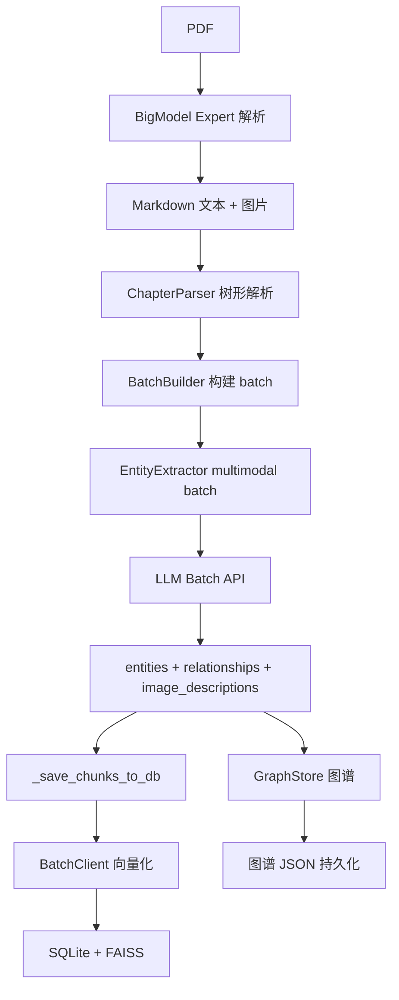

# work-docs-library

通用化技术文档知识库管理工具。

本项目是一个面向技术文档（**当前仅支持 PDF**）的自动化知识提取 pipeline，以 **Kimi Code CLI Plugin** 形式运行。它支持：

- **智能文档解析**：PDF 通过 BigModel Expert API 解析为 Markdown 文本 + 图片，保留完整格式；失败时自动 fallback 到本地 PDFParser
- **知识图谱构建**：自动提取实体（Feature、Module、Register、Signal 等）和关系（IMPLEMENTS、CONTAINS、HAS_REGISTER 等），构建可查询的知识图谱
- **向量语义检索**：基于 FAISS 的语义向量索引，支持相似度搜索
- **Batch API 架构**：所有 LLM 调用通过 Batch API 提交，成本为同步 API 的 50%，支持超大 JSONL 自动拆分并行处理
- **章节级增量更新**：文档修订后，按章节 `content_hash` 指纹比较，未变章节复用实体缓存与 embedding，仅对变更/新增章节进行 LLM 提取，万页级文档变更一页时成本降低 99%+
- **Multimodal 图片理解**：LLM 直接分析文档中的图片（时序图、架构框图、寄存器表等），生成文字描述用于向量化

---

> ⚠️ **前置要求**：本项目依赖 Python 虚拟环境。首次安装后，请务必执行 [安装步骤](#安装) 创建 `venv` 并安装依赖，否则 Kimi CLI 调用插件工具时会因缺少依赖而失败。

---

## 目录

1. [架构概览](#架构概览)
2. [目录结构](#目录结构)
3. [安装](#安装)
4. [快速开始](#快速开始)
5. [Plugin 工具说明](#plugin-工具说明)
6. [配置说明](#配置说明)
7. [核心模块说明](#核心模块说明)
8. [开发与测试](#开发与测试)
9. [已知限制与注意事项](#已知限制与注意事项)

---

## 架构概览

### DocGraphPipeline 架构



**数据流说明：**

1. `BigModelParserClient` 调用 **BigModel 专用** Expert API 解析 PDF，输出 Markdown 文本（含 `` 图片引用）+ `images/` 目录（⚠️ 该 API 非 OpenAI-compatible，仅支持 BigModel 厂商；失败时自动 fallback 到本地 `PDFParser`）
2. `ChapterParser.parse_tree()` 将 Markdown 文本解析为树形章节结构（`#` 为文档标题/书名，`##` 为章节，`###` 为子章节）
3. `BatchBuilder.build_batches()` 以 `##` 为硬边界（不跨章节合并）、`###` 为基本 chunk 单位（内容较短时可合并）构建 batch 列表
4. `EntityExtractor` 对每个 batch 的文本流式解析 Markdown 图片引用，按原文出现顺序构建 multimodal content（文本 → `[image_id: alt]` → base64 图片），提交到 Kimi Batch API
5. LLM 返回 JSON，包含 `entities`、`relationships`、`image_descriptions`
6. `GraphStore`（NetworkX）构建实体关系图谱，**同名同类型实体自动去重合并**。每个文档保存独立子图 `graphs/{doc_id}.json`；`KnowledgeBaseService.ingest_document()` 完成后**全量重建**全局图 `graphs/global.json`（`clear()` + 遍历所有子图重新加载），确保无幽灵残留，实现**跨文档知识互通**。合并时同时保存每个文档的原始属性快照到 `doc_properties[doc_id]`，支持按文档精确查询
7. 增量更新：以 `chapter_title` 为键比对 `content_hash`，未变章节直接复用缓存的 `extracted_entities`/`extracted_relations`/`embedding`，仅对变更/新增章节重新提取和向量化
8. `_save_chunks_to_db()` 清理旧 chunks/向量、插入新 chunks、合并 `image_descriptions` 到 content，通过 `BatchClient` 批量向量化（未配置时降级到同步 `EmbeddingClient`），写入 SQLite + FAISS

### 输入文档约束

本工具对被处理的 Markdown 文档（由 BigModel Expert 解析生成）有以下约束：

1. **图片引用格式**：必须使用标准 Markdown 格式 ``，其中 `image_name` 将作为全局唯一的 `image_id` 使用
2. **image_name 要求**：`[]` 中的名称应有意义且唯一（如 `"Figure 1: Timing Diagram"`），不建议留空。若留空，程序将退化为内部编号
3. **图片路径**：`()` 中的路径应为相对于解析输出目录的相对路径，且该路径下必须存在对应的实际图片文件

---

## 目录结构

```
work-docs-library/
├── plugin.json                   # Kimi Code CLI Plugin 配置
├── AGENTS.md                     # Agent 开发指南（架构、策略、代码规范）
├── README.md                     # 本文件
├── config.json                   # 用户持久化配置（API 参数、模型选择等）
├── scripts/
│   ├── plugin_router.py          # Plugin 统一路由（stdin/stdout JSON）
│   ├── requirements.txt
│   ├── .env.example              # 环境变量模板
│   ├── .env                      # 实际环境变量（gitignored）
│   ├── prompts/                  # LLM 提示词文件（运行时读取，无需重启）
│   │   ├── entity_extraction_system.txt   # 实体提取 system 提示词
│   │   └── entity_extraction_user.txt     # 实体提取 user 模板
│   ├── core/                     # 业务逻辑层
│   │   ├── config.py             # 配置中心
│   │   ├── doc_graph_pipeline.py # ⭐ DocGraphPipeline 主管道
│   │   ├── batch_clients.py      # BaseBatchClient + BatchClient（通用，服务商无感）
│   │   ├── llm_chat_client.py    # LLM 对话客户端（辅助用途）
│   │   ├── embedding_client.py   # Embedding 客户端（辅助用途）
│   │   ├── bigmodel_parser_client.py  # BigModel Expert 文件解析
│   │   ├── graph_store.py        # 图谱存储（NetworkX）
│   │   ├── db.py                 # SQLite 数据库操作
│   │   ├── vector_index.py       # FAISS 向量索引管理
│   │   ├── models.py             # 数据模型 (Document/Chunk)
│   │   ├── enums.py              # StrEnum 定义 (ChunkStatus/DocumentStatus/ChunkType)
│   │   └── knowledge_base_service.py  # 统一服务层封装
│   ├── parsers/                  # IO / 解析层
│   │   ├── pdf_parser.py         # PDF 本地解析器（fallback，输出与 BigModel 一致）
│   │   ├── office_parser.py      # DOCX / XLSX 解析器（代码存在，尚未接入 pipeline）
│   │   └── image_utils.py        # 图片压缩工具
│   └── tests/                    # pytest 测试集（216 个用例）
├── knowledge_base/               # 运行时自动生成：数据库、FAISS 索引、解析输出
│   ├── workdocs.db
│   ├── faiss.index
│   ├── id_map.json
│   └── parsed/<doc_id>/          # BigModel Expert 解析输出
├── venv/                         # Python 虚拟环境
└── .gitignore
```

---

## 安装

### 环境要求

- Python >= 3.11
- 支持 Linux/macOS/Windows（主要测试于 Linux）

### 安装步骤

```bash
cd ~/.kimi/plugins/work-docs-library
python3 -m venv venv
source venv/bin/activate
pip install -r scripts/requirements.txt
```

### 配置

复制环境变量模板并编辑：

```bash
cp scripts/.env.example scripts/.env
# 编辑 scripts/.env，填入你的 API Key
```

用户持久化配置也可写入 `config.json`（项目根目录），详见 [配置说明](#配置说明)。

---

## 快速开始

本项目以 **Kimi Code CLI Plugin** 形式运行，通过 Kimi CLI 的命令行界面调用工具。

### 1. 导入文档

```bash
# 在 Kimi CLI 中执行
/ingest path/to/document.pdf
```

处理流程：
1. BigModel Expert 解析 PDF → Markdown + 图片
2. 构建树形章节结构
3. 按 batch 提交到 Kimi Batch API 进行实体提取
4. 构建知识图谱并持久化
5. 向量化后写入 SQLite + FAISS

### 2. 语义搜索

```bash
/search AH bus arbitration
```

### 3. 按章节查询

```bash
/query --doc-id <DOC_HASH> --chapter "System Architecture"
```

### 4. 查看已导入文档

```bash
/status
```

### 5. 图谱查询

图谱数据以 JSON 格式持久化，可直接读取：

```bash
# 查看生成的图谱文件
ls knowledge_base/graphs/

# 查看图谱统计
python -c "
import json, sys
with open('knowledge_base/graphs/<doc_id>.json') as f:
    g = json.load(f)
print(f'entities={len(g.get(\"nodes\", []))}, relations={len(g.get(\"edges\", []))}')
"
```

---

## Plugin 工具说明

Kimi CLI 通过 `plugin.json` 注册以下工具：

| 工具名 | 作用 |
|--------|------|
| `ingest` | 提取并存储文档（PDF） |
| `search` | 基于 FAISS 的语义向量搜索 |
| `query` | 按章节、关键词、概念查询 chunk |
| `status` | 列出所有已导入文档 |
| `toc` | 查看文档目录 |
| `progress` | 查看文档处理进度 |
| `reprocess` | 强制重新处理文档 |
| `get_content` | 获取完整未截断内容 |
| `graph_query` | 查询知识图谱实体（按类型/名称） |
| `graph_neighbors` | 查询实体的邻居节点（含关系属性） |
| `graph_path` | 查找两实体间的路径（支持关系过滤） |
| `graph_subgraph` | 提取以某实体为中心的子图 |
| `graph_add_entity` | 添加/更新图谱实体 |
| `graph_update_entity` | 更新实体属性 |
| `graph_delete_entity` | 删除实体（级联删边） |
| `graph_add_relation` | 添加/更新图谱关系 |
| `graph_delete_relation` | 删除关系 |
| `graph_verify_entity` | 标记实体为已验证 |
| `graph_search_with_graph` | 语义搜索 + 关联图谱扩展 |
| `graph_get_content_with_entities` | 获取 chunk 及关联实体 |
| `graph_feedback` | 提交对实体/关系的反馈 |
| `graph_conflicts` | 查询冲突日志 |

---

## 配置说明

### 配置优先级架构

```
1. 环境变量（Kimi CLI 运行时注入，如 llm.api_key）
   ↓
2. config.json（用户持久化配置，项目根目录）
   ↓
3. 环境变量（.env 文件，如 WORKDOCS_LLM_API_KEY）
   ↓
4. 代码硬编码默认值
```

`config.json` 与 `.env` 为双轨配置系统：
- **`config.json`**：用户持久化配置，适合存放模型选择、端点地址、维度等不敏感的参数。由 `plugin.json` 的 `config_file` 指定路径
- **`.env`**：适合存放 API Key 等凭证，gitignored，不进入版本控制
- **环境变量**：Kimi CLI 运行时注入，优先级最高

### 关键配置项

| 变量名 | 默认值 | 说明 |
|--------|--------|------|
| `WORKDOCS_LLM_API_KEY` | 空 | Kimi API Key（Batch API 用） |
| `WORKDOCS_LLM_BASE_URL` | `https://api.moonshot.cn/v1` | Kimi Base URL |
| `WORKDOCS_LLM_MODEL` | `kimi-k2.5` | 对话模型 |
| `WORKDOCS_EMBEDDING_API_KEY` | 空 | BigModel API Key（向量化用） |
| `WORKDOCS_EMBEDDING_BASE_URL` | `https://open.bigmodel.cn/api/paas/v4` | BigModel Base URL |
| `WORKDOCS_EMBEDDING_MODEL` | `embedding-3` | 向量化模型 |
| `WORKDOCS_EMBEDDING_DIMENSION` | `1024` | 向量维度 |
| `WORKDOCS_PARSER_API_KEY` | 空 | BigModel Expert 解析 API Key（⚠️ 仅用于 PDF 解析，为 BigModel 专有接口，非 OpenAI-compatible） |
| `WORKDOCS_LLM_BATCH_MAX_CHARS` | `10000` | 每个 batch 最大文本字符数 |
| `WORKDOCS_LLM_BATCH_TIMEOUT` | `3600` | Batch API 轮询超时（秒） |
| `WORKDOCS_EMBED_BATCH_MAX_CHARS` | `4000` | 向量化 chunk 最大字符数 |
| `WORKDOCS_LLM_VISION_MAX_EDGE` | `1024` | 图片压缩最长边（px） |
| `WORKDOCS_LLM_VISION_QUALITY` | `85` | JPEG 压缩质量 1-100 |

---

## 核心模块说明

### 文档处理管道
| 模块 | 职责 |
|------|------|
| `core/doc_graph_pipeline.py` | ⭐ **DocGraphPipeline**：主管道，涵盖解析 → 章节树 → batch 构建 → multimodal 实体提取 → 图谱 → 向量化 |
| `core/bigmodel_parser_client.py` | BigModel Expert 文件解析客户端（⚠️ BigModel 专用 API） |
| `core/batch_clients.py` | BaseBatchClient + BatchClient（通用 OpenAI-compatible Batch API，含并行批处理） |

### 数据模型与存储
| 模块 | 职责 |
|------|------|
| `core/graph_store.py` | GraphEntity / GraphRelation / NetworkXGraphStore：实体关系图谱 |
| `core/db.py` | KnowledgeDB：SQLite 增删改查 |
| `core/vector_index.py` | VectorIndex：FAISS 向量索引管理 |
| `core/models.py` | Chunk、Document 数据模型 |

### 配置
| 模块 | 职责 |
|------|------|
| `core/config.py` | 统一配置中心，环境变量 / `config.json` / `.env` 三层优先级 |

---

## 数据库与存储架构

### Schema

数据库位于 `knowledge_base/workdocs.db`。

#### `documents` — 文档元数据
| 字段 | 说明 |
|------|------|
| `doc_id` (PK) | 文件内容 MD5 哈希 |
| `title` | 文档标题 |
| `source_path` (UNIQUE) | 原始文件路径 |
| `file_type` | `.pdf` |
| `total_pages` | PDF 物理页数 |
| `chapters` | JSON 序列化的章节列表 |
| `extracted_at` | 处理时间戳（ISO 格式） |
| `file_hash` | 内容哈希 |
| `status` | `pending` → `done` / `failed` |

#### `chunks` — 内容块
| 字段 | 说明 |
|------|------|
| `id` (PK, AUTOINCREMENT) | SQLite 自增 ID，FAISS 索引用它 |
| `doc_id` (FK) | 所属文档 |
| `chunk_id` | 逻辑 ID（如 `ch_0`） |
| `content` | 原始提取内容（含合并后的图片描述） |
| `chunk_type` | `text` / `table` / `image_desc` / `summary` |
| `chapter_title` | 所属章节 |
| `keywords` | JSON 列表：提取的关键词 |
| `summary` | 章节摘要 |
| `metadata` | JSON：嵌入向量、图片信息、content_hash、缓存的实体/关系等 |
| `created_at` | 创建时间戳 |
| `status` | `pending` → `embedded` → `done`（`ChunkStatus` StrEnum） |

### 图谱存储

图谱以 JSON 格式持久化到 `knowledge_base/graphs/<doc_id>.json`：

```json
{
  "nodes": [
    {"type": "Module", "name": "DMA_Controller", "properties": {...}}
  ],
  "edges": [
    {"type": "HAS_REGISTER", "from": "DMA_Controller", "to": "DMA_CTRL", ...}
  ]
}
```

---

## 开发与测试

### 运行测试

```bash
cd /path/to/work-docs-library
PYTHONPATH=scripts ./venv/bin/python -m pytest scripts/tests/ -v
```

**当前状态：216 个测试全部通过。**

### 常用测试文档

- `spru924f.pdf` — TI C2000 HRPWM Reference Guide（~80页，架构框图、时序图、寄存器表）
- `DVI0045.pdf` — ARM Multi-layer AHB Technical Overview（~8页，系统框图）

### BigModel Expert 文件解析配置

项目使用 **BigModel Expert** 作为文档解析主路径：

```bash
# .env 中配置
WORKDOCS_PARSER_API_KEY=your-api-key
```

**API 说明**：
- 服务类型：`expert`（PDF 专用，保留图片，0.012元/页）
- 输出格式：ZIP（`result.md` + `images/*.jpg`）
- 图片命名：`images/{uuid}_{page}_{x}_{y}_{w}_{h}_{index}.jpg`
- 若 BigModel 失败，自动 fallback 到本地 `PDFParser`，输出格式与 BigModel 完全一致（Markdown + images/）

---

## Prompts 提示词文件

`scripts/prompts/` 目录下的文本文件被代码**运行时读取**，无需重启即可生效。

### `entity_extraction_system.txt` — 实体提取 system 提示词

**被谁读取**：`EntityExtractor._load_prompt("entity_extraction_system")`

**作用**：定义 LLM 的身份、实体/关系类型、输出格式。

**格式规范**：
- 纯文本，无占位符
- 明确指定 `entities`、`relationships`、`image_descriptions` 的 JSON 输出格式

### `entity_extraction_user.txt` — 实体提取 user 模板

**被谁读取**：`EntityExtractor._load_prompt("entity_extraction_user")`

**作用**：提供具体任务指令和占位符。

**格式规范**：
- 必须包含 `{{chapters}}` 占位符，运行时被替换为章节文本
- 必须包含 `{{images}}` 占位符（当前替换为空字符串，图片通过 multimodal content 直接传入）

---

## 已知限制与注意事项

1. **仅支持 PDF**：DOCX/XLSX 解析器代码已存在，但尚未接入 `DocGraphPipeline`
2. **Batch API 延迟**：Batch API 成本为同步 API 的 50%，但存在分钟级排队延迟
3. **JSONL 大小限制**：单个 JSONL 文件不能超过 100MB，超大文档会自动拆分为多个并行 batch
4. **Embedding 维度不可变**：FAISS 索引创建后维度固定。更换模型导致维度变化时，必须删除旧索引并重新处理
5. **FAISS 与 SQLite 非原子**：极端情况下可能出现索引与元数据不一致，可通过 `reprocess` 重建
6. **图片压缩**：`LLM_VISION_MAX_EDGE`（默认 1024）和 `LLM_VISION_QUALITY`（默认 85）控制 base64 图片大小
7. **NetworkX 内存上限**：全局图为内存存储，数百个文档 × 万页级时可能达到 GB 级。当前单机目标规模可接受，预留 Neo4j 迁移接口
8. **输入文档约束**：Markdown 图片引用 `` 中的 `name` 将作为 `image_id`，建议填写有意义的名称
9. **PDF 解析依赖 BigModel 专用 API**：文档提取主路径使用 BigModel 专有 Expert API（`/files/parser/create`），非 OpenAI-compatible，无法直接切换至其他厂商。若 BigModel 不可用，可依赖本地 `PDFParser`（PyMuPDF）作为 fallback，输出格式与 BigModel 完全一致，但解析质量可能略有差异
10. **跨产品外设变体**：同一个外设/寄存器出现在多个产品手册中时，`doc_properties` 保存每个文档的原始属性快照，全局图的 `properties` 仍为合并后值。查询时通过 `doc_id` 参数获取指定产品的精确属性。产品型号通过启发式正则从文档标题/文件名自动提取，支持 `WORKDOCS_PRODUCT_NAME` 手动覆盖

---

## 许可证

MIT
