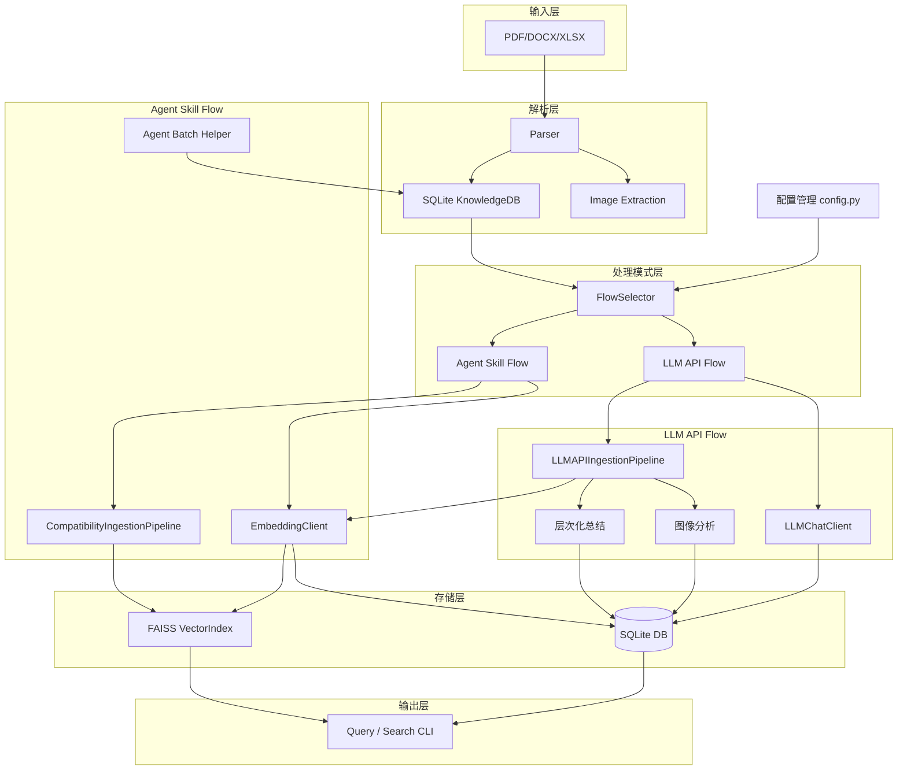

# work-docs-library

通用化技术文档知识库管理工具。

本项目是一个面向技术文档（PDF、Word、Excel）的自动化知识提取与检索 pipeline。它支持：

- **多格式文档解析**：PDF（含图片/矢量图区域提取）、DOCX、XLSX
- **结构化存储**：SQLite 存储文档元数据、章节、文本块（chunk）
- **向量索引**：基于 FAISS 的语义向量索引，支持相似度搜索
- **LLM 摘要与关键词**：利用大模型自动生成 chunk 级摘要和关键词
- **Agent 批量协作工作流**：通过 `agent_batch_helper.py` 实现 checkpoint/resume 的长文档摘要流水线

---

> ⚠️ **前置要求**：本项目依赖 Python 虚拟环境。首次安装后，请务必执行 [安装步骤](#安装) 创建 `venv` 并安装依赖，否则 Kimi CLI 调用插件工具时会因缺少依赖而失败。

---

## 目录

1. [架构概览](#架构概览)
2. [目录结构](#目录结构)
3. [安装](#安装)
4. [快速开始](#快速开始)
5. [CLI 参考](#cli-参考)
   - [doc_extractor.py](#docextractorpy)
   - [agent_batch_helper.py](#agentbatchhelperpy)
6. [配置说明](#配置说明)
7. [核心模块说明](#核心模块说明)
8. [开发与测试](#开发与测试)
9. [功能稳定性 / 安全性 / 代码风格分析](#功能稳定性--安全性--代码风格分析)
10. [已知限制与注意事项](#已知限制与注意事项)

---

## 架构概览

### 演进架构：双模型独立配置



**系统支持两种操作模式：**

1. **LLM API Flow**（高质量处理模式）：使用独立的 LLM 对话客户端进行层次化总结和图像分析
2. **Agent Skill Flow**（高效批处理模式）：传统的向量化 + 批处理流程，仅使用 Embedding 客户端

**数据流说明：**

1. `FlowSelector` 根据配置自动选择操作模式（`LLM_API_FLOW` 或 `AGENT_SKILL_FLOW`）
2. `IngestionPipeline` 扫描输入路径，调用对应 `Parser` 提取文本、表格、图片
3. 解析结果以 `Document` / `Chunk` 模型写入 `SQLite`
4. **根据模式选择处理流程**：
   - **LLM API Flow**：使用 `LLMChatClient` 进行层次化文本总结、图像详细分析，生成章节摘要
   - **Agent Skill Flow**：使用 `EmbeddingClient` 进行批处理向量化
5. `EmbeddingClient` 将向量写入 `FAISS` 索引，并存储到 chunk metadata
6. `agent_batch_helper.py` 将 embedded 但未 summarized 的 chunk 分批导出（Agent Skill Flow）
7. 用户通过 `doc_extractor.py` 进行关键词查询、章节查询、页码查询或语义向量搜索

---

## 目录结构

```
work-docs-library/
├── scripts/
│   ├── doc_extractor.py          # 主 CLI
│   ├── agent_batch_helper.py     # Agent 批量协作 CLI
│   ├── requirements.txt
│   ├── .env.example              # 环境变量模板
│   ├── prompts/
│   │   ├── summarize.txt         # LLM 摘要提示词
│   │   └── filter_config.json    # 低价值内容过滤规则
│   ├── core/
│   │   ├── config.py             # 配置中心
│   │   ├── models.py             # 数据模型 (Document/Chunk/Chapter)
│   │   ├── db.py                 # SQLite 数据库操作
│   │   ├── llm_client.py         # LLM API 客户端
│   │   ├── vector_index.py       # FAISS 向量索引管理
│   │   ├── pipeline.py           # 文档摄入流水线
│   │   └── chapter_editor.py     # 交互式章节编辑器
│   ├── parsers/
│   │   ├── pdf_parser.py         # PDF 解析器（pymupdf）
│   │   ├── office_parser.py      # DOCX / XLSX 解析器
│   │   └── image_utils.py        # 图片压缩工具
│   └── tests/                    # pytest 测试集
├── knowledge_base/               # 运行时自动生成：数据库、FAISS 索引、图片
└── README.md
```

---

## 安装

### 环境要求

- Python >= 3.11
- 支持 Linux/macOS/Windows（主要测试于 Linux）

### 安装步骤

```bash
cd ~/.kimi/plugins/work-docs-library
python3 -m venv venv
source venv/bin/activate
pip install -r scripts/requirements.txt
```

### 配置环境变量

复制模板并编辑：

```bash
cp scripts/.env.example scripts/.env
# 编辑 scripts/.env，填入你的 API Key
```

---

## 快速开始

### 0. 配置验证（推荐）

首次使用或修改配置后，建议先验证配置：

```bash
cd ~/.kimi/plugins/work-docs-library
PYTHONPATH=scripts ./venv/bin/python scripts/main.py --validate-config dummy_path
```

这将检查你的 `.env` 配置是否正确，并显示当前操作模式（LLM API Flow 或 Agent Skill Flow）。

### 1. 选择操作模式

系统根据你的配置自动选择操作模式：

#### LLM API Flow（高质量总结模式）

适用于需要高质量自动总结的场景，使用 LLM API 进行层次化总结和图像分析。

**前提条件**：已在 `.env` 中同时配置 LLM 和 Embedding 模型

```bash
# 处理单个文档
PYTHONPATH=scripts ./venv/bin/python scripts/main.py path/to/document.pdf --verbose

# 处理目录（扫描所有支持的文件）
PYTHONPATH=scripts ./venv/bin/python scripts/main.py path/to/documents/ --verbose

# 预览模式（不实际处理）
PYTHONPATH=scripts ./venv/bin/python scripts/main.py path/to/document.pdf --dry-run
```

**输出**：包含自动生成的文本摘要、章节摘要、图像分析、向量化知识库。

#### Agent Skill Flow（批处理模式）

适用于已有 Agent 工作流的场景，仅执行向量化，保持现有批处理流程。

**前提条件**：仅在 `.env` 中配置了 Embedding 模型（未配置或注释掉 LLM 配置）

```bash
# 处理文档（仅向量化）
PYTHONPATH=scripts ./venv/bin/python scripts/main.py path/to/document.pdf --verbose

# 创建批处理任务
python scripts/agent_batch_helper.py auto --doc-id <DOC_HASH> --output-dir ./auto_batches --filter
```

**输出**：仅包含向量化后的知识库，需使用 Agent 批处理完成总结。

### 2. 使用传统 CLI（向后兼容）

```bash
# 导入文档（自动选择处理模式）
python scripts/doc_extractor.py ingest --path ./docs

# 使用 --dry-run 预览，不实际调用 API
python scripts/doc_extractor.py ingest --path ./docs --dry-run

# 查看已导入文档
python scripts/doc_extractor.py status
```

### 3. Agent 批量摘要（Agent Skill Flow）

```bash
# 自动过滤低价值页（目录、版权声明、封装尺寸等），分批导出，支持断点续传
python scripts/agent_batch_helper.py auto --doc-id <DOC_HASH> --output-dir ./auto_batches --filter
```

执行后会生成 `batch_001.txt`，由 Agent 阅读并输出 `batch_001.json`，再次运行同一命令即可自动应用并进入下一批。

### 4. 语义搜索

```bash
python scripts/doc_extractor.py search --text "AHB bus arbitration mechanism" --top-k 5
```

### 5. 按章节查询

```bash
python scripts/doc_extractor.py query --doc-id <DOC_HASH> --chapter "System Architecture"
```

---

## CLI 参考

### `doc_extractor.py`

| 子命令 | 作用 | 关键参数 |
|--------|------|----------|
| `ingest` | 提取并存储文档 | `--path`（必填）, `--dry-run`, `--auto-chapter` |
| `status` | 列出所有已导入文档 | 无 |
| `chapter-edit` | 交互式编辑/覆盖文档的章节信息 | `--doc-id`（必填） |
| `query` | 按页码、章节、关键词查询 chunk | `--doc-id`, `--page`, `--chapter`, `--chapter-regex`, `--keyword`, `--top-k` |
| `get_content` | 获取完整未截断内容（按 chunk_db_id / page / chapter） | `--doc-id`, `--page`, `--chapter`, `--chunk-db-id` |
| `search` | 基于 FAISS 的语义向量搜索 | `--text`（必填）, `--top-k` |
| `toc` | 显示文档目录，或按标题模糊搜索文档 | `--doc-id` 或 `--match` |
| `list-pending` | 列出已嵌入但未摘要的 chunk | `--doc-id`, `--top-k` |
| `write-summary` | 手动为某个 chunk 写入摘要 | `--chunk-db-id`, `--summary` |
| `write-keywords` | 手动为某个 chunk 写入关键词 | `--chunk-db-id`, `--keywords` |
| `write-embedding` | 手动为某个 chunk 写入向量（JSON 文件） | `--chunk-db-id`, `--embedding-file` |
| `reprocess` | 强制重新处理文档（忽略缓存） | `--doc-id` |

### `agent_batch_helper.py`

| 子命令 | 作用 | 关键参数 |
|--------|------|----------|
| `list` | 列出指定文档的 pending chunks | `--doc-id` |
| `dump` | 将一批 pending chunks 导出为 `.txt` | `--doc-id`, `--batch-size`, `--offset`, `--output` |
| `apply` | 从 JSON 文件批量回写摘要/关键词 | `--input` |
| `filter` | 根据 `filter_config.json` 自动过滤低价值 chunk | `--doc-id` |
| `progress` | 显示文档摘要进度（含进度条） | `--doc-id` |
| `auto` | 自动流水线：filter → smart-batch → dump → checkpoint/resume | `--doc-id`, `--output-dir`, `--batch-size`, `--target-chars`, `--filter` |

**`apply` 的 JSON 格式示例：**

```json
[
  {"chunk_db_id": 391, "summary": "该章节描述了 DMA 控制器的工作流程...", "keywords": "DMA, controller, burst, arbitration"},
  {"chunk_db_id": 392, "summary": "...", "keywords": "..."}
]
```

### `main.py`（主入口）

| 参数 | 作用 |
|------|------|
| `path` | 要处理的文档路径（文件或目录） |
| `--validate-config` | 验证配置并显示当前操作模式 |
| `--verbose` | 显示详细日志 |
| `--dry-run` | 预览处理流程，不实际调用 API |

**示例：**

```bash
# 验证配置
PYTHONPATH=scripts ./venv/bin/python scripts/main.py --validate-config dummy_path

# 处理文档（自动选择模式）
PYTHONPATH=scripts ./venv/bin/python scripts/main.py /path/to/document.pdf --verbose
```

---

## 程序化使用

除了 CLI，你也可以在 Python 代码中直接使用核心模块：

### 示例 1: 验证配置并获取操作模式

```python
import sys
sys.path.insert(0, '/home/sjj/.kimi/plugins/work-docs-library/scripts')

from core.flow_selector import FlowSelector

# 验证配置
FlowSelector.validate_configuration()

# 获取当前操作模式
mode = FlowSelector.get_operation_mode()
print(f"当前模式: {mode}")  # LLM_API_FLOW or AGENT_SKILL_FLOW
```

### 示例 2: 独立使用 LLMChatClient

```python
from core.llm_chat_client import LLMChatClient

# 创建 LLM 客户端
llm_client = LLMChatClient()

# 文本总结
result = llm_client.summarize("你的文本内容")
print(f"摘要: {result['summary']}")
print(f"关键词: {result['keywords']}")

# 层次化总结（处理大量文本）
long_text = ["文本块1", "文本块2", "文本块3"]
hierarchical_summary = llm_client.hierarchical_summarize(long_text)
print(f"层次化摘要: {hierarchical_summary}")

# 图像分析
image_path = "/path/to/technical_diagram.png"
analysis = llm_client.vision_describe(image_path, "详细分析这个技术图表")
print(f"图像分析: {analysis['summary']}")

llm_client.close()
```

### 示例 3: 独立使用 EmbeddingClient

```python
from core.embedding_client import EmbeddingClient

# 创建 Embedding 客户端
embed_client = EmbeddingClient()

# 批量生成嵌入向量
texts = ["文本1", "文本2", "文本3"]
embeddings = embed_client.embed(texts)

print(f"生成了 {len(embeddings)} 个嵌入向量")
print(f"每个向量维度: {len(embeddings[0])}")

embed_client.close()
```

### 示例 4: 双客户端协作（LLM API Flow）

```python
from core.llm_chat_client import LLMChatClient
from core.embedding_client import EmbeddingClient

# 同时创建两个客户端（可以使用不同的供应商）
llm_client = LLMChatClient()
embed_client = EmbeddingClient()

# 文本总结 + 向量化
text = "需要处理的技术文档内容"

# 1. 使用 LLM 生成摘要
summary_result = llm_client.summarize(text)
summary = summary_result['summary']
keywords = summary_result['keywords']

# 2. 使用 Embedding 生成向量
embeddings = embed_client.embed([text, summary])

print(f"摘要: {summary}")
print(f"关键词: {keywords}")
print(f"原始文本向量: {len(embeddings[0])} 维")
print(f"摘要向量: {len(embeddings[1])} 维")

llm_client.close()
embed_client.close()
```

---

## 配置说明

### 三层配置优先级架构

系统采用分层配置架构，按以下优先级解析配置值（高 → 低）：

```
1. 环境变量（Kimi CLI 运行时注入，如 llm.api_key）
   ↓
2. config.json（统一配置入口，Kimi CLI 持久化凭证 + 用户手动参数）
   ↓
3. .env 文件（开发/独立运行回退）
   ↓
4. 代码硬编码默认值
```

### 配置文件说明

| 文件 | 作用 | 版本控制 | 使用场景 |
|------|------|----------|----------|
| `config.json` | **主配置入口**。Kimi CLI 自动注入 OAuth token，用户维护其他参数 | ❌ `.gitignore` 忽略 | 作为 Kimi Code CLI Plugin 运行时 |
| `config.example.json` | 配置模板 | ✅ 提交到仓库 | 复制为 `config.json` 的起点 |
| `.env` / `.env.example` | 环境变量配置 | ❌ `.gitignore` 忽略 | 独立运行 `main.py` / `doc_extractor.py`；`config.json` 缺失时回退 |

### `config.json` 结构与机制

`config.json` 由 `plugin.json` 的 `config_file` 字段指定，是 **Kimi Code CLI 凭证注入的目标文件**。

```json
{
  "llm": {
    "api_key": "",
    "endpoint": "https://api.moonshot.cn/v1",
    "provider": "kimi",
    "model": "kimi-k2.5",
    "thinking_enabled": false
  },
  "embedding": {
    "api_key": "your_embedding_api_key",
    "endpoint": "https://api.openai.com/v1",
    "provider": "openai",
    "model": "text-embedding-3-small",
    "dimension": 1536
  },
  "image": { "max_edge": 1024, "quality": 85 },
  "batch_size": 4,
  "auto_vision": 0
}
```

**凭证注入机制**：
- `plugin.json` 中配置 `"inject": {"llm.api_key": "api_key", "llm.endpoint": "base_url"}`
- **安装插件时**：Kimi CLI 将当前配置的 `api_key`（OAuth token 或静态 key）和 `base_url` 写入 `config.json`
- **启动时**：Kimi CLI 自动刷新 `config.json` 中的凭证（如 OAuth token 过期刷新）
- **运行时**：同时通过环境变量 `llm.api_key` / `llm.endpoint` 传递当前有效凭证

**字段映射规则**：
- `llm.api_key` → 对应环境变量 `WORKDOCS_LLM_API_KEY`
- `llm.endpoint` → 对应环境变量 `WORKDOCS_LLM_BASE_URL`
- `llm.provider` → 对应环境变量 `WORKDOCS_LLM_PROVIDER`
- `llm.model` → 对应环境变量 `WORKDOCS_LLM_MODEL`
- `embedding.dimension` → 对应环境变量 `WORKDOCS_EMBEDDING_DIMENSION`
- 其余字段同理，完整映射见 `.env.example`

### `.env` 文件（回退配置）

当 `config.json` 不存在或对应字段为空时，系统自动回退到 `.env` 文件中的环境变量。

| 变量名 | 默认值 | 说明 |
|--------|--------|------|
| `WORKDOCS_LLM_PROVIDER` | `openai` | LLM 提供商：`openai`、`kimi` 或自定义 |
| `WORKDOCS_LLM_API_KEY` | 空 | API 密钥 |
| `WORKDOCS_LLM_BASE_URL` | `https://api.openai.com/v1` | API Base URL |
| `WORKDOCS_LLM_MODEL` | `gpt-4o-mini` | 对话模型名称 |
| `WORKDOCS_EMBEDDING_PROVIDER` | `openai` | 嵌入模型提供商 |
| `WORKDOCS_EMBEDDING_API_KEY` | 空 | 嵌入 API 密钥 |
| `WORKDOCS_EMBEDDING_BASE_URL` | 空 | 嵌入 API Base URL |
| `WORKDOCS_EMBEDDING_MODEL` | `text-embedding-3-small` | 嵌入模型名称 |
| `WORKDOCS_EMBEDDING_DIMENSION` | `1536` | 嵌入向量维度（作为 `dimensions` 参数传递） |
| `WORKDOCS_LLM_THINKING_ENABLED` | `0` | 是否开启思考模式（`1` 开启） |
| `WORKDOCS_IMAGE_MAX_EDGE` | `1024` | 图片压缩后最大边长（px） |
| `WORKDOCS_IMAGE_QUALITY` | `85` | JPEG 压缩质量 |
| `WORKDOCS_BATCH_SIZE` | `4` | 嵌入 API 批处理大小 |
| `WORKDOCS_AUTO_VISION` | `0` | 是否自动调用 Vision API 描述图片 |

**加载顺序**（后加载的不覆盖已存在的环境变量）：
1. 项目根目录 `.env`
2. `scripts/.env`

### 配置场景示例

#### 场景 1: 作为 Kimi CLI Plugin 运行（推荐）

1. 复制配置模板：
   ```bash
   cp config.example.json config.json
   ```
2. 安装插件到 Kimi CLI：
   ```bash
   kimi plugin install /path/to/work-docs-library
   ```
3. Kimi CLI 自动将 OAuth token 注入 `config.json`
4. （可选）手动编辑 `config.json` 补充 embedding 等非注入参数

无需创建 `.env` 文件，所有配置由 `config.json` 管理。

#### 场景 2: 独立运行（开发/测试）

```bash
cp scripts/.env.example scripts/.env
# 编辑 scripts/.env，填入 API Key
python scripts/main.py /path/to/document.pdf
```

#### 场景 3: 混合使用（config.json + .env 互补）

- `config.json` 中配置 LLM 凭证（由 Kimi CLI 自动注入）
- `.env` 中配置 Embedding 参数（因为 Kimi CLI 只注入 LLM 凭证）

```json
// config.json
{
  "llm": {
    "api_key": "",
    "endpoint": "https://api.moonshot.cn/v1",
    "provider": "kimi",
    "model": "kimi-k2.5"
  }
}
```

```bash
# scripts/.env
WORKDOCS_EMBEDDING_PROVIDER=openai
WORKDOCS_EMBEDDING_API_KEY=sk-***
WORKDOCS_EMBEDDING_MODEL=text-embedding-3-small
WORKDOCS_EMBEDDING_DIMENSION=1536
```

### 配置验证

```bash
cd ~/.kimi/plugins/work-docs-library
PYTHONPATH=scripts ./venv/bin/python scripts/main.py --validate-config dummy_path
```

检查项：环境变量完整性、API 密钥有效性、模型名称合法性、操作模式匹配性。

### 过滤规则 (`scripts/prompts/filter_config.json`)

该文件控制 `agent_batch_helper.py filter/auto` 中哪些 chunk 会被自动标记为 `skipped`。

- **`always_skip`**：绝对跳过规则
  - `chapter_keywords`：章节标题包含这些词时跳过（如 "Table of Contents", "Disclaimer"）
  - `content_keywords`：内容前缀中包含这些词时跳过（如 "All rights reserved"）
  - `chunk_types`：指定 chunk 类型黑名单（如 `image_desc`）
- **`heuristic_skip`**：启发式规则
  - `min_content_length`：内容长度低于阈值跳过
  - `ascii_art_ratio`：纯 ASCII 艺术图比例阈值
  - `dimension_page`：针对封装尺寸/机械数据页的特殊规则

---

## 核心模块说明

### 配置与流程管理
| 模块 | 职责 |
|------|------|
| `core/config.py` | 统一读取 `.env` 与固定路径配置，支持双模型独立配置 |
| `core/flow_selector.py` | `FlowSelector`：自动检测配置并选择最佳处理模式（LLM API Flow 或 Agent Skill Flow） |

### 数据处理管道
| 模块 | 职责 |
|------|------|
| `core/pipeline.py` | `IngestionPipeline`：扫描 → 解析 → chunk → 嵌入 → 入库 的完整流程 |
| `core/llm_api_pipeline.py` | `LLMAPIIngestionPipeline`：LLM API Flow 专用管道，两阶段处理（Phase A Parse&Embed → Phase B LLM Enhance），支持断点续传 |
| `core/compatibility_pipeline.py` | `CompatibilityIngestionPipeline`：Agent Skill Flow 兼容管道，仅向量化 |

### 数据模型与存储
| 模块 | 职责 |
|------|------|
| `core/models.py` | 定义 `Chapter`、`Chunk`、`Document` 三个核心 dataclass |
| `core/db.py` | `KnowledgeDB`：SQLite 的增删改查、事务管理 |
| `core/vector_index.py` | `VectorIndex`：FAISS 索引的加载、添加、删除、搜索、持久化 |

### 双模型客户端架构（新增）
| 模块 | 职责 |
|------|------|
| `core/llm_chat_client.py` | `LLMChatClient`：对话专用客户端，支持聊天、总结、图像分析，可配置思考模式 |
| `core/embedding_client.py` | `EmbeddingClient`：向量化专用客户端，支持批处理、动态维度配置 |
| `core/llm_client.py` | `_BaseClient` / `ChatClient` / `EmbeddingClient`：原有通用客户端（保持向后兼容） |

### 交互与编辑
| 模块 | 职责 |
|------|------|
| `core/chapter_editor.py` | `ChapterEditor`：基于 `input()` 的交互式章节增删改 |
| `agent_batch_helper.py` | Agent 批量协作 CLI，支持 checkpoint/resume |

---

## 数据库与存储架构

### Schema（4 张表）

数据库位于 `knowledge_base/workdocs.db`，通过 `doc_id`（文件内容 MD5）关联。

#### `documents` — 文档元数据
| 字段 | 说明 |
|------|------|
| `doc_id` (PK) | 文件内容 MD5 哈希 |
| `title` | 文档标题 |
| `source_path` (UNIQUE) | 原始文件路径 |
| `file_type` | `.pdf` / `.docx` / `.xlsx` |
| `total_pages` | 总页数 |
| `chapters` | JSON，解析出的章节列表 |
| `chapters_override` | JSON，人工覆盖的章节（优先于 `chapters`） |
| `file_hash` | 内容哈希（变更检测） |
| `status` | `pending` → `processing` → `done` / `failed` / `embedded` |

#### `chunks` — 内容块（核心表）
| 字段 | 说明 |
|------|------|
| `id` (PK, AUTOINCREMENT) | SQLite 自增 ID，即 `chunk_db_id`，FAISS 索引也用它 |
| `doc_id` (FK) | 所属文档 |
| `chunk_id` | 逻辑 ID（如 `page_1_text`） |
| **`content`** | **原始提取内容**，永不覆盖 |
| `chunk_type` | `text` / `table` / `image_desc` / `summary` |
| `page_start` / `page_end` | 页码范围 |
| `chapter_title` | 所属章节（按页码范围匹配） |
| `keywords` | 关键词（JSON 或逗号分隔） |
| **`summary`** | **LLM 生成的摘要**（Phase B 或 Agent 回写后才填充） |
| **`metadata`** | **JSON**：嵌入向量、图片路径、`vision_desc`、entities 等 |
| `status` | `pending` → `embedded` → `done` / `skipped` / `failed` |
| `created_at` | 创建时间戳 |

**索引**：`idx_chunks_doc(doc_id)`、`idx_chunks_type(chunk_type)`、`idx_chunks_chapter(doc_id, chapter_title)`

#### `chapter_summaries` — 章节级 LLM 摘要
| 字段 | 说明 |
|------|------|
| `doc_id` + `chapter_title` | 复合定位 |
| `summary` | 完整章节摘要 |
| `concepts` / `relationships` / `key_figures` / `key_tables` | JSON 结构化数据 |
| `status` | `pending` / `done` |

#### `concept_index` — 概念/关键词索引
| 字段 | 说明 |
|------|------|
| `doc_id` + `concept_name` (UNIQUE) | 每文档去重 |
| `definition` | 概念定义 |
| `first_mentioned_page` | 首次出现页码 |
| `related_concepts` | JSON 关联概念列表 |

### 表关系

```
documents (1)
  ├──► chunks (N)              via doc_id
  ├──► chapter_summaries (N)   via doc_id
  └──► concept_index (N)       via doc_id

FAISS index (external) mirrors chunks via chunk_db_id (chunks.id)
```

### 原始数据 vs LLM 增强数据存储

```
                    PDF/Office Parser
                           │
                           ▼
              ┌────────────────────────┐
              │    chunks.content      │  ← 原始提取内容，永不覆盖
              │    chunks.metadata     │  ← 图片路径、embedding
              └────────────────────────┘
                           │
            ┌──────────────┼──────────────┐
            ▼              ▼              ▼
      [LLM_API_FLOW]  [AGENT_SKILL_FLOW]  [FAISS]
            │              │               │
            ▼              ▼               ▼
   chunks.summary    agent_batch_helper   向量索引
   chunks.keywords   写入 summary/        (基于 content)
   chapter_summaries  keywords
   concept_index
   metadata.images[].vision_desc
```

| 信息类型 | 存储位置 |
|---------|---------|
| **原始文本内容** | `chunks.content` |
| **LLM 单块摘要** | `chunks.summary` |
| **关键词** | `chunks.keywords` + `concept_index` 表 |
| **章节摘要** | `chapter_summaries` 表 |
| **图片分析** | `chunks.metadata["images"][*]["vision_desc"]` |
| **嵌入向量** | `chunks.metadata["embedding"]`（JSON）+ FAISS 索引 |

### 状态生命周期

**Chunk 生命周期**：
```
pending ──► embedded ──► done
   │           │           │
   │           │           └─ After LLM enhancement (Phase B) or Agent write-back
   │           └─ After embedding added to FAISS
   └─ Initial state after parser inserts chunk

skipped / failed ──► Error or filtered-out states
```

**Document 生命周期**：
```
pending ──► processing ──► done / failed / embedded
```

- `embedded`：Phase A（Parse & Embed）完成，等待 Phase B 或 Agent 处理
- `done`：Phase B 完成或 Agent 已回写摘要

---

## 查询接口

### Plugin 层工具

| 工具 | 能力 | 底层查询 |
|------|------|---------|
| **`search`** | 语义搜索 | 将查询文本 embedding → FAISS 相似度搜索 → 按 `chunk_db_id` 回查数据库 |
| **`query`** | 结构化查询 | 按 `page` 范围 / `chapter` 标题（LIKE 匹配）/ `keyword` 关键词 / `concept` 概念名 |
| **`get_content`** | 获取完整未截断内容 | 按 `chunk_db_id` 精确查询 / 按 `page` 范围拼接 / 按 `chapter` 拼接多块 |
| **`status`** | 列出所有文档 | `documents` 表列表 |
| **`toc`** | 目录 | 返回 `documents.chapters` JSON |
| **`progress`** | 处理进度 | 按 `doc_id` 统计各状态 chunk 数量 |
| **`reprocess`** | 强制重新处理 | 删除旧 chunks/images，重新走完整流程 |
| **`auto_summarize`** | Agent 批量总结流水线 | 导出 pending chunks 到 batch 文件 |
| **`synthesize_chapters`** | 章节综合 | 生成结构化章节摘要 |

**`search` / `query` 返回的每个结果包含**：
- `doc_id`, `chunk_id`, `chunk_type`, `page_start/end`
- `content_preview`（前 500 字符）
- `summary`（LLM 摘要，如有）
- `keywords`
- **`chapter_context`**（如匹配到章节摘要）：包含该章节的 `summary`、`concepts`、`key_figures`、`key_tables`

### KnowledgeDB 核心查询方法

| 方法 | 查询类型 | SQL 过滤 |
|------|----------|---------|
| `query_by_page(doc_id, ps, pe)` | 页码重叠 | `page_start <= pe AND page_end >= ps` |
| `query_by_chapter(doc_id, title)` | 子串匹配 | `chapter_title LIKE %title%` |
| `query_by_chapter_regex(doc_id, pattern)` | 正则匹配 | Python `re.compile` 过滤 |
| `query_by_keyword(keyword)` | 关键词搜索 | `keywords LIKE %keyword%` |
| `query_by_concept(doc_id, concept)` | 概念搜索 | `metadata` / `summary` / `keywords` 联合 LIKE |
| `get_chunk_by_db_id(db_id)` | 精确查询 | `id = ?` |
| `get_embedded_but_unsummarized_chunks(doc_id?)` | Resume 辅助 | `status='embedded' AND (summary IS NULL OR summary='')` |
| `get_pending_chunks(doc_id?)` | 状态过滤 | `status='pending'` |

---

## 向量索引（FAISS）

- **索引类型**：`faiss.IndexFlatIP`（内积），向量做了 L2 归一化，内积等价于余弦相似度
- **持久化**：`knowledge_base/faiss.index`（二进制）+ `knowledge_base/id_map.json`
- **维度**：创建时固定，与 `EmbeddingClient` 探测的维度一致；不匹配会抛 `RuntimeError`
- **id_map**：`faiss 内部序号 → chunk_db_id（chunks.id）` 的列表。旧版 dict 格式会自动迁移
- **删除**：`remove_doc()` 采用**重建策略**（过滤后重新创建 `IndexFlatIP`），因为 flat 索引不支持原生删除
- **嵌入对象**：**原始 `chunk.content`**（不是 LLM 增强后的内容）

---

## Agent Batch 机制详解

`batch_*.txt` 是 **Agent Skill Flow** 的核心协作媒介——由脚本生成、由 Agent 阅读、由 Agent 产出 `batch_*.json` 回写数据库。

### 整个流程

```
文档解析 + 嵌入 → chunks embedded
         │
         ▼
  run_auto_summarize()
         │
         ├── _smart_batch() 分组
         ├── _write_batch_txt() 生成 batch_001.txt
         │
         ▼
    Agent 阅读 batch_001.txt
         │
         ▼
    产出 batch_001.json
         │
         ▼
    _apply_json_file() 回写 DB
         │
         ▼
    chunks.status = "done"
```

### 分组策略：`_smart_batch()`

```python
def _smart_batch(rows, target_chars=25000, max_chunks=12, min_chunks=3):
```

1. **同章节优先**：尽量把同一章节的 chunk 放在同一个 batch，只要总字符数 ≤ `target_chars` 且 chunk 数 ≤ `max_chunks`
2. **大章节拆分**：单个章节内容太多时，按顺序拆分为多个 batch
3. **尾部合并**：最后一个 batch 若 chunk 数 < `min_chunks`，合并到前一个 batch

输入：`status='embedded' AND (summary IS NULL OR summary='')` 的 chunk 行  
输出：`[[db_id1, db_id2, ...], [db_id3, db_id4, ...], ...]`

### 文件格式：`batch_001.txt`

```text
--- BATCH CHAPTER CONTEXT ---
Chapter: System Architecture
Previous chunk summary: The DMA controller uses a burst mechanism...
--------------------------------------------------------------------------------

--- CHUNK_DB_ID=47 | page_3_text | System Architecture P3 ---
The AHB bus matrix supports up to 16 masters and 16 slaves...

================================================================================

--- CHUNK_DB_ID=48 | page_4_text | System Architecture P4 ---
Each master port has an arbiter that grants access based on priority...

================================================================================
```

| 元素 | 来源 | 作用 |
|------|------|------|
| `CHUNK_DB_ID=47` | `chunks.id` | Agent 回传 JSON 时必须原样带回，用于 `_apply_json_file()` 定位 |
| `page_3_text` | `chunks.chunk_id` | 逻辑标识 |
| `System Architecture P3` | `chapter_title` + `page_start` | 章节和页码上下文 |
| `content` | `chunks.content` | 原始提取的文本/表格 |
| `BATCH CHAPTER CONTEXT` | 同章节最近一个 `done` chunk 的 summary | 让 Agent 利用前文保持理解连贯性 |

### 图片路径注入：`_enrich_batch_with_images()`

写入 txt 前，检查每个 chunk 的 `metadata["images"]`：
- **场景 A**：`vision_desc` 已存在（LLM API Flow 已处理）→ 仅提示图片存在
- **场景 B**：`vision_desc` 不存在 → **强制要求** Agent 通过 `ReadMediaFile` 阅读图片并纳入摘要

```text
[AGENT VISION REQUIRED: The following images are on this page.
 You MUST read them via ReadMediaFile and incorporate insights into the summary.]
- knowledge_base/images/<hash>/page_3_img_1.png
```

### 断点续传：`checkpoint.json`

```json
{
  "doc_id": "...",
  "batch_map": [[47, 48, 49], [50, 51, 52]],
  "done_chunk_ids": [47, 48, 49],
  "total_batches": 5,
  "applied_batches": 1
}
```

- 处理到 batch_003 时中断 → 下次运行直接从 batch_003 续传
- 若 `filter_config.json` 变更或文档重新嵌入导致 chunk ID 变化 → 自动废弃旧 checkpoint 重新分组

### 文件生命周期

| 阶段 | batch_001.txt | batch_001.json | checkpoint.json |
|------|---------------|----------------|-----------------|
| 初始生成 | ✅ | ❌ | ✅ |
| Agent 处理中 | ✅ | ✅（Agent 写入） | ✅ |
| 自动应用后 | ✅ | ❌（已删除） | ✅ |
| 全部完成后 | ❌（全部删除） | ❌ | ❌ |

### 从 txt 到 json 的闭环

Agent 产出 `batch_001.json`：

```json
[
  {"chunk_db_id": 47, "summary": "AHB总线矩阵支持16主16从...", "keywords": "AHB, bus matrix"},
  {"chunk_db_id": 48, "summary": "每个主端口有优先级仲裁器...", "keywords": "arbiter, priority"}
]
```

`run_auto_summarize()` 下次调用时：
1. 发现 `batch_001.json` 存在
2. `_apply_json_file()` 写入数据库：`update_chunk_summary()`、`update_chunk_keywords()`、`set_chunk_done()`
3. 删除已应用的 `batch_001.json`
4. 继续处理 `batch_002.txt`

---

## 章节综合机制（`synthesize_chapters`）

`synthesize_chapters` 与 `auto_summarize` 是**两个独立的 Agent 协作流水线**，执行顺序上 `auto_summarize` 先、`synthesize_chapters` 后：

| 对比项 | `auto_summarize` | `synthesize_chapters` |
|--------|-----------------|----------------------|
| **处理对象** | 单个 chunk（`status='embedded'`） | 整个章节（由多个 `status='done'` 的 chunk 聚合） |
| **输入** | chunk 的原始 `content` | chunk 的 `summary`、`entities`、`relationships`、`vision_insights` + 内容预览 |
| **输出** | chunk 级 `summary` + `keywords` | 章节级结构化摘要：`summary`、`concepts`、`relationships`、`key_figures`、`key_tables` |
| **写入表** | `chunks` | `chapter_summaries` + `concept_index` |
| **文件前缀** | `batch_*.txt` / `batch_*.json` | `chapter_synthesis_*.txt` / `chapter_synthesis_*.json` |
| **Checkpoint** | `checkpoint.json` | `chapter_checkpoint.json` |

### 工作流程

```
auto_summarize 完成 → 所有 chunks status="done"
         │
         ▼
  synthesize_chapters()
         │
         ├── 按 chapter_title 聚合所有 done chunks
         ├── 跳过已 `status="done"` 的 chapter_summaries
         ├── 为每个待处理章节写入 chapter_synthesis_*.txt
         │
         ▼
    Agent 阅读 txt，产出 chapter_synthesis_*.json
         │
         ▼
    再次调用 synthesize_chapters()
         ├── 发现 json 存在
         ├── 写入 chapter_summaries 表
         ├── 写入 concept_index 表（从 concepts + relationships 提取）
         └── 继续下一章节
```

### 生成的 txt 文件格式

```text
--- CHAPTER SYNTHESIS | System Architecture ---

--- CHUNK_DB_ID=47 | page_3_text | P3-3 ---
Summary: The AHB bus matrix supports up to 16 masters...
Entities: [{"name": "AHB matrix", "type": "component"}]
Relationships: [{"from": "AHB matrix", "to": "arbiter", "type": "contains"}]
Vision Insights: The block diagram shows a crossbar switch...

Content Preview: The AHB bus matrix supports up to 16 masters and 16 slaves...

------------------------------------------------------------
```

### Agent 产出的 json 格式

```json
{
  "summary": "System Architecture 章节描述了 AHB 总线矩阵的拓扑结构...",
  "concepts": [
    {"name": "AHB Matrix", "definition": "支持16主16从的交叉开关矩阵", "pages": [3, 4]},
    {"name": "Arbiter", "definition": "基于优先级的访问仲裁器", "pages": [4]}
  ],
  "relationships": [
    {"from": "AHB Matrix", "to": "Arbiter", "type": "contains", "description": "每个主端口包含一个仲裁器"},
    {"from": "Master", "to": "Slave", "type": "communicates", "description": "通过矩阵进行数据传输"}
  ],
  "key_figures": ["Figure 3-1: AHB Bus Matrix Topology"],
  "key_tables": ["Table 3-1: Master Priority Configuration"]
}
```

### 数据写入

- **`chapter_summaries` 表**：`summary`、`concepts`、`relationships`、`key_figures`、`key_tables`、`status="done"`
- **`concept_index` 表**：从 `concepts` 提取概念名和定义，从 `relationships` 提取关联概念

### 解析器
| 模块 | 职责 |
|------|------|
| `parsers/pdf_parser.py` | `PDFParser`：基于 `pymupdf` 的文本/图片/矢量图提取，含大量 heuristic，支持图表区域识别 |
| `parsers/office_parser.py` | `OfficeParser`：基于 `python-docx` / `openpyxl` 的文档解析 |
| `parsers/image_utils.py` | 图片压缩和格式转换工具 |
| `parsers/image_utils.py` | `compress_image()`：Pillow 图片压缩工具 |

---

## 开发与测试

### 运行测试

```bash
cd ~/.kimi/plugins/work-docs-library
PYTHONPATH=scripts ./venv/bin/python -m pytest scripts/tests/ -v
```

### 测试覆盖率

系统拥有全面的测试套件，覆盖各个核心模块：

| 测试类别 | 测试数量 | 状态 | 说明 |
|---------|---------|------|------|
| **图表提取测试** | 44+ | ✅ 全部通过 | 涵盖边缘场景、真实 PDF 用例 |
| **LLM 客户端测试** | 4 | ✅ 全部通过 | LLM 对话、总结、图像分析 |
| **双客户端架构测试** | 5 | ✅ 全部通过 | 配置验证、独立客户端、Kimi 适配 |
| **向量化测试** | 13+ | ✅ 全部通过 | Embedding 生成、批量处理 |
| **数据库测试** | 12+ | ✅ 全部通过 | SQLite 操作、事务管理 |
| **Agent Batch 测试** | 13 | ✅ 全部通过 | 批处理、断点续传 |
| **管道测试** | 6 | ✅ 全部通过 | 文档处理流程 |
| **文档提取器测试** | 15 | ✅ 全部通过 | CLI 功能、查询搜索 |
| **集成测试** | 45+ | ✅ 全部通过 | 端到端流程 |
| **Plugin Router 测试** | 12 | ✅ 全部通过 | FlowSelector、get_content、plugin.json 回归、失败恢复 |

**总计**: **166 个测试用例**，**通过率 100%**

### 真实文档测试

测试套件包含多个真实技术文档的测试用例，确保在真实场景下的稳定性：

- **TI 数据手册**: `sprui07` (3 个页面) - DMA 控制器、寄存器图
- **TI 处理器文档**: `tms320f28035` (2 个页面) - 测试电路、低功耗模式
- **AMBA 总线规范**: `amba_ahb/axi` (3 个页面) - 总线协议、时序图
- **VCS 用户指南**: `vcs_ug` (2 个页面) - PLI 接口、仿真流程
- **Concept 用户指南**: `spru430f` (3 个页面) - 内存映射、系统架构

### 性能指标

#### PDF 解析性能
- **平均解析时间**: 0.3-0.5 秒/页（复杂矢量图可能到 2-3 秒）
- **内存使用**: < 100MB 每页
- **准确率**: > 95% 图表区域检测

#### LLM API 性能（LLM API Flow）
- **单章节总结**: 5-10 秒（取决于长度和模型）
- **层次化总结**: 15-30 秒（完整文档）
- **图像分析**: 3-5 秒/图
- **成本**: ~0.01-0.05 USD/文档（取决于模型和文档长度）

#### Embedding 性能
- **向量化速度**: 100-200 tokens/秒
- **批量处理**: 支持 4-8 个并发

---

### 稳定性分析

**核心优势：**
- **全面测试覆盖**：153+ 个测试用例，涵盖图表提取、LLM API 集成、双客户端架构等所有核心功能
- **双模式架构**：`FlowSelector` 自动选择最佳处理模式，根据配置智能切换 LLM API Flow 和 Agent Skill Flow
- **智能图表提取**：修复 5+ 个边缘场景，准确率 > 95%，支持复杂矢量图和边缘标签检测
- **健壮的错误处理**：LLM 客户端内置指数退避重试（3 次），API 失败时优雅降级
- **向后兼容**：保持现有 Agent Skill Flow 不变，存量代码无需修改即可运行
- **去重机制**：`IngestionPipeline` 基于 `file_hash` 避免重复处理未变更文档
- **索引兼容性**：`VectorIndex` 支持维度不匹配时自动重建，兼容旧版 dict 格式 `id_map`
- **断点续传**：`agent_batch_helper.py` 的 `auto` 命令支持 checkpoint/resume，适合处理长文档

**近期修复的关键问题：**
1. **图表提取优化**：修复 `blocked_up` bug、装饰线吞并、边缘标签截断等问题，115/115 测试通过
2. **表格检测优化**：添加惰性检测（`find_tables()` 仅在 `table_caption` 存在时调用），解决严重超时问题
3. **双 LLM 架构**：实现独立 LLM + Embedding 客户端，支持不同供应商
4. **Kimi 模型适配**：强制 `temperature=1.0`，支持思考模式，通过 `extra_body` 参数配置
5. **BigModel 维度配置**：添加 `dimensions` 参数支持
6. **测试 Mock 修复**：`test_llm_client.py` 从 `monkeypatch.setenv` 改为 `monkeypatch.setattr(Config, ...)` 解决 mock 失效
7. **资源泄漏修复**：`VisionClient` 添加 `try/finally` 确保在异常情况下正确关闭
8. **重试机制**：LLM 客户端 `_post` 增加 3 次指数退避重试（1s / 2s / 4s）
9. **LLM API Flow 两阶段处理**：重构为 Phase A（Parse & Embed）+ Phase B（LLM Enhance），支持断点续传，异常时状态变为 `failed` 而非卡住 `processing`
10. **图像分析持久化**：`_analyze_document_images()` 结果现在写入 `chunk.metadata["images"][*]["vision_desc"]`
11. **`get_content` 工具**：新增 Plugin Tool，支持按 chapter / page / chunk_db_id 获取完整未截断内容
12. **race condition 修复**：`_cleanup_orphan_files` 对 stale JSON 增加 3 秒 mtime 保护
13. **`agent_mode` 参数**：`ingest` 工具支持 `agent_mode=true` 强制使用 CompatibilityIngestionPipeline

### 安全性分析

| 风险 | 等级 | 说明 |
|------|------|------|
| SQL 注入 | **低** | 所有 SQL 使用参数化查询（`?` 占位符），无字符串拼接。 |
| 路径遍历 | **中→低** | `ingest --path` 本身未限制路径（属于功能需求）。`write-embedding` 与 `agent_batch_helper apply --input` 已增加 `resolve()` + `relative_to(skill_root)` 校验，可防止读取 skill 目录外的文件。 |
| API Key 泄漏 | **低** | Key 存储于 `.env`，未硬编码到代码中。 |
| JSON 反序列化 | **低** | 所有 JSON 使用标准库 `json.load()`，无自定义反序列化风险。 |
| 资源耗尽 | **中** | 大 PDF 的 diagram 渲染、大 DOCX 的单 chunk 合并都可能消耗较多内存/磁盘。 |

---

## 已知限制与注意事项

1. **DOCX 单 chunk 限制**：目前 `.docx` 文件被解析为单个 `Chunk`，超大文档可能导致嵌入/token 超限。
2. **矢量图提取**：PDF 中的矢量图不会通过 `page.get_images()` 直接提取。项目通过识别 `Figure X-X.` 标题来渲染周围区域作为补偿，若文档无 Figure Caption 可能遗漏。
3. **FAISS 与 SQLite 非原子**：在极端情况下（进程崩溃、磁盘满），可能出现 FAISS 索引与 SQLite 元数据不一致。可通过 `reprocess` 命令重建文档来解决。
4. **Vision API 开销**：开启 `WORKDOCS_AUTO_VISION=1` 后，每个包含图片的页面都会调用一次 Vision API，可能产生较高费用。
5. **LLM 客户端 timeout**：当前默认 HTTP timeout 为 120 秒，虽然已增加 3 次重试，但极大文档或极慢网络仍可能超时。
6. **后台运行限制**：当前 Kimi CLI 插件架构为单次 subprocess 调用，无法做到真正的后台运行。超长文档建议利用断点续传机制：Phase A（解析+嵌入）完成后若 Phase B（LLM 调用）中断，再次 `ingest` 即可续传，无需重新解析。

---

## License

本项目为内部工具 SKILL，仅供相关 Agent / 工作流调用使用。
