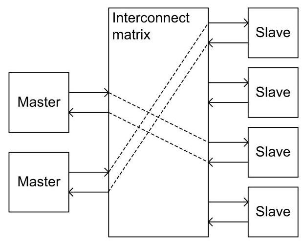

# Sample Technical Document for Testing

This is a synthetic document used for pipeline integration testing. It covers multiple Markdown structural elements: headings, tables, images, code blocks, and long content sections.

## Overview

This document describes the architecture of a sample system-on-chip (SoC) designed for test purposes. The SoC contains multiple masters and slaves connected through an interconnect matrix.

### Key Features

- Multi-master support with up to 8 AHB masters
- Multi-slave support with up to 16 AHB slaves
- Configurable arbitration schemes
- Low-latency crossbar interconnect
- Memory protection unit (MPU) support

### System Block Diagram

The following figure shows the top-level block diagram of the SoC:



The interconnect matrix enables parallel access paths between multiple masters and slaves. Each layer can operate independently when accessing different slaves.

### Register Summary

The following table summarizes the key registers in the system control module:

<table><tr><td>Register</td><td>Offset</td><td>Width</td><td>Access</td><td>Reset</td></tr><tr><td>SYS_CTRL</td><td>0x00</td><td>32</td><td>R/W</td><td>0x0000_0000</td></tr><tr><td>CLK_CFG</td><td>0x04</td><td>32</td><td>R/W</td><td>0x0000_0001</td></tr><tr><td>INT_MASK</td><td>0x08</td><td>32</td><td>R/W</td><td>0xFFFF_FFFF</td></tr><tr><td>INT_STAT</td><td>0x0C</td><td>32</td><td>R</td><td>0x0000_0000</td></tr><tr><td>DMA_CTRL</td><td>0x10</td><td>32</td><td>R/W</td><td>0x0000_0000</td></tr></table>

## Detailed Implementation

This section provides a detailed description of the implementation. The content is intentionally long to test the chapter splitting logic in the pipeline.

### 1.1 Clock Generation

The clock generation module produces all internal clocks from a single external crystal oscillator. The PLL (Phase-Locked Loop) multiplies the input frequency to generate the core clock, while dividers produce peripheral clocks at lower frequencies.

The clock tree is organized hierarchically. The root clock source can be either the external crystal or an internal RC oscillator. After the root source, the PLL generates the system clock at up to 1 GHz. From the system clock, AHB bus clocks are derived through programmable dividers. APB peripheral clocks are further divided from the AHB clocks.

Clock gating is supported at multiple levels. Each major functional block has its own clock gate controlled by the power management unit. When a block is idle, its clock can be gated to save power. The clock gates are controlled by the CLK_CFG register.

### 1.2 Reset Distribution

The reset distribution network ensures orderly startup and shutdown of all modules. There are three types of resets: power-on reset (POR), system reset, and module-level soft reset.

The POR is generated by an external pin and initializes all registers to their default values. The system reset can be triggered by software writing to the SYS_CTRL register or by a watchdog timeout. Module soft resets are controlled individually through the SYS_CTRL register bits.

Reset sequencing is important. The PLL must be stable before the core logic is released from reset. The reset controller manages this sequencing automatically. After POR, the controller waits for the PLL lock signal before de-asserting the system reset.

### 1.3 Interrupt Controller

The interrupt controller supports up to 64 interrupt sources with 8 priority levels. Each interrupt can be individually enabled or masked through the INT_MASK register. The interrupt status is visible in the INT_STAT register.

Interrupt sources include:
- Timer interrupts (4 sources)
- DMA completion interrupts (8 sources)
- External GPIO interrupts (16 sources)
- Communication interface interrupts (UART, SPI, I2C)
- Error and fault interrupts

The interrupt controller uses a vectored interrupt scheme. Each interrupt source has a unique vector number. When an interrupt is acknowledged, the vector number is provided to the processor, which uses it to jump to the correct handler.

### 1.4 DMA Engine

The DMA engine supports up to 8 channels with programmable transfer sizes. Each channel can be configured for memory-to-memory, memory-to-peripheral, or peripheral-to-memory transfers.

DMA channel configuration includes:
- Source address and destination address
- Transfer count (up to 64K words)
- Transfer width (8, 16, or 32 bits)
- Burst size (1, 4, 8, or 16 beats)
- Address increment mode (increment, decrement, or fixed)

The DMA controller includes a priority arbiter. When multiple channels request service simultaneously, the arbiter selects the highest priority channel. Priority can be fixed or rotating.

Linked list mode is supported for scatter-gather operations. In this mode, the DMA controller reads a descriptor from memory that contains the transfer parameters. After completing one descriptor, it automatically loads the next descriptor.

### 1.5 Bus Arbitration

The bus arbitration unit manages access to shared slaves from multiple masters. Two arbitration schemes are supported: fixed priority and round-robin.

In fixed priority mode, each master is assigned a priority level. When multiple masters request the same slave, the master with the highest priority wins. Lower priority masters may be starved if higher priority masters make continuous requests.

In round-robin mode, each master gets a turn in sequence. This ensures fairness but may increase latency for high-priority transactions.

The arbitration scheme is selected per slave through configuration registers.

### 1.6 Memory Map

The SoC includes several memory regions:

- On-chip SRAM: 512KB at address 0x2000_0000
- Flash memory interface: Supports up to 16MB external flash
- Boot ROM: 32KB at address 0x0000_0000
- Peripheral registers: Located in the 0x4000_0000 to 0x5FFF_FFFF range

The memory protection unit (MPU) supports 8 regions with configurable base address, size, and access permissions. Each region can be configured as execute-only, read-only, read-write, or no-access.

### 1.7 Power Management

The power management unit controls multiple power domains. Each major functional block can be placed in a low-power state independently.

Supported low-power modes:
- Run mode: All clocks running at full speed
- Sleep mode: CPU clock gated, peripherals running
- Deep sleep mode: Most clocks gated, only watchdog and GPIO wake-up active
- Hibernate mode: All power domains off except backup domain

Wake-up sources include external interrupts, RTC alarm, watchdog timer, and GPIO level changes.

### 1.8 Debug Support

The debug interface supports JTAG and SWD (Serial Wire Debug) protocols. Through the debug interface, the processor can be halted, single-stepped, and examined.

Debug features include:
- 6 hardware breakpoints
- 4 watchpoints
- Real-time trace through ITM (Instrumentation Trace Macrocell)
- Flash programming through debug interface

The debug access port (DAP) is accessible even when the processor is in reset or a low-power mode.

## Code Examples

The following code examples demonstrate typical register access patterns.

```c
// Enable the DMA controller
#define DMA_CTRL_REG  (*(volatile uint32_t *)0x40001000)

void dma_init(void) {
    DMA_CTRL_REG = 0x00000001;  // Enable DMA
}

// Configure a DMA transfer
void dma_config_channel(uint32_t ch, uint32_t src, uint32_t dst, uint32_t count) {
    volatile uint32_t *ch_regs = (volatile uint32_t *)(0x40001000 + 0x100 * ch);
    ch_regs[0] = src;   // Source address
    ch_regs[1] = dst;   // Destination address
    ch_regs[2] = count; // Transfer count
    ch_regs[3] = 0x05;  // Enable channel, 32-bit width
}
```

Register access follows the standard C2000 convention. The `volatile` keyword ensures the compiler does not optimize away memory accesses to hardware registers.

## Conclusion

This document has covered the architecture, implementation details, and programming model of the sample SoC. The interconnect matrix enables efficient multi-master operation, while the DMA engine offloads data transfers from the CPU. The flexible clock and reset schemes support a wide range of applications.

For additional information, refer to the individual module reference guides.
