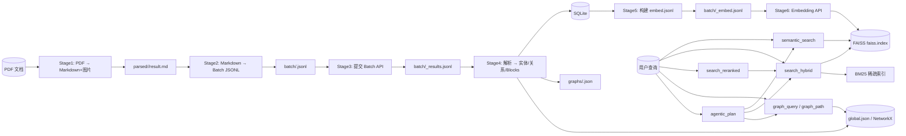

# work-docs-library 项目全面分析报告

> **分析目标**：全面了解项目功能与流程，梳理最佳实践，并识别功能、流程、目标之间的匹配问题。
> **分析日期**：2026-06-23
> **分析范围**：README.md、AGENTS.md、DESIGN.md、plugin manifest、scripts/core/、scripts/parsers/、scripts/plugin_router.py、scripts/mcp_server.py、scripts/tests/、skills/
> **当前基线**：`ruff check scripts/` ✅，`pyright scripts/` ✅ 0 errors，`pytest scripts/tests/` ✅ **514 passed**

---

## 1. 执行摘要

`work-docs-library` 是一个面向 **IC 前端设计技术文档（PDF）** 的自动化知识提取与检索插件，以 **Kimi Code CLI 的 MCP 扩展** 形态运行。它将 PDF 解析为 Markdown + 图片，自动抽取实体与关系构建跨文档知识图谱，并向量化支持语义/混合检索与 Agentic 搜索。

### 核心优势
- **AI Agent 原生设计**：复杂策略进 Skill，通用机制进代码；MCP 工具保持原子性。
- **成本优化**：实体提取走 LLM Batch API，Embedding 走同步单文本 API。
- **跨文档知识互通**：全局 NetworkX 图谱 + 文档子图快照，同名同类型实体自动合并。
- **混合检索与重排序**：BM25 稀疏索引（CJK 2-gram）+ FAISS 稠密检索 RRF 融合，支持 LLM/CrossEncoder 重排序。
- **状态安全优先**：所有写操作保留在 `admin_tools.py`，不暴露为 MCP 写工具。
- **测试隔离完善**：conftest 三重隔离机制彻底防止 `.env` 与生产数据污染测试。

### 主要风险
- **文档与代码存在多处不一致**：测试数、版本号、Skill 工具表、README 示例参数等。
- **架构复杂度高**：多个模块超过 1000 行，`KnowledgeBaseService` 承担过多职责，存在抽象泄漏。
- **部分能力“代码已存在但未接入”**：DOCX/XLSX 解析器、图谱可视化、部分 Stage 调试能力。
- **MCP 工具表面存在误导**：Skill 告诉 Agent 可以调用 `reprocess`，但该工具并未暴露。

---

## 2. 项目目标与定位

### 2.1 一句话目标

> 将 IC 前端设计 PDF 技术文档自动转换为结构化、可检索、可推理的跨文档知识库，并以 MCP 插件形式服务 AI Agent。

### 2.2 目标用户与部署形态

| 维度 | 说明 |
|------|------|
| **主要形态** | Kimi Code CLI 的 MCP Plugin |
| **入口** | `kimi.plugin.json` 声明，安装路径通常为 `~/.kimi/plugins/work-docs-library` |
| **调用方式** | MCP 原子工具 `mcp__workdocs__*` + Skill 编排 |
| **管理入口** | `scripts/admin_tools.py`（阶段调试、评估、图谱修改、全局重建） |
| **目标用户** | 使用 Kimi CLI 的 IC 设计工程师 / 由 Skill 驱动的 AI Agent |

### 2.3 核心价值主张

| 能力 | 关键实现 |
|------|---------|
| 智能 PDF 解析 | BigModel Expert API 为主，本地 PyMuPDF + TOC 驱动章节识别为 fallback |
| 知识图谱构建 | LLM Batch API 提取 Module/Register/Field/Instruction/PipelineStage/Peripheral 等实体与关系 |
| 跨文档互通 | `global.json` 全局图 + `{doc_id}.json` 子图快照，同名同类型实体自动合并 |
| 向量语义检索 | FAISS `IndexIDMap2` + `IndexFlatIP`，直接以 `block_db_id` 作为存储 ID |
| 混合检索与重排序 | BM25 + FAISS RRF 融合；LLM/CrossEncoder passage reranking |
| Agentic 搜索 | `AgenticSearchPlanner` 将复杂问题分解为 `SearchStep`，由外部 Skill 执行 |
| 章节级增量更新 | 按章节 `content_hash` 指纹比对，未变章节复用缓存 |
| 评估框架 | `EvalQuestion`/`EvalDataset` + 检索指标 + LLM-as-judge（Faithfulness / Context Precision / Context Recall / Answer Relevancy） |

### 2.4 关键约束与非目标

- **不做独立 SaaS**：无多租户、无 Web UI、无服务端部署。
- **状态安全优先于智能**：数据变更操作保留在 `admin_tools.py`，不暴露为 MCP 写工具。
- **零数据丢失**：禁止过滤/截断源数据，只允许按 Markdown 标题层级拆分。
- **测试禁止调用真实 API**：所有外部 API 使用 Mock / Fake。
- **当前仅支持 PDF**：DOCX/XLSX 解析器代码已存在，但未接入 pipeline。
- **可视化尚未实现**：Graphviz / D3.js 在“下一阶段”计划中。

---

## 3. 功能清单与实现状态

### 3.1 Pipeline 六阶段

| 阶段 | 功能 | 实现状态 | 关键产物 |
|------|------|:--------:|----------|
| Stage 1 | PDF → Markdown + 图片 | ✅ | `parsed/{doc_id}/result.md` + `images/` |
| Stage 2 | Markdown → Batch JSONL | ✅ | `batch/{doc_id}.jsonl` + `_blocks.json` |
| Stage 3 | 提交 Batch API | ✅ | `batch/{doc_id}_results.jsonl` |
| Stage 4 | 解析结果 → 实体/关系/内容块 | ✅ | SQLite + `graphs/{doc_id}.json` |
| Stage 5 | 构建 Embedding 队列 | ✅ | `batch/{doc_id}_embed.jsonl` |
| Stage 6 | Embedding API → FAISS/SQLite | ✅ | `faiss.index` |

### 3.2 存储系统

| 存储 | 技术 | 用途 |
|------|------|------|
| 元数据 | SQLite | 文档、blocks、headings、eval、feedback、conflict logs |
| 向量 | FAISS `IndexIDMap2(IndexFlatIP)` | 稠密向量检索，block_db_id 直接作为 ID |
| 图谱 | NetworkX + JSON | 全局图与子图，内存加载 |
| 桥接 | 内存双向索引 | block ↔ entity 快速关联，重启从 SQLite 重建 |

### 3.3 查询能力

| 查询类型 | MCP 工具 | 实现 |
|----------|---------|------|
| 语义搜索 | `semantic_search` | FAISS dense + 可选 graph_depth 扩展 |
| 混合检索 | `search_hybrid` | RRF 融合 dense + BM25 |
| 重排序检索 | `search_reranked` | hybrid + LLM/CrossEncoder rerank |
| 章节查询 | `query` / `get_content` | 按 doc_id/chapter/concept 查 content_blocks |
| 图谱查询 | `graph_query` / `graph_path` | 实体/邻居/子图/路径 |
| 来源追溯 | `graph_provenance` | 实体 → source doc/chunk |
| 冲突查看 | `graph_conflicts` | 同名实体属性覆盖日志 |
| Agentic 规划 | `agentic_plan` | LLM 分解问题为 SearchStep |
| 状态仪表盘 | `status` | 多 scope 结构化状态 |

### 3.4 管理/维护能力（admin_tools.py，非 MCP）

| 命令 | 用途 |
|------|------|
| `stage1_parse` ~ `stage6_submit_embed_batches` | 单阶段调试 |
| `ingest` / `reprocess` | 端到端导入/重处理 |
| `evaluate` / `run_eval` | 评估数据集 |
| `rebuild_global_graph` | 全局图重建 |
| `graph_upsert_entity/delete_entity/upsert_relation/delete_relation` | 图谱 CRUD |
| `graph_feedback` | 用户反馈 |

---

## 4. 数据流与流程

### 4.1 完整数据流图



### 4.2 增量更新流程

```
新 result.md
  ├── ChapterParser 构建新章节树
  ├── 计算每章节 section_content_hash
  ├── 与旧 content_blocks 比对
  │     ├── 标题存在且 hash 匹配 → unchanged（复用旧 extracted_entities/relations）
  │     ├── 标题存在但 hash 不同 → changed（重新 LLM 提取）
  │     ├── 新标题 → added（新增提取）
  │     └── 旧标题缺失 → removed（清理旧 blocks）
  ├── 仅对 changed/added 章节构建 Batch 请求
  └── Stage4 合并新结果与未变缓存
```

### 4.3 查询流程细节

**混合检索**：
1. `EmbeddingClient.embed(query)` 获取 query 向量。
2. `VectorIndex.search` 返回 dense candidates（默认 top 50）。
3. `BM25SparseIndex.search` 返回 sparse candidates（默认 top 50）。
4. `RRFFusionRetriever` 按 `score = Σ 1/(k+rank)` 融合，默认 `k=60`。
5. 返回 `top_k` 个 blocks。

**重排序**：
1. 调用 `search_hybrid(query, candidate_k=top_k*4)` 获取候选。
2. `LLMReranker` / `CrossEncoderReranker` 对 `(query, passage)` 打分。
3. 按 score 降序返回 top_k。
4. LLM 失败时回退到 hybrid 结果。

---

## 5. 架构与模块分析

### 5.1 模块职责

| 模块 | 职责 |
|------|------|
| `core/config.py` | 集中式配置，环境变量 / `.env` / 默认值三层覆盖 |
| `core/models.py` | 纯数据模型：`Document`、`Chunk`、`Chapter`、`EvalQuestion`、`EvalDataset` |
| `core/enums.py` | StrEnum：`ChunkStatus`、`DocumentStatus`、`ChunkType` |
| `core/db.py` | SQLite 封装：CRUD、事务、状态查询 |
| `core/vector_index.py` | FAISS 索引：add/search/remove/transaction/文件锁 |
| `core/graph_store.py` | 图谱抽象 + NetworkX 实现 + `SubGraphView` |
| `core/knowledge_base_service.py` | 统一服务层：存储、检索、图谱、桥接、pipeline 编排 |
| `core/doc_graph_pipeline.py` | 六阶段 ingestion pipeline（~2,188 行） |
| `core/llm_chat_client.py` | 同步 OpenAI-compatible chat 客户端 |
| `core/batch_clients.py` | Batch API 客户端，支持并行 chunking |
| `core/embedding_client.py` | Embedding API 客户端 |
| `core/bigmodel_parser_client.py` | BigModel Expert PDF 解析客户端 |
| `core/sparse_index.py` | BM25 稀疏索引（CJK 2-gram） |
| `core/hybrid_retriever.py` | RRF 融合检索器 |
| `core/reranker.py` | `Reranker` ABC + `CrossEncoderReranker` + `LLMReranker` |
| `core/evaluation.py` | 评估指标与 EvalHarness |
| `core/agentic_search.py` | 查询分解规划器 |
| `core/status_collector.py` | 结构化状态仪表盘 |

### 5.2 关键抽象

| 抽象 | 实现 | 评价 |
|------|------|------|
| `GraphStore` (ABC) | `NetworkXGraphStore` | 接口约 30 个方法，替代后端实现成本高 |
| `Reranker` (ABC) | `CrossEncoderReranker`, `LLMReranker` | 清晰的两方法抽象 |
| `SubGraphView` | 只读 `nx.DiGraph` 包装 | 便于转换为 LLM 文本上下文 |
| `_EntityChunkBridge` | 内存双向索引 | 支持语义-图谱联合查询 |

### 5.3 机制 vs 策略分离

| 分类 | 模块 |
|------|------|
| **机制** | `config`, `models`, `db`, `vector_index`, `graph_store`, `sparse_index`, `hybrid_retriever`, `reranker`, `llm_chat_client`, `batch_clients`, `embedding_client` |
| **策略/编排** | `doc_graph_pipeline.py`（六阶段流程、chunking、增量策略）、`pdf_parser.py` / `gaps_first_scanner.py` / `borderless_table_extractor.py`（文档布局启发式） |
| **混合** | `knowledge_base_service.py`（既是 facade，又承担缓存、桥接同步、graph rollback、pipeline 调用） |
| **策略外置** | `agentic_search.py` 只返回 `SearchStep`，执行在 Skill；评估 workflow 设计为外部 Agent/Skill 编排 |

### 5.4 架构问题

| 问题 | 位置 | 影响 |
|------|------|------|
| **超大模块** | `doc_graph_pipeline.py` (~2,188 行)、`graph_store.py` (~1,623 行)、`PDFParser` (~1,368 行)、`KnowledgeBaseService` (~1,187 行) | 难以单独测试和理解 |
| **抽象泄漏** | `KnowledgeBaseService.reprocess_document` 直接访问 `graph._g` 和 `graph._property_index` | 破坏 `GraphStore` 封装 |
| **服务层过重** | `KnowledgeBaseService` 集成 DB、向量、图、pipeline、bridge、sparse index、reranker | 职责过多 |
| **策略内嵌存储** | `NetworkXGraphStore.add_entity` 使用完整性评分启发式做冲突解决 | 存储层承载业务策略 |
| **重复启发式** | `PDFParser` 与 `GapsFirstScanner` 存在 caption/zone/table 判断逻辑的重复 |
| **未接入能力** | `parsers/office_parser.py` 未接入 pipeline | 依赖已安装但未使用 |

---

## 6. MCP / Plugin 工具面

### 6.1 14 个 MCP 工具

| 工具 | 类型 | 说明 |
|------|------|------|
| `ingest` | Write | 端到端导入 PDF（唯一暴露的写 MCP 工具） |
| `semantic_search` | Read | 向量搜索，可扩展 graph_depth |
| `search_hybrid` | Read | RRF 混合检索 |
| `search_reranked` | Read | hybrid + 重排序 |
| `agentic_plan` | Read | 查询分解 |
| `query` | Read | 按 doc/chapter/concept 查 blocks |
| `get_content` | Read | 读取章节或 block 内容 |
| `status` | Read | 状态仪表盘 |
| `toc` | Read | 文档目录 |
| `graph_query` | Read | 图谱实体/邻居/子图查询 |
| `graph_path` | Read | 实体间路径搜索 |
| `graph_provenance` | Read | 实体来源追溯 |
| `graph_conflicts` | Read | 冲突日志 |
| `config` | Read | 有效配置（脱敏） |

### 6.2 权限模型

- **AI Agent 可调用**：所有 Read 工具 + `ingest`。
- **Admin-only**：图谱 CRUD、feedback、rebuild、evaluate/run_eval、stage 调试、reprocess。
- **设计理由**：`AGENTS.md` 明确“状态安全优先于智能”，数据变更保留人工/审计边界。

### 6.3 Skill 层级

| Skill | 位置 | 作用 |
|------|------|------|
| `using-workdocs` | `skills/using-workdocs/SKILL.md` | 入口 skill，列出工具与子 skill |
| `ingesting-workdocs` | `skills/ingesting-workdocs/SKILL.md` | 导入/更新工作流 |
| `exploring-workdocs` | `skills/exploring-workdocs/SKILL.md` | 查询/图谱工作流 |
| `agentic-search` | `~/.agents/skills/agentic-search/SKILL.md` | 多跳 planned retrieval（用户级） |

---

## 7. 测试与质量基础设施

### 7.1 测试隔离（`conftest.py`）

| 层 | 机制 |
|----|------|
| 环境清理 | 移除所有 `WORKDOCS_*` 环境变量 |
| 阻止 `.env` | 将 `dotenv.load_dotenv` 替换为空操作 |
| 路径重定向 | 创建临时目录，覆盖 DB/FAISS/Graph 路径 |
| 种子数据 | 复制 `scripts/tests/data/parsed/` 到临时目录 |

### 7.2 测试统计

- **当前实际**：514 passed，0 failed，0 skipped（约 46 秒）。
- **文档声明**：README / AGENTS 仍写 491，存在文档漂移。

### 7.3 质量工具

| 工具 | 状态 |
|------|------|
| ruff | ✅ All checks passed |
| pyright | ✅ 0 errors, 0 warnings |
| pytest | ✅ 514 passed |

### 7.4 Mock 模式

- 使用 `monkeypatch` 替换 `requests.post`、类方法、整个 client class。
- 不调用真实 API。
- `test_mcp_server.py` 通过 subprocess 启动本地 MCP server 做协议测试。

### 7.5 测试覆盖缺口

- `admin_tools.py` 无测试。
- `core/enums.py`、`core/models.py` 无直接测试。
- `parsers/gaps_first_scanner.py` 仅通过 PDF 集成测试间接覆盖。
- `core/hybrid_retriever.py` 只有 5 个测试，RRF 边界覆盖较薄。

---

## 8. 最佳实践清单（从项目中提炼）

### 8.1 设计原则

1. **AI Agent 原生插件**：LLM 成本由外部 Agent/Skill 承担，插件提供原子机制。
2. **机制 vs 策略分离**：通用能力（检索、存储、LLM 调用）进代码；复杂 workflow 进 Skill。
3. **状态安全优先于智能**：数据变更操作保留在 admin 层，不暴露为 MCP 写工具。
4. **零数据丢失**：不过滤/截断源数据，仅按标题层级结构性拆分。
5. **配置单一来源**：活跃配置项权威表格在 README，`.env.example` 必须同步。

### 8.2 工程实践

1. **测试三重隔离**：清除环境变量、阻止 dotenv、重定向配置路径到临时目录。
2. **Mock 优先**：所有外部 API 测试使用 Fake 客户端。
3. **参数化 SQL**：所有 SQLite 查询使用 `?` 占位符。
4. **Prompt 外置**：所有 LLM prompt 放在 `scripts/prompts/*.txt`，代码按名称读取。
5. **安全的 Prompt 替换**：优先使用 `string.Template.safe_substitute()` 避免用户输入冲突。
6. **FAISS 事务**：先写 FAISS 再写 SQLite，SQLite 失败时 rollback 向量。
7. **Graph rollback**：图修改前快照，失败时恢复旧状态并落盘。
8. **LLM Batch 成本优化**：实体提取走 Batch API，Embedding 因实测延迟走同步 API。

### 8.3 代码风格

1. **ruff + pyright + pytest** 强制工具链。
2. **dataclass** 领域模型，`StrEnum` 状态定义。
3. **日志格式统一**：`%(asctime)s | %(levelname)-8s | %(name)s | %(message)s`。
4. **中文文档/注释可接受**：ruff 忽略 `D415` 适配中文标点。

---

## 9. 功能-流程-目标匹配问题

### 9.1 High 级别问题

| # | 问题 | 证据 | 影响 | 建议 |
|---|------|------|------|------|
| H1 | **Skill 告诉 Agent 调用未暴露的 `reprocess` 工具** | `skills/using-workdocs/SKILL.md:31`、`skills/ingesting-workdocs/SKILL.md:33` 均列出 `mcp__workdocs__reprocess`；但 `scripts/mcp_server.py:MCP_TOOL_MAP` 只有 14 个工具，不含 `reprocess` | Agent 按 Skill 执行会直接失败，破坏可用性 | 从 Skill 中移除 `reprocess` 引用，或将其真正暴露为 MCP 工具 |
| H2 | **`using-workdocs` 工具表重复/数量错误** | 同文件列出 `status` 两次，并包含 `reprocess`，共 15 行 | 给 Agent 造成困惑 | 去重、移除 `reprocess`，保持 14 个工具 |
| H3 | **版本号不一致** | `kimi.plugin.json:3` 版本 `1.2.0`，`pyproject.toml:2` 版本 `0.1.0` | 安装包与插件 manifest 版本不同步 | 统一版本号，建议以 `pyproject.toml` 为源，plugin manifest 同步 |

### 9.2 Medium 级别问题

| # | 问题 | 证据 | 影响 | 建议 |
|---|------|------|------|------|
| M1 | **README 查询示例使用不存在的 `include_children` 参数** | `README.md:394` 示例 `mcp__workdocs__query {"include_children": true}`；`tool_query` 不接受该参数 | 用户/Agent 按示例调用会失败 | 移除或替换为正确参数（`chapter_regex` / `concept`） |
| M2 | **文档测试数与实际不匹配** | README/AGENTS 多处写 491；实际 514 | 违反项目自身“测试数字统一引用”规则 | 更新三份文档中的测试数为 514 |
| M3 | **`kimi.plugin.json` 描述未涵盖核心能力** | 描述仅写“PDF 导入、语义搜索、知识图谱查询”，未提及混合检索、重排序、Agentic 搜索 | 插件能力在 manifest 中未充分展示 | 更新 description 以反映 14 工具完整能力 |
| M4 | **`pyproject.toml` 包含未接入能力的依赖** | `python-docx`、`openpyxl` 已列为依赖，但 DOCX/XLSX 未接入 pipeline | 增加安装体积与维护面 | 将相关依赖移入 optional-dependencies，或完成 DOCX/XLSX 接入 |
| M5 | **`status` MCP schema 描述不完整** | schema 写 `scope` 为 `"all|doc"`，实际支持 11 个 scope | 限制 Agent 对 status 能力的理解 | 更新 schema 枚举全部 scope |
| M6 | **`toc` schema 过于宽松** | schema 无 required 字段，但运行时要求 `doc_id` 或 `match` | 空参数调用会失败 | 在 schema 中标记 `doc_id`/`match` 至少一个 required |

### 9.3 Low / 架构级别问题

| # | 问题 | 证据 | 影响 | 建议 |
|---|------|------|------|------|
| L1 | **超大模块与职责过载** | `doc_graph_pipeline.py` ~2,188 行、`KnowledgeBaseService` ~1,187 行 | 可维护性下降 | 按阶段拆分 pipeline，将 bridge/persistence/retriever composition 从 service 中抽出 |
| L2 | **抽象泄漏** | `KnowledgeBaseService.reprocess_document` 直接访问 `graph._g` | 破坏 GraphStore 封装 | 通过 `GraphStore` 提供事务/快照接口 |
| L3 | **GraphStore ABC 过于庞大** | ~30 个抽象方法 | Neo4j 等替代实现成本高 | 拆分为读写/查询/管理子接口 |
| L4 | **硬编码 step_type 白名单** | `AgenticSearchPlanner._parse_steps` | 新增 step type 需改代码 | 改为可配置 schema 或允许 Skill 提供扩展 |
| L5 | **稀疏索引缓存失效粒度粗** | 基于 content_blocks 总数而非内容 hash | 替换同数量 block 时缓存不刷新 | 增加内容 hash 或版本号校验 |
| L6 | **parser 启发式逻辑重复** | `PDFParser` 与 `GapsFirstScanner` 重复 caption/zone/table 判断 | 维护困难、行为不一致风险 | 抽取共享工具函数 |
| L7 | **admin_tools.py 无测试** | — | admin 命令回归风险 | 添加最小 smoke test |
| L8 | **README 图片格式描述不一致** | 一处写 `.jpg`，AGENTS 明确 PNG | 文档矛盾 | 统一为 PNG |

### 9.4 目标-实现匹配度评估

| 目标 | 匹配度 | 说明 |
|------|:------:|------|
| AI Agent 原生插件 | ✅ 高 | 原则明确，工具原子，策略外置 |
| 跨文档知识图谱 | ✅ 高 | 全局图 + 子图快照 + 实体合并已实现 |
| 向量语义检索 | ✅ 高 | FAISS + 稠密检索完整 |
| 混合检索与重排序 | ✅ 高 | BM25 + RRF + LLM/CrossEncoder rerank 已实现 |
| Agentic 搜索 | ⚠️ 中 | 规划器与 Skill 已存在，但 Skill 可发现性弱，部分参数别名未对齐 |
| 评估框架 | ⚠️ 中 | retrieval/RAG 评估已实现，但 admin 未充分文档化 |
| DOCX/XLSX 支持 | ❌ 低 | 解析器代码存在，未接入 pipeline |
| 可视化 | ❌ 低 | 仅计划中 |
| 状态安全优先 | ✅ 高 | 写工具未暴露为 MCP |

---

## 10. 建议行动计划

### 立即修复（P0，影响 Agent 可用性）

1. 修复 `skills/using-workdocs/SKILL.md` 和 `skills/ingesting-workdocs/SKILL.md`：移除 `mcp__workdocs__reprocess` 引用，去重 `status`，确保工具数=14。
2. 修复 `README.md:394` 查询示例：移除 `include_children`。
3. 统一 `kimi.plugin.json` 与 `pyproject.toml` 版本号。

### 短期修复（P1，文档与一致性）

4. 更新 README/AGENTS/DESIGN 中的测试数为 514。
5. 更新 `kimi.plugin.json` description，突出混合检索、重排序、Agentic 搜索。
6. 完善 `status` / `toc` MCP schema。
7. 将 `python-docx` / `openpyxl` 移入 optional dependencies，或完成 DOCX/XLSX pipeline 接入。

### 中期优化（P2，架构健康）

8. 拆分 `doc_graph_pipeline.py` 为 per-stage 模块。
9. 为 `KnowledgeBaseService` 抽取 persistence manager、bridge manager、retriever composition。
10. 收敛 `KnowledgeBaseService` 对 `graph._g` 的直接访问。
11. 拆分 `graph_store.py`，缩小 `GraphStore` ABC。
12. 抽取 `PDFParser` / `GapsFirstScanner` 共享启发式函数。

### 长期能力补齐

13. 实现图谱可视化导出（Graphviz / D3.js）。
14. 完成 DOCX/XLSX 接入 `DocGraphPipeline`。
15. 为 `admin_tools.py` 增加 smoke tests。

---

## 11. 结论

`work-docs-library` 是一个目标清晰、架构完整、测试健壮的 AI Agent 插件项目。其 **AI Agent 原生设计、状态安全优先、零数据丢失、机制-策略分离** 等原则在代码中得到了较好贯彻。混合检索、重排序、Agentic 搜索、评估框架等高级能力也已落地。

然而，项目在快速发展过程中出现了一些 **文档-代码漂移和 Skill-MCP 表面不一致**，其中最严重的是 Skill 引用未暴露的 MCP 工具，可能直接导致 Agent 执行失败。此外，部分模块体积过大、职责混合，长期可维护性需要关注。

建议优先修复 P0/P1 一致性问题，再逐步推进架构拆分与能力补齐。
